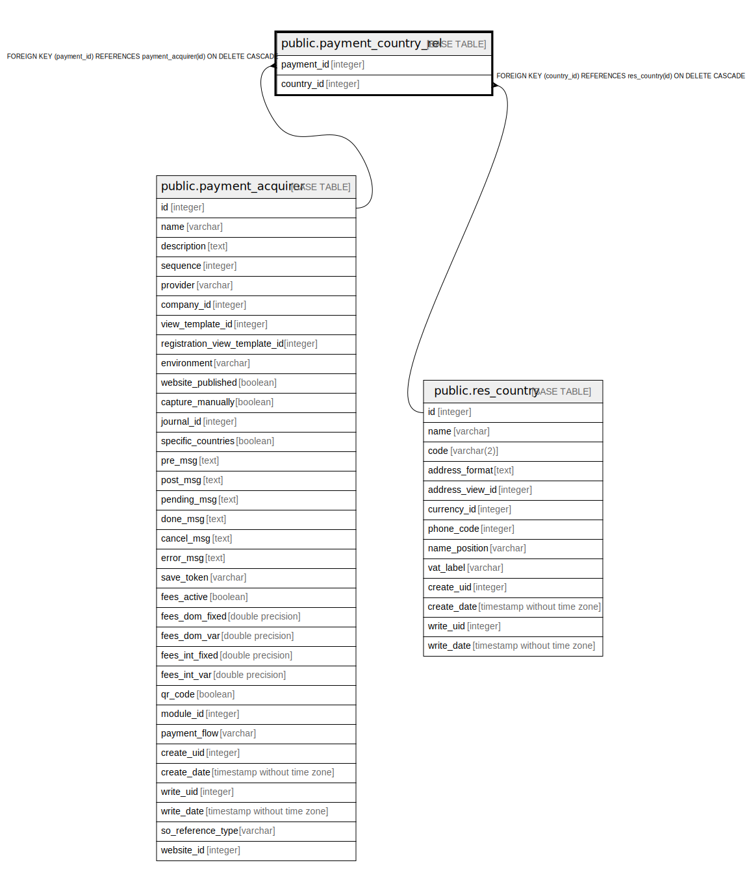

# public.payment_country_rel

## Description

RELATION BETWEEN payment_acquirer AND res_country

## Columns

| Name | Type | Default | Nullable | Children | Parents | Comment |
| ---- | ---- | ------- | -------- | -------- | ------- | ------- |
| payment_id | integer |  | false |  | [public.payment_acquirer](public.payment_acquirer.md) |  |
| country_id | integer |  | false |  | [public.res_country](public.res_country.md) |  |

## Constraints

| Name | Type | Definition |
| ---- | ---- | ---------- |
| payment_country_rel_country_id_fkey | FOREIGN KEY | FOREIGN KEY (country_id) REFERENCES res_country(id) ON DELETE CASCADE |
| payment_country_rel_payment_id_fkey | FOREIGN KEY | FOREIGN KEY (payment_id) REFERENCES payment_acquirer(id) ON DELETE CASCADE |
| payment_country_rel_payment_id_country_id_key | UNIQUE | UNIQUE (payment_id, country_id) |

## Indexes

| Name | Definition |
| ---- | ---------- |
| payment_country_rel_payment_id_country_id_key | CREATE UNIQUE INDEX payment_country_rel_payment_id_country_id_key ON public.payment_country_rel USING btree (payment_id, country_id) |
| payment_country_rel_payment_id_idx | CREATE INDEX payment_country_rel_payment_id_idx ON public.payment_country_rel USING btree (payment_id) |
| payment_country_rel_country_id_idx | CREATE INDEX payment_country_rel_country_id_idx ON public.payment_country_rel USING btree (country_id) |

## Relations

---

> Generated by [tbls](https://github.com/k1LoW/tbls)
