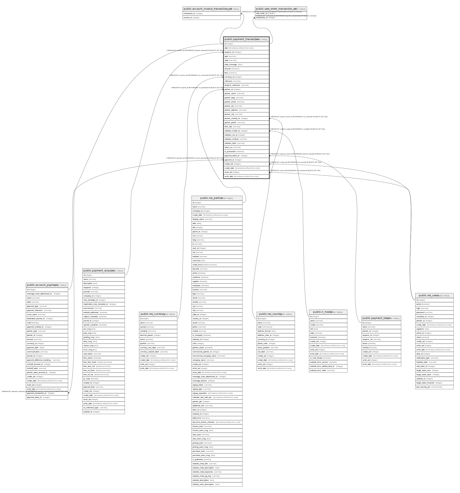

# public.payment_transaction

## Description

Payment Transaction

## Columns

| Name | Type | Default | Nullable | Children | Parents | Comment |
| ---- | ---- | ------- | -------- | -------- | ------- | ------- |
| id | integer | nextval('payment_transaction_id_seq'::regclass) | false | [public.account_payment](public.account_payment.md) [public.account_invoice_transaction_rel](public.account_invoice_transaction_rel.md) [public.sale_order_transaction_rel](public.sale_order_transaction_rel.md) |  |  |
| date | timestamp without time zone |  | true |  |  | Validation Date |
| acquirer_id | integer |  | false |  | [public.payment_acquirer](public.payment_acquirer.md) | Acquirer |
| type | varchar |  | false |  |  | Type |
| state | varchar |  | false |  |  | Status |
| state_message | text |  | true |  |  | Message |
| amount | numeric |  | false |  |  | Amount |
| fees | numeric |  | true |  |  | Fees |
| currency_id | integer |  | false |  | [public.res_currency](public.res_currency.md) | Currency |
| reference | varchar |  | false |  |  | Reference |
| acquirer_reference | varchar |  | true |  |  | Acquirer Reference |
| partner_id | integer |  | true |  | [public.res_partner](public.res_partner.md) | Customer |
| partner_name | varchar |  | true |  |  | Partner Name |
| partner_lang | varchar |  | true |  |  | Language |
| partner_email | varchar |  | true |  |  | Email |
| partner_zip | varchar |  | true |  |  | Zip |
| partner_address | varchar |  | true |  |  | Address |
| partner_city | varchar |  | true |  |  | City |
| partner_country_id | integer |  | false |  | [public.res_country](public.res_country.md) | Country |
| partner_phone | varchar |  | true |  |  | Phone |
| html_3ds | varchar |  | true |  |  | 3D Secure HTML |
| callback_model_id | integer |  | true |  | [public.ir_model](public.ir_model.md) | Callback Document Model |
| callback_res_id | integer |  | true |  |  | Callback Document ID |
| callback_method | varchar |  | true |  |  | Callback Method |
| callback_hash | varchar |  | true |  |  | Callback Hash |
| return_url | varchar |  | true |  |  | Return URL after payment |
| is_processed | boolean |  | true |  |  | Has the payment been post processed |
| payment_token_id | integer |  | true |  | [public.payment_token](public.payment_token.md) | Payment Token |
| payment_id | integer |  | true |  | [public.account_payment](public.account_payment.md) | Payment |
| create_uid | integer |  | true |  | [public.res_users](public.res_users.md) | Created by |
| create_date | timestamp without time zone |  | true |  |  | Created on |
| write_uid | integer |  | true |  | [public.res_users](public.res_users.md) | Last Updated by |
| write_date | timestamp without time zone |  | true |  |  | Last Updated on |

## Constraints

| Name | Type | Definition | Comment |
| ---- | ---- | ---------- | ------- |
| payment_transaction_create_uid_fkey | FOREIGN KEY | FOREIGN KEY (create_uid) REFERENCES res_users(id) ON DELETE SET NULL |  |
| payment_transaction_write_uid_fkey | FOREIGN KEY | FOREIGN KEY (write_uid) REFERENCES res_users(id) ON DELETE SET NULL |  |
| payment_transaction_currency_id_fkey | FOREIGN KEY | FOREIGN KEY (currency_id) REFERENCES res_currency(id) ON DELETE SET NULL |  |
| payment_transaction_partner_id_fkey | FOREIGN KEY | FOREIGN KEY (partner_id) REFERENCES res_partner(id) ON DELETE SET NULL |  |
| payment_transaction_callback_model_id_fkey | FOREIGN KEY | FOREIGN KEY (callback_model_id) REFERENCES ir_model(id) ON DELETE SET NULL |  |
| payment_transaction_partner_country_id_fkey | FOREIGN KEY | FOREIGN KEY (partner_country_id) REFERENCES res_country(id) ON DELETE SET NULL |  |
| payment_transaction_payment_id_fkey | FOREIGN KEY | FOREIGN KEY (payment_id) REFERENCES account_payment(id) ON DELETE SET NULL |  |
| payment_transaction_acquirer_id_fkey | FOREIGN KEY | FOREIGN KEY (acquirer_id) REFERENCES payment_acquirer(id) ON DELETE SET NULL |  |
| payment_transaction_pkey | PRIMARY KEY | PRIMARY KEY (id) |  |
| payment_transaction_reference_uniq | UNIQUE | UNIQUE (reference) | unique(reference) |
| payment_transaction_payment_token_id_fkey | FOREIGN KEY | FOREIGN KEY (payment_token_id) REFERENCES payment_token(id) ON DELETE SET NULL |  |

## Indexes

| Name | Definition |
| ---- | ---------- |
| payment_transaction_pkey | CREATE UNIQUE INDEX payment_transaction_pkey ON public.payment_transaction USING btree (id) |
| payment_transaction_reference_index | CREATE INDEX payment_transaction_reference_index ON public.payment_transaction USING btree (reference) |
| payment_transaction_reference_uniq | CREATE UNIQUE INDEX payment_transaction_reference_uniq ON public.payment_transaction USING btree (reference) |

## Relations

---

> Generated by [tbls](https://github.com/k1LoW/tbls)
