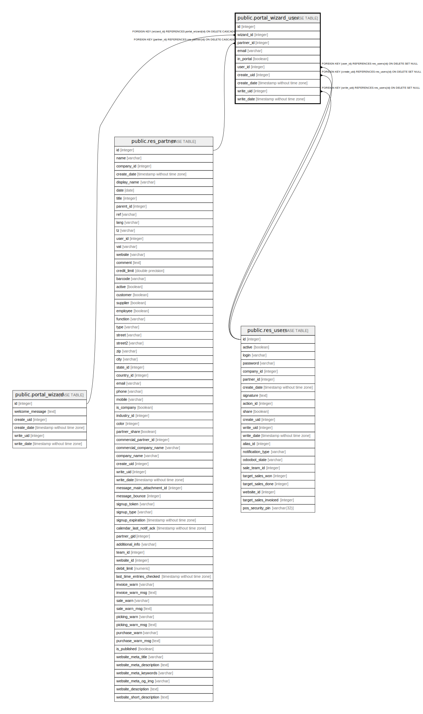

# public.portal_wizard_user

## Description

Portal User Config

## Columns

| Name | Type | Default | Nullable | Children | Parents | Comment |
| ---- | ---- | ------- | -------- | -------- | ------- | ------- |
| id | integer | nextval('portal_wizard_user_id_seq'::regclass) | false |  |  |  |
| wizard_id | integer |  | false |  | [public.portal_wizard](public.portal_wizard.md) | Wizard |
| partner_id | integer |  | false |  | [public.res_partner](public.res_partner.md) | Contact |
| email | varchar |  | true |  |  | Email |
| in_portal | boolean |  | true |  |  | In Portal |
| user_id | integer |  | true |  | [public.res_users](public.res_users.md) | Login User |
| create_uid | integer |  | true |  | [public.res_users](public.res_users.md) | Created by |
| create_date | timestamp without time zone |  | true |  |  | Created on |
| write_uid | integer |  | true |  | [public.res_users](public.res_users.md) | Last Updated by |
| write_date | timestamp without time zone |  | true |  |  | Last Updated on |

## Constraints

| Name | Type | Definition |
| ---- | ---- | ---------- |
| portal_wizard_user_create_uid_fkey | FOREIGN KEY | FOREIGN KEY (create_uid) REFERENCES res_users(id) ON DELETE SET NULL |
| portal_wizard_user_user_id_fkey | FOREIGN KEY | FOREIGN KEY (user_id) REFERENCES res_users(id) ON DELETE SET NULL |
| portal_wizard_user_write_uid_fkey | FOREIGN KEY | FOREIGN KEY (write_uid) REFERENCES res_users(id) ON DELETE SET NULL |
| portal_wizard_user_partner_id_fkey | FOREIGN KEY | FOREIGN KEY (partner_id) REFERENCES res_partner(id) ON DELETE CASCADE |
| portal_wizard_user_wizard_id_fkey | FOREIGN KEY | FOREIGN KEY (wizard_id) REFERENCES portal_wizard(id) ON DELETE CASCADE |
| portal_wizard_user_pkey | PRIMARY KEY | PRIMARY KEY (id) |

## Indexes

| Name | Definition |
| ---- | ---------- |
| portal_wizard_user_pkey | CREATE UNIQUE INDEX portal_wizard_user_pkey ON public.portal_wizard_user USING btree (id) |

## Relations

---

> Generated by [tbls](https://github.com/k1LoW/tbls)
