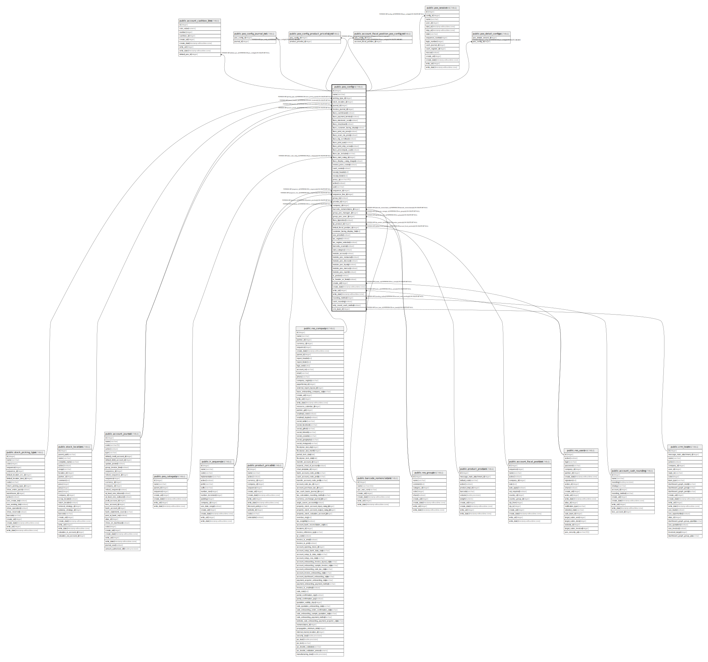

# public.pos_config

## Description

Point of Sale Configuration

## Columns

| Name | Type | Default | Nullable | Children | Parents | Comment |
| ---- | ---- | ------- | -------- | -------- | ------- | ------- |
| id | integer | nextval('pos_config_id_seq'::regclass) | false | [public.account_cashbox_line](public.account_cashbox_line.md) [public.pos_config_journal_rel](public.pos_config_journal_rel.md) [public.pos_config_product_pricelist_rel](public.pos_config_product_pricelist_rel.md) [public.account_fiscal_position_pos_config_rel](public.account_fiscal_position_pos_config_rel.md) [public.pos_session](public.pos_session.md) [public.pos_detail_configs](public.pos_detail_configs.md) |  |  |
| name | varchar |  | false |  |  | Point of Sale Name |
| picking_type_id | integer |  | true |  | [public.stock_picking_type](public.stock_picking_type.md) | Operation Type |
| stock_location_id | integer |  | false |  | [public.stock_location](public.stock_location.md) | Stock Location |
| journal_id | integer |  | true |  | [public.account_journal](public.account_journal.md) | Sales Journal |
| invoice_journal_id | integer |  | true |  | [public.account_journal](public.account_journal.md) | Invoice Journal |
| iface_cashdrawer | boolean |  | true |  |  | Cashdrawer |
| iface_payment_terminal | boolean |  | true |  |  | Payment Terminal |
| iface_electronic_scale | boolean |  | true |  |  | Electronic Scale |
| iface_vkeyboard | boolean |  | true |  |  | Virtual KeyBoard |
| iface_customer_facing_display | boolean |  | true |  |  | Customer Facing Display |
| iface_print_via_proxy | boolean |  | true |  |  | Print via Proxy |
| iface_scan_via_proxy | boolean |  | true |  |  | Scan via Proxy |
| iface_big_scrollbars | boolean |  | true |  |  | Large Scrollbars |
| iface_print_auto | boolean |  | true |  |  | Automatic Receipt Printing |
| iface_print_skip_screen | boolean |  | true |  |  | Skip Preview Screen |
| iface_precompute_cash | boolean |  | true |  |  | Prefill Cash Payment |
| iface_tax_included | varchar |  | false |  |  | Tax Display |
| iface_start_categ_id | integer |  | true |  | [public.pos_category](public.pos_category.md) | Initial Category |
| iface_display_categ_images | boolean |  | true |  |  | Display Category Pictures |
| restrict_price_control | boolean |  | true |  |  | Restrict Price Modifications to Managers |
| cash_control | boolean |  | true |  |  | Cash Control |
| receipt_header | text |  | true |  |  | Receipt Header |
| receipt_footer | text |  | true |  |  | Receipt Footer |
| proxy_ip | varchar(45) |  | true |  |  | IP Address |
| active | boolean |  | true |  |  | Active |
| uuid | varchar |  | true |  |  | Uuid |
| sequence_id | integer |  | true |  | [public.ir_sequence](public.ir_sequence.md) | Order IDs Sequence |
| sequence_line_id | integer |  | true |  | [public.ir_sequence](public.ir_sequence.md) | Order Line IDs Sequence |
| group_by | boolean |  | true |  |  | Group Journal Items |
| pricelist_id | integer |  | false |  | [public.product_pricelist](public.product_pricelist.md) | Default Pricelist |
| company_id | integer |  | false |  | [public.res_company](public.res_company.md) | Company |
| barcode_nomenclature_id | integer |  | true |  | [public.barcode_nomenclature](public.barcode_nomenclature.md) | Barcode Nomenclature |
| group_pos_manager_id | integer |  | true |  | [public.res_groups](public.res_groups.md) | Point of Sale Manager Group |
| group_pos_user_id | integer |  | true |  | [public.res_groups](public.res_groups.md) | Point of Sale User Group |
| iface_tipproduct | boolean |  | true |  |  | Product tips |
| tip_product_id | integer |  | true |  | [public.product_product](public.product_product.md) | Tip Product |
| default_fiscal_position_id | integer |  | true |  | [public.account_fiscal_position](public.account_fiscal_position.md) | Default Fiscal Position |
| customer_facing_display_html | text |  | true |  |  | Customer facing display content |
| use_pricelist | boolean |  | true |  |  | Use a pricelist. |
| tax_regime | boolean |  | true |  |  | Tax Regime |
| tax_regime_selection | boolean |  | true |  |  | Tax Regime Selection value |
| barcode_scanner | boolean |  | true |  |  | Barcode Scanner |
| start_category | boolean |  | true |  |  | Set Start Category |
| module_account | boolean |  | true |  |  | Invoicing |
| module_pos_restaurant | boolean |  | true |  |  | Is a Bar/Restaurant |
| module_pos_discount | boolean |  | true |  |  | Global Discounts |
| module_pos_loyalty | boolean |  | true |  |  | Loyalty Program |
| module_pos_mercury | boolean |  | true |  |  | Integrated Card Payments |
| module_pos_reprint | boolean |  | true |  |  | Reprint Receipt |
| is_posbox | boolean |  | true |  |  | PosBox |
| is_header_or_footer | boolean |  | true |  |  | Header & Footer |
| create_uid | integer |  | true |  | [public.res_users](public.res_users.md) | Created by |
| create_date | timestamp without time zone |  | true |  |  | Created on |
| write_uid | integer |  | true |  | [public.res_users](public.res_users.md) | Last Updated by |
| write_date | timestamp without time zone |  | true |  |  | Last Updated on |
| rounding_method | integer |  | true |  | [public.account_cash_rounding](public.account_cash_rounding.md) | Cash rounding |
| cash_rounding | boolean |  | true |  |  | Cash Rounding |
| only_round_cash_method | boolean |  | true |  |  | Only apply rounding on cash |
| crm_team_id | integer |  | true |  | [public.crm_team](public.crm_team.md) | Sales Team |

## Constraints

| Name | Type | Definition |
| ---- | ---- | ---------- |
| pos_config_create_uid_fkey | FOREIGN KEY | FOREIGN KEY (create_uid) REFERENCES res_users(id) ON DELETE SET NULL |
| pos_config_write_uid_fkey | FOREIGN KEY | FOREIGN KEY (write_uid) REFERENCES res_users(id) ON DELETE SET NULL |
| pos_config_group_pos_manager_id_fkey | FOREIGN KEY | FOREIGN KEY (group_pos_manager_id) REFERENCES res_groups(id) ON DELETE SET NULL |
| pos_config_group_pos_user_id_fkey | FOREIGN KEY | FOREIGN KEY (group_pos_user_id) REFERENCES res_groups(id) ON DELETE SET NULL |
| pos_config_company_id_fkey | FOREIGN KEY | FOREIGN KEY (company_id) REFERENCES res_company(id) ON DELETE SET NULL |
| pos_config_sequence_id_fkey | FOREIGN KEY | FOREIGN KEY (sequence_id) REFERENCES ir_sequence(id) ON DELETE SET NULL |
| pos_config_sequence_line_id_fkey | FOREIGN KEY | FOREIGN KEY (sequence_line_id) REFERENCES ir_sequence(id) ON DELETE SET NULL |
| pos_config_crm_team_id_fkey | FOREIGN KEY | FOREIGN KEY (crm_team_id) REFERENCES crm_team(id) ON DELETE SET NULL |
| pos_config_tip_product_id_fkey | FOREIGN KEY | FOREIGN KEY (tip_product_id) REFERENCES product_product(id) ON DELETE SET NULL |
| pos_config_pricelist_id_fkey | FOREIGN KEY | FOREIGN KEY (pricelist_id) REFERENCES product_pricelist(id) ON DELETE SET NULL |
| pos_config_default_fiscal_position_id_fkey | FOREIGN KEY | FOREIGN KEY (default_fiscal_position_id) REFERENCES account_fiscal_position(id) ON DELETE SET NULL |
| pos_config_invoice_journal_id_fkey | FOREIGN KEY | FOREIGN KEY (invoice_journal_id) REFERENCES account_journal(id) ON DELETE SET NULL |
| pos_config_journal_id_fkey | FOREIGN KEY | FOREIGN KEY (journal_id) REFERENCES account_journal(id) ON DELETE SET NULL |
| pos_config_rounding_method_fkey | FOREIGN KEY | FOREIGN KEY (rounding_method) REFERENCES account_cash_rounding(id) ON DELETE SET NULL |
| pos_config_barcode_nomenclature_id_fkey | FOREIGN KEY | FOREIGN KEY (barcode_nomenclature_id) REFERENCES barcode_nomenclature(id) ON DELETE SET NULL |
| pos_config_stock_location_id_fkey | FOREIGN KEY | FOREIGN KEY (stock_location_id) REFERENCES stock_location(id) ON DELETE SET NULL |
| pos_config_picking_type_id_fkey | FOREIGN KEY | FOREIGN KEY (picking_type_id) REFERENCES stock_picking_type(id) ON DELETE SET NULL |
| pos_config_iface_start_categ_id_fkey | FOREIGN KEY | FOREIGN KEY (iface_start_categ_id) REFERENCES pos_category(id) ON DELETE SET NULL |
| pos_config_pkey | PRIMARY KEY | PRIMARY KEY (id) |

## Indexes

| Name | Definition |
| ---- | ---------- |
| pos_config_pkey | CREATE UNIQUE INDEX pos_config_pkey ON public.pos_config USING btree (id) |
| pos_config_name_index | CREATE INDEX pos_config_name_index ON public.pos_config USING btree (name) |

## Relations

---

> Generated by [tbls](https://github.com/k1LoW/tbls)
