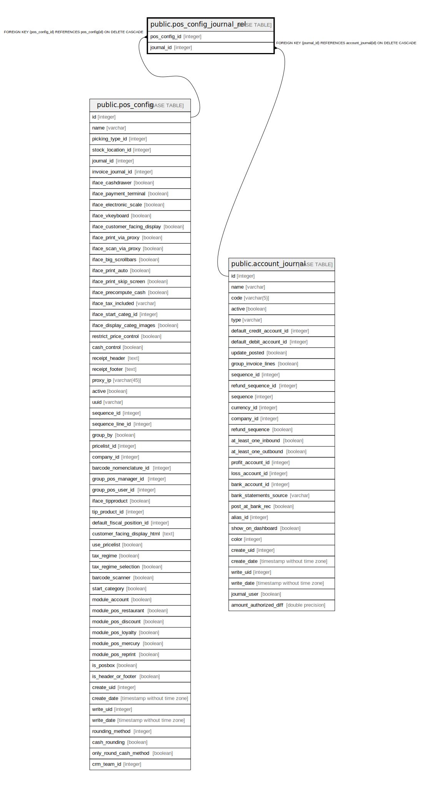

# public.pos_config_journal_rel

## Description

RELATION BETWEEN pos_config AND account_journal

## Columns

| Name | Type | Default | Nullable | Children | Parents | Comment |
| ---- | ---- | ------- | -------- | -------- | ------- | ------- |
| pos_config_id | integer |  | false |  | [public.pos_config](public.pos_config.md) |  |
| journal_id | integer |  | false |  | [public.account_journal](public.account_journal.md) |  |

## Constraints

| Name | Type | Definition |
| ---- | ---- | ---------- |
| pos_config_journal_rel_journal_id_fkey | FOREIGN KEY | FOREIGN KEY (journal_id) REFERENCES account_journal(id) ON DELETE CASCADE |
| pos_config_journal_rel_pos_config_id_fkey | FOREIGN KEY | FOREIGN KEY (pos_config_id) REFERENCES pos_config(id) ON DELETE CASCADE |
| pos_config_journal_rel_pos_config_id_journal_id_key | UNIQUE | UNIQUE (pos_config_id, journal_id) |

## Indexes

| Name | Definition |
| ---- | ---------- |
| pos_config_journal_rel_pos_config_id_journal_id_key | CREATE UNIQUE INDEX pos_config_journal_rel_pos_config_id_journal_id_key ON public.pos_config_journal_rel USING btree (pos_config_id, journal_id) |
| pos_config_journal_rel_pos_config_id_idx | CREATE INDEX pos_config_journal_rel_pos_config_id_idx ON public.pos_config_journal_rel USING btree (pos_config_id) |
| pos_config_journal_rel_journal_id_idx | CREATE INDEX pos_config_journal_rel_journal_id_idx ON public.pos_config_journal_rel USING btree (journal_id) |

## Relations

---

> Generated by [tbls](https://github.com/k1LoW/tbls)
