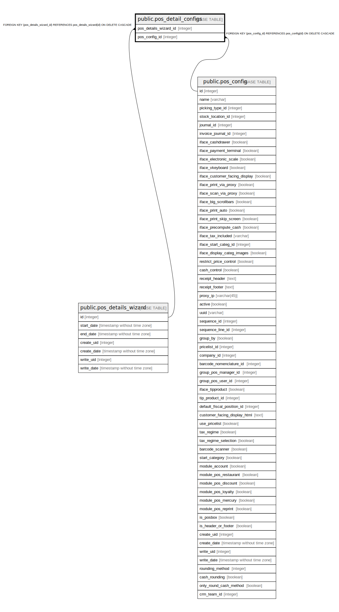

# public.pos_detail_configs

## Description

RELATION BETWEEN pos_details_wizard AND pos_config

## Columns

| Name | Type | Default | Nullable | Children | Parents | Comment |
| ---- | ---- | ------- | -------- | -------- | ------- | ------- |
| pos_details_wizard_id | integer |  | false |  | [public.pos_details_wizard](public.pos_details_wizard.md) |  |
| pos_config_id | integer |  | false |  | [public.pos_config](public.pos_config.md) |  |

## Constraints

| Name | Type | Definition |
| ---- | ---- | ---------- |
| pos_detail_configs_pos_config_id_fkey | FOREIGN KEY | FOREIGN KEY (pos_config_id) REFERENCES pos_config(id) ON DELETE CASCADE |
| pos_detail_configs_pos_details_wizard_id_fkey | FOREIGN KEY | FOREIGN KEY (pos_details_wizard_id) REFERENCES pos_details_wizard(id) ON DELETE CASCADE |
| pos_detail_configs_pos_details_wizard_id_pos_config_id_key | UNIQUE | UNIQUE (pos_details_wizard_id, pos_config_id) |

## Indexes

| Name | Definition |
| ---- | ---------- |
| pos_detail_configs_pos_details_wizard_id_pos_config_id_key | CREATE UNIQUE INDEX pos_detail_configs_pos_details_wizard_id_pos_config_id_key ON public.pos_detail_configs USING btree (pos_details_wizard_id, pos_config_id) |
| pos_detail_configs_pos_details_wizard_id_idx | CREATE INDEX pos_detail_configs_pos_details_wizard_id_idx ON public.pos_detail_configs USING btree (pos_details_wizard_id) |
| pos_detail_configs_pos_config_id_idx | CREATE INDEX pos_detail_configs_pos_config_id_idx ON public.pos_detail_configs USING btree (pos_config_id) |

## Relations

---

> Generated by [tbls](https://github.com/k1LoW/tbls)
