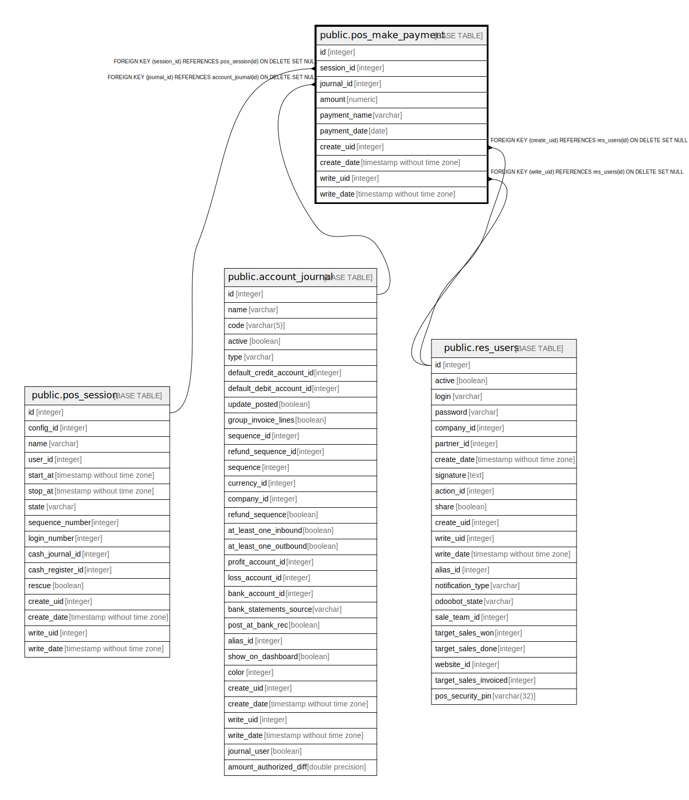

# public.pos_make_payment

## Description

Point of Sale Payment

## Columns

| Name | Type | Default | Nullable | Children | Parents | Comment |
| ---- | ---- | ------- | -------- | -------- | ------- | ------- |
| id | integer | nextval('pos_make_payment_id_seq'::regclass) | false |  |  |  |
| session_id | integer |  | false |  | [public.pos_session](public.pos_session.md) | Session |
| journal_id | integer |  | false |  | [public.account_journal](public.account_journal.md) | Payment Mode |
| amount | numeric |  | false |  |  | Amount |
| payment_name | varchar |  | true |  |  | Payment Reference |
| payment_date | date |  | false |  |  | Payment Date |
| create_uid | integer |  | true |  | [public.res_users](public.res_users.md) | Created by |
| create_date | timestamp without time zone |  | true |  |  | Created on |
| write_uid | integer |  | true |  | [public.res_users](public.res_users.md) | Last Updated by |
| write_date | timestamp without time zone |  | true |  |  | Last Updated on |

## Constraints

| Name | Type | Definition |
| ---- | ---- | ---------- |
| pos_make_payment_create_uid_fkey | FOREIGN KEY | FOREIGN KEY (create_uid) REFERENCES res_users(id) ON DELETE SET NULL |
| pos_make_payment_write_uid_fkey | FOREIGN KEY | FOREIGN KEY (write_uid) REFERENCES res_users(id) ON DELETE SET NULL |
| pos_make_payment_journal_id_fkey | FOREIGN KEY | FOREIGN KEY (journal_id) REFERENCES account_journal(id) ON DELETE SET NULL |
| pos_make_payment_session_id_fkey | FOREIGN KEY | FOREIGN KEY (session_id) REFERENCES pos_session(id) ON DELETE SET NULL |
| pos_make_payment_pkey | PRIMARY KEY | PRIMARY KEY (id) |

## Indexes

| Name | Definition |
| ---- | ---------- |
| pos_make_payment_pkey | CREATE UNIQUE INDEX pos_make_payment_pkey ON public.pos_make_payment USING btree (id) |

## Relations

---

> Generated by [tbls](https://github.com/k1LoW/tbls)
