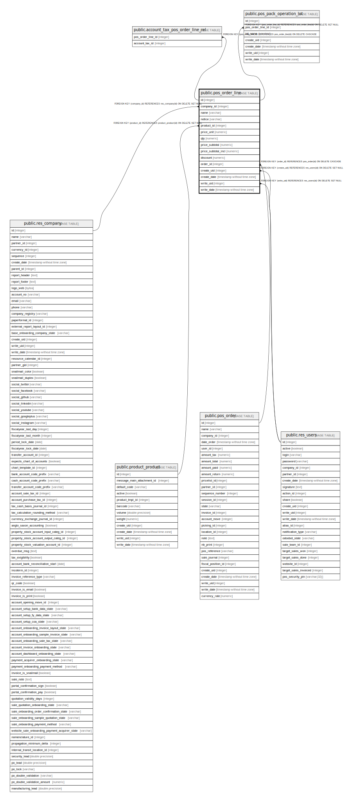

# public.pos_order_line

## Description

Point of Sale Order Lines

## Columns

| Name | Type | Default | Nullable | Children | Parents | Comment |
| ---- | ---- | ------- | -------- | -------- | ------- | ------- |
| id | integer | nextval('pos_order_line_id_seq'::regclass) | false | [public.account_tax_pos_order_line_rel](public.account_tax_pos_order_line_rel.md) [public.pos_pack_operation_lot](public.pos_pack_operation_lot.md) |  |  |
| company_id | integer |  | false |  | [public.res_company](public.res_company.md) | Company |
| name | varchar |  | false |  |  | Line No |
| notice | varchar |  | true |  |  | Discount Notice |
| product_id | integer |  | false |  | [public.product_product](public.product_product.md) | Product |
| price_unit | numeric |  | true |  |  | Unit Price |
| qty | numeric |  | true |  |  | Quantity |
| price_subtotal | numeric |  | false |  |  | Subtotal w/o Tax |
| price_subtotal_incl | numeric |  | false |  |  | Subtotal |
| discount | numeric |  | true |  |  | Discount (%) |
| order_id | integer |  | true |  | [public.pos_order](public.pos_order.md) | Order Ref |
| create_uid | integer |  | true |  | [public.res_users](public.res_users.md) | Created by |
| create_date | timestamp without time zone |  | true |  |  | Created on |
| write_uid | integer |  | true |  | [public.res_users](public.res_users.md) | Last Updated by |
| write_date | timestamp without time zone |  | true |  |  | Last Updated on |

## Constraints

| Name | Type | Definition |
| ---- | ---- | ---------- |
| pos_order_line_create_uid_fkey | FOREIGN KEY | FOREIGN KEY (create_uid) REFERENCES res_users(id) ON DELETE SET NULL |
| pos_order_line_write_uid_fkey | FOREIGN KEY | FOREIGN KEY (write_uid) REFERENCES res_users(id) ON DELETE SET NULL |
| pos_order_line_company_id_fkey | FOREIGN KEY | FOREIGN KEY (company_id) REFERENCES res_company(id) ON DELETE SET NULL |
| pos_order_line_product_id_fkey | FOREIGN KEY | FOREIGN KEY (product_id) REFERENCES product_product(id) ON DELETE SET NULL |
| pos_order_line_order_id_fkey | FOREIGN KEY | FOREIGN KEY (order_id) REFERENCES pos_order(id) ON DELETE CASCADE |
| pos_order_line_pkey | PRIMARY KEY | PRIMARY KEY (id) |

## Indexes

| Name | Definition |
| ---- | ---------- |
| pos_order_line_pkey | CREATE UNIQUE INDEX pos_order_line_pkey ON public.pos_order_line USING btree (id) |

## Relations

---

> Generated by [tbls](https://github.com/k1LoW/tbls)
