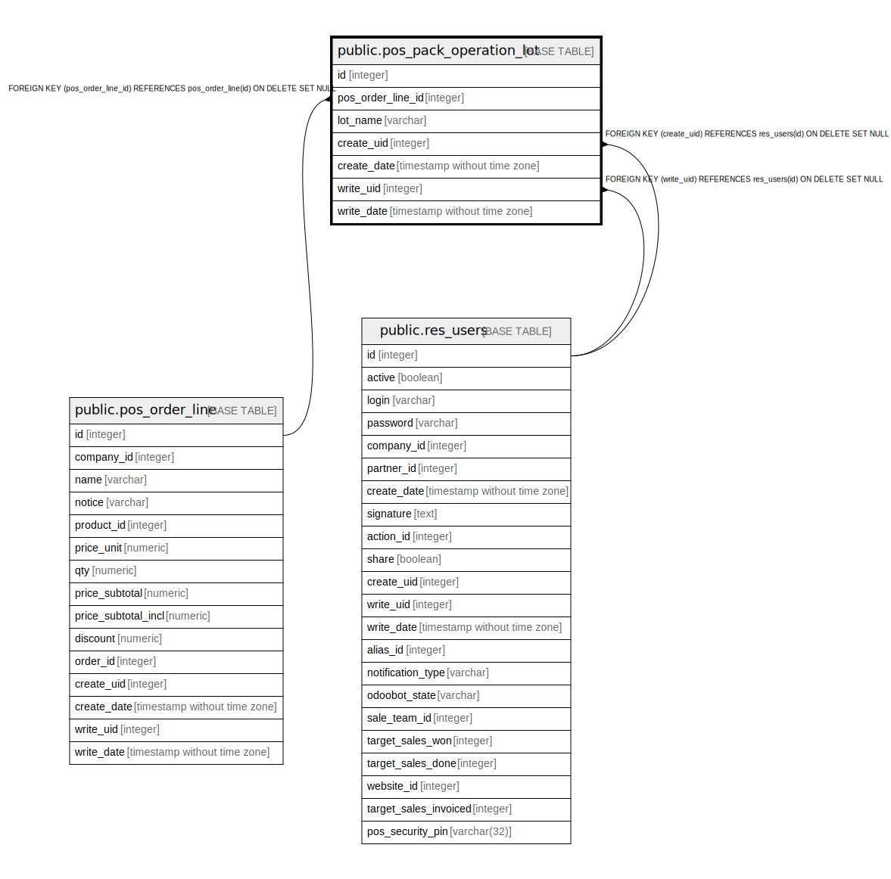

# public.pos_pack_operation_lot

## Description

Specify product lot/serial number in pos order line

## Columns

| Name | Type | Default | Nullable | Children | Parents | Comment |
| ---- | ---- | ------- | -------- | -------- | ------- | ------- |
| id | integer | nextval('pos_pack_operation_lot_id_seq'::regclass) | false |  |  |  |
| pos_order_line_id | integer |  | true |  | [public.pos_order_line](public.pos_order_line.md) | Pos Order Line |
| lot_name | varchar |  | true |  |  | Lot Name |
| create_uid | integer |  | true |  | [public.res_users](public.res_users.md) | Created by |
| create_date | timestamp without time zone |  | true |  |  | Created on |
| write_uid | integer |  | true |  | [public.res_users](public.res_users.md) | Last Updated by |
| write_date | timestamp without time zone |  | true |  |  | Last Updated on |

## Constraints

| Name | Type | Definition |
| ---- | ---- | ---------- |
| pos_pack_operation_lot_create_uid_fkey | FOREIGN KEY | FOREIGN KEY (create_uid) REFERENCES res_users(id) ON DELETE SET NULL |
| pos_pack_operation_lot_write_uid_fkey | FOREIGN KEY | FOREIGN KEY (write_uid) REFERENCES res_users(id) ON DELETE SET NULL |
| pos_pack_operation_lot_pos_order_line_id_fkey | FOREIGN KEY | FOREIGN KEY (pos_order_line_id) REFERENCES pos_order_line(id) ON DELETE SET NULL |
| pos_pack_operation_lot_pkey | PRIMARY KEY | PRIMARY KEY (id) |

## Indexes

| Name | Definition |
| ---- | ---------- |
| pos_pack_operation_lot_pkey | CREATE UNIQUE INDEX pos_pack_operation_lot_pkey ON public.pos_pack_operation_lot USING btree (id) |

## Relations

---

> Generated by [tbls](https://github.com/k1LoW/tbls)
