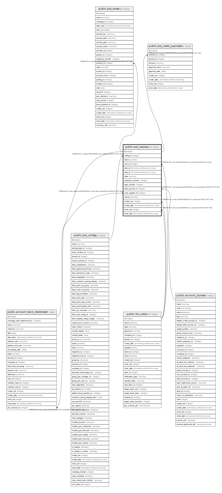

# public.pos_session

## Description

Point of Sale Session

## Columns

| Name | Type | Default | Nullable | Children | Parents | Comment |
| ---- | ---- | ------- | -------- | -------- | ------- | ------- |
| id | integer | nextval('pos_session_id_seq'::regclass) | false | [public.account_bank_statement](public.account_bank_statement.md) [public.pos_order](public.pos_order.md) [public.pos_make_payment](public.pos_make_payment.md) |  |  |
| config_id | integer |  | false |  | [public.pos_config](public.pos_config.md) | Point of Sale |
| name | varchar |  | false |  |  | Session ID |
| user_id | integer |  | false |  | [public.res_users](public.res_users.md) | Responsible |
| start_at | timestamp without time zone |  | true |  |  | Opening Date |
| stop_at | timestamp without time zone |  | true |  |  | Closing Date |
| state | varchar |  | false |  |  | Status |
| sequence_number | integer |  | true |  |  | Order Sequence Number |
| login_number | integer |  | true |  |  | Login Sequence Number |
| cash_journal_id | integer |  | true |  | [public.account_journal](public.account_journal.md) | Cash Journal |
| cash_register_id | integer |  | true |  | [public.account_bank_statement](public.account_bank_statement.md) | Cash Register |
| rescue | boolean |  | true |  |  | Recovery Session |
| create_uid | integer |  | true |  | [public.res_users](public.res_users.md) | Created by |
| create_date | timestamp without time zone |  | true |  |  | Created on |
| write_uid | integer |  | true |  | [public.res_users](public.res_users.md) | Last Updated by |
| write_date | timestamp without time zone |  | true |  |  | Last Updated on |

## Constraints

| Name | Type | Definition | Comment |
| ---- | ---- | ---------- | ------- |
| pos_session_create_uid_fkey | FOREIGN KEY | FOREIGN KEY (create_uid) REFERENCES res_users(id) ON DELETE SET NULL |  |
| pos_session_user_id_fkey | FOREIGN KEY | FOREIGN KEY (user_id) REFERENCES res_users(id) ON DELETE SET NULL |  |
| pos_session_write_uid_fkey | FOREIGN KEY | FOREIGN KEY (write_uid) REFERENCES res_users(id) ON DELETE SET NULL |  |
| pos_session_cash_journal_id_fkey | FOREIGN KEY | FOREIGN KEY (cash_journal_id) REFERENCES account_journal(id) ON DELETE SET NULL |  |
| pos_session_cash_register_id_fkey | FOREIGN KEY | FOREIGN KEY (cash_register_id) REFERENCES account_bank_statement(id) ON DELETE SET NULL |  |
| pos_session_config_id_fkey | FOREIGN KEY | FOREIGN KEY (config_id) REFERENCES pos_config(id) ON DELETE SET NULL |  |
| pos_session_pkey | PRIMARY KEY | PRIMARY KEY (id) |  |
| pos_session_uniq_name | UNIQUE | UNIQUE (name) | unique(name) |

## Indexes

| Name | Definition |
| ---- | ---------- |
| pos_session_pkey | CREATE UNIQUE INDEX pos_session_pkey ON public.pos_session USING btree (id) |
| pos_session_config_id_index | CREATE INDEX pos_session_config_id_index ON public.pos_session USING btree (config_id) |
| pos_session_user_id_index | CREATE INDEX pos_session_user_id_index ON public.pos_session USING btree (user_id) |
| pos_session_state_index | CREATE INDEX pos_session_state_index ON public.pos_session USING btree (state) |
| pos_session_uniq_name | CREATE UNIQUE INDEX pos_session_uniq_name ON public.pos_session USING btree (name) |

## Relations

---

> Generated by [tbls](https://github.com/k1LoW/tbls)
