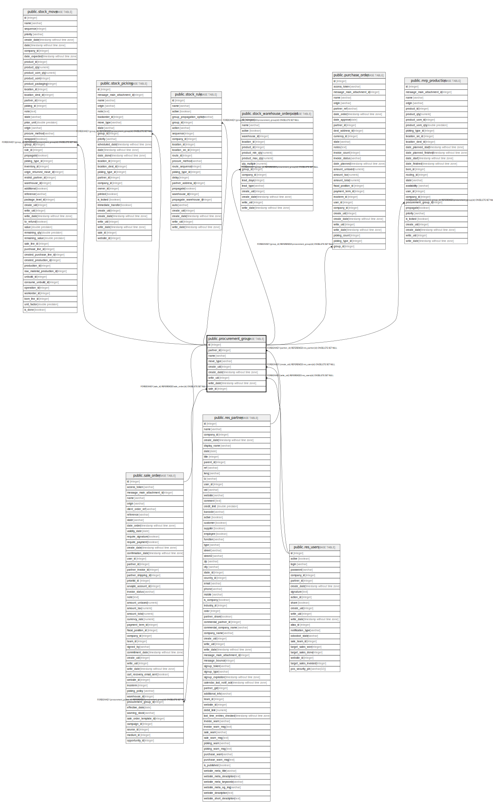

# public.procurement_group

## Description

Procurement Group

## Columns

| Name | Type | Default | Nullable | Children | Parents | Comment |
| ---- | ---- | ------- | -------- | -------- | ------- | ------- |
| id | integer | nextval('procurement_group_id_seq'::regclass) | false | [public.sale_order](public.sale_order.md) [public.stock_move](public.stock_move.md) [public.stock_picking](public.stock_picking.md) [public.stock_rule](public.stock_rule.md) [public.stock_warehouse_orderpoint](public.stock_warehouse_orderpoint.md) [public.purchase_order](public.purchase_order.md) [public.mrp_production](public.mrp_production.md) |  |  |
| partner_id | integer |  | true |  | [public.res_partner](public.res_partner.md) | Partner |
| name | varchar |  | false |  |  | Reference |
| move_type | varchar |  | false |  |  | Delivery Type |
| create_uid | integer |  | true |  | [public.res_users](public.res_users.md) | Created by |
| create_date | timestamp without time zone |  | true |  |  | Created on |
| write_uid | integer |  | true |  | [public.res_users](public.res_users.md) | Last Updated by |
| write_date | timestamp without time zone |  | true |  |  | Last Updated on |
| sale_id | integer |  | true |  | [public.sale_order](public.sale_order.md) | Sale Order |

## Constraints

| Name | Type | Definition |
| ---- | ---- | ---------- |
| procurement_group_create_uid_fkey | FOREIGN KEY | FOREIGN KEY (create_uid) REFERENCES res_users(id) ON DELETE SET NULL |
| procurement_group_write_uid_fkey | FOREIGN KEY | FOREIGN KEY (write_uid) REFERENCES res_users(id) ON DELETE SET NULL |
| procurement_group_partner_id_fkey | FOREIGN KEY | FOREIGN KEY (partner_id) REFERENCES res_partner(id) ON DELETE SET NULL |
| procurement_group_sale_id_fkey | FOREIGN KEY | FOREIGN KEY (sale_id) REFERENCES sale_order(id) ON DELETE SET NULL |
| procurement_group_pkey | PRIMARY KEY | PRIMARY KEY (id) |

## Indexes

| Name | Definition |
| ---- | ---------- |
| procurement_group_pkey | CREATE UNIQUE INDEX procurement_group_pkey ON public.procurement_group USING btree (id) |

## Relations

---

> Generated by [tbls](https://github.com/k1LoW/tbls)
