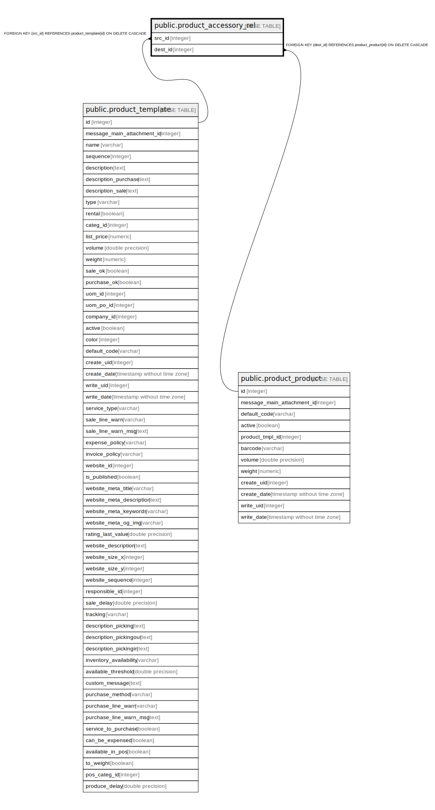

# public.product_accessory_rel

## Description

RELATION BETWEEN product_template AND product_product

## Columns

| Name | Type | Default | Nullable | Children | Parents | Comment |
| ---- | ---- | ------- | -------- | -------- | ------- | ------- |
| src_id | integer |  | false |  | [public.product_template](public.product_template.md) |  |
| dest_id | integer |  | false |  | [public.product_product](public.product_product.md) |  |

## Constraints

| Name | Type | Definition |
| ---- | ---- | ---------- |
| product_accessory_rel_src_id_fkey | FOREIGN KEY | FOREIGN KEY (src_id) REFERENCES product_template(id) ON DELETE CASCADE |
| product_accessory_rel_dest_id_fkey | FOREIGN KEY | FOREIGN KEY (dest_id) REFERENCES product_product(id) ON DELETE CASCADE |
| product_accessory_rel_src_id_dest_id_key | UNIQUE | UNIQUE (src_id, dest_id) |

## Indexes

| Name | Definition |
| ---- | ---------- |
| product_accessory_rel_src_id_dest_id_key | CREATE UNIQUE INDEX product_accessory_rel_src_id_dest_id_key ON public.product_accessory_rel USING btree (src_id, dest_id) |
| product_accessory_rel_src_id_idx | CREATE INDEX product_accessory_rel_src_id_idx ON public.product_accessory_rel USING btree (src_id) |
| product_accessory_rel_dest_id_idx | CREATE INDEX product_accessory_rel_dest_id_idx ON public.product_accessory_rel USING btree (dest_id) |

## Relations

---

> Generated by [tbls](https://github.com/k1LoW/tbls)
