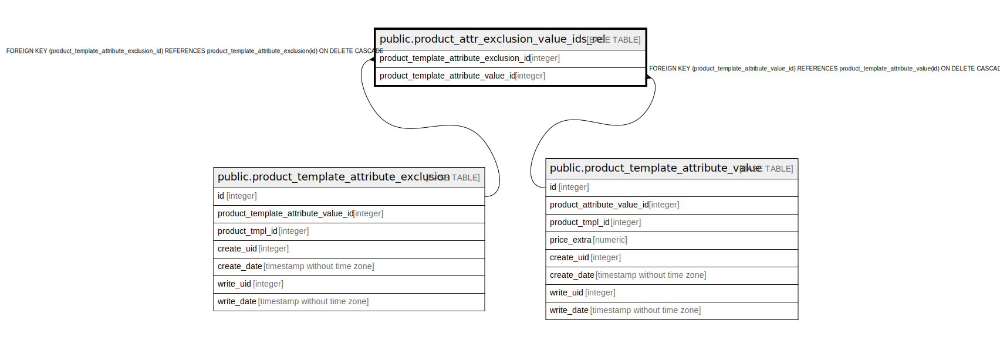

# public.product_attr_exclusion_value_ids_rel

## Description

RELATION BETWEEN product_template_attribute_exclusion AND product_template_attribute_value

## Columns

| Name | Type | Default | Nullable | Children | Parents | Comment |
| ---- | ---- | ------- | -------- | -------- | ------- | ------- |
| product_template_attribute_exclusion_id | integer |  | false |  | [public.product_template_attribute_exclusion](public.product_template_attribute_exclusion.md) |  |
| product_template_attribute_value_id | integer |  | false |  | [public.product_template_attribute_value](public.product_template_attribute_value.md) |  |

## Constraints

| Name | Type | Definition |
| ---- | ---- | ---------- |
| product_attr_exclusion_value__product_template_attribute_v_fkey | FOREIGN KEY | FOREIGN KEY (product_template_attribute_value_id) REFERENCES product_template_attribute_value(id) ON DELETE CASCADE |
| product_attr_exclusion_value__product_template_attribute_e_fkey | FOREIGN KEY | FOREIGN KEY (product_template_attribute_exclusion_id) REFERENCES product_template_attribute_exclusion(id) ON DELETE CASCADE |
| product_attr_exclusion_value__product_template_attribute_ex_key | UNIQUE | UNIQUE (product_template_attribute_exclusion_id, product_template_attribute_value_id) |

## Indexes

| Name | Definition |
| ---- | ---------- |
| product_attr_exclusion_value__product_template_attribute_ex_key | CREATE UNIQUE INDEX product_attr_exclusion_value__product_template_attribute_ex_key ON public.product_attr_exclusion_value_ids_rel USING btree (product_template_attribute_exclusion_id, product_template_attribute_value_id) |
| product_attr_exclusion_value__product_template_attribute_ex_idx | CREATE INDEX product_attr_exclusion_value__product_template_attribute_ex_idx ON public.product_attr_exclusion_value_ids_rel USING btree (product_template_attribute_exclusion_id) |
| product_attr_exclusion_value__product_template_attribute_va_idx | CREATE INDEX product_attr_exclusion_value__product_template_attribute_va_idx ON public.product_attr_exclusion_value_ids_rel USING btree (product_template_attribute_value_id) |

## Relations

---

> Generated by [tbls](https://github.com/k1LoW/tbls)
