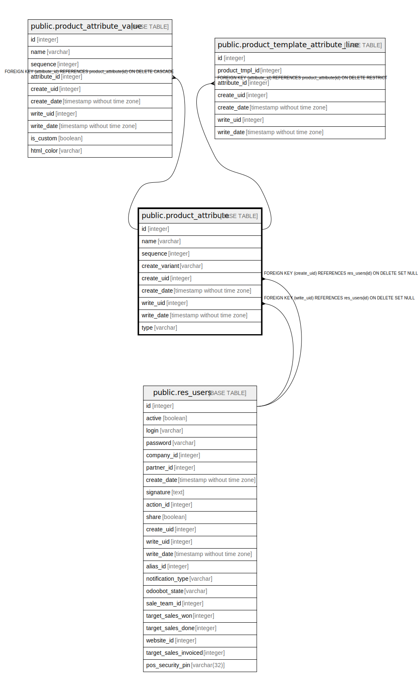

# public.product_attribute

## Description

Product Attribute

## Columns

| Name | Type | Default | Nullable | Children | Parents | Comment |
| ---- | ---- | ------- | -------- | -------- | ------- | ------- |
| id | integer | nextval('product_attribute_id_seq'::regclass) | false | [public.product_attribute_value](public.product_attribute_value.md) [public.product_template_attribute_line](public.product_template_attribute_line.md) |  |  |
| name | varchar |  | false |  |  | Attribute |
| sequence | integer |  | true |  |  | Sequence |
| create_variant | varchar |  | false |  |  | Create Variants |
| create_uid | integer |  | true |  | [public.res_users](public.res_users.md) | Created by |
| create_date | timestamp without time zone |  | true |  |  | Created on |
| write_uid | integer |  | true |  | [public.res_users](public.res_users.md) | Last Updated by |
| write_date | timestamp without time zone |  | true |  |  | Last Updated on |
| type | varchar |  | false |  |  | Type |

## Constraints

| Name | Type | Definition |
| ---- | ---- | ---------- |
| product_attribute_create_uid_fkey | FOREIGN KEY | FOREIGN KEY (create_uid) REFERENCES res_users(id) ON DELETE SET NULL |
| product_attribute_write_uid_fkey | FOREIGN KEY | FOREIGN KEY (write_uid) REFERENCES res_users(id) ON DELETE SET NULL |
| product_attribute_pkey | PRIMARY KEY | PRIMARY KEY (id) |

## Indexes

| Name | Definition |
| ---- | ---------- |
| product_attribute_pkey | CREATE UNIQUE INDEX product_attribute_pkey ON public.product_attribute USING btree (id) |
| product_attribute_sequence_index | CREATE INDEX product_attribute_sequence_index ON public.product_attribute USING btree (sequence) |

## Relations

---

> Generated by [tbls](https://github.com/k1LoW/tbls)
