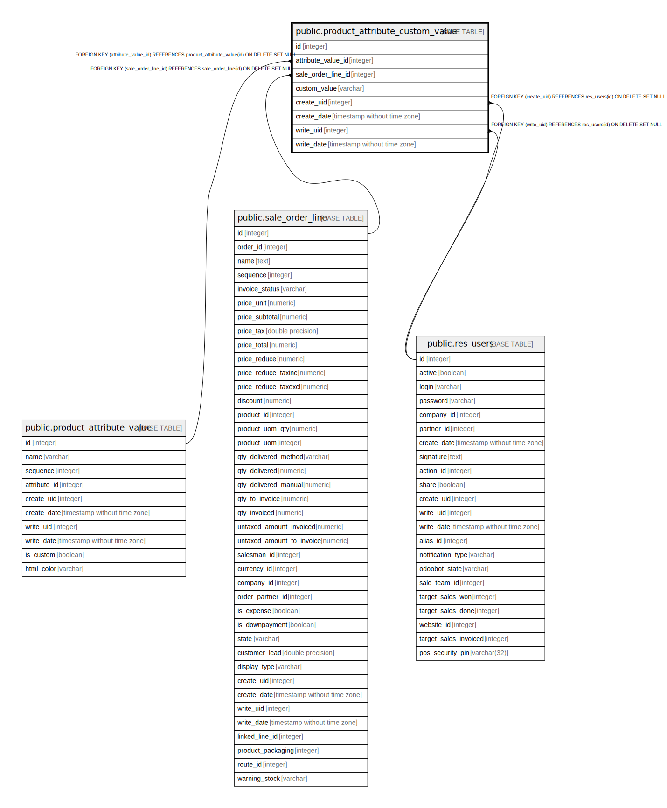

# public.product_attribute_custom_value

## Description

Product Attribute Custom Value

## Columns

| Name | Type | Default | Nullable | Children | Parents | Comment |
| ---- | ---- | ------- | -------- | -------- | ------- | ------- |
| id | integer | nextval('product_attribute_custom_value_id_seq'::regclass) | false |  |  |  |
| attribute_value_id | integer |  | true |  | [public.product_attribute_value](public.product_attribute_value.md) | Attribute |
| sale_order_line_id | integer |  | true |  | [public.sale_order_line](public.sale_order_line.md) | Sale order line |
| custom_value | varchar |  | true |  |  | Custom value |
| create_uid | integer |  | true |  | [public.res_users](public.res_users.md) | Created by |
| create_date | timestamp without time zone |  | true |  |  | Created on |
| write_uid | integer |  | true |  | [public.res_users](public.res_users.md) | Last Updated by |
| write_date | timestamp without time zone |  | true |  |  | Last Updated on |

## Constraints

| Name | Type | Definition |
| ---- | ---- | ---------- |
| product_attribute_custom_value_create_uid_fkey | FOREIGN KEY | FOREIGN KEY (create_uid) REFERENCES res_users(id) ON DELETE SET NULL |
| product_attribute_custom_value_write_uid_fkey | FOREIGN KEY | FOREIGN KEY (write_uid) REFERENCES res_users(id) ON DELETE SET NULL |
| product_attribute_custom_value_attribute_value_id_fkey | FOREIGN KEY | FOREIGN KEY (attribute_value_id) REFERENCES product_attribute_value(id) ON DELETE SET NULL |
| product_attribute_custom_value_pkey | PRIMARY KEY | PRIMARY KEY (id) |
| product_attribute_custom_value_sale_order_line_id_fkey | FOREIGN KEY | FOREIGN KEY (sale_order_line_id) REFERENCES sale_order_line(id) ON DELETE SET NULL |

## Indexes

| Name | Definition |
| ---- | ---------- |
| product_attribute_custom_value_pkey | CREATE UNIQUE INDEX product_attribute_custom_value_pkey ON public.product_attribute_custom_value USING btree (id) |

## Relations

---

> Generated by [tbls](https://github.com/k1LoW/tbls)
