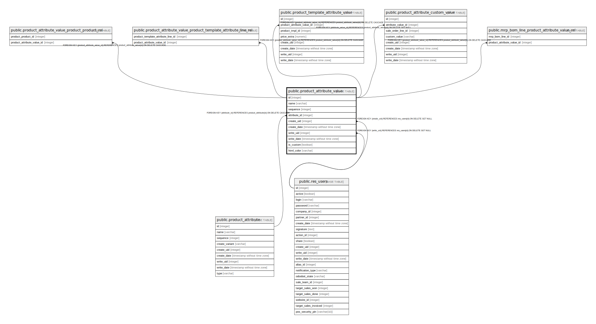

# public.product_attribute_value

## Description

Attribute Value

## Columns

| Name | Type | Default | Nullable | Children | Parents | Comment |
| ---- | ---- | ------- | -------- | -------- | ------- | ------- |
| id | integer | nextval('product_attribute_value_id_seq'::regclass) | false | [public.product_attribute_value_product_product_rel](public.product_attribute_value_product_product_rel.md) [public.product_attribute_value_product_template_attribute_line_rel](public.product_attribute_value_product_template_attribute_line_rel.md) [public.product_template_attribute_value](public.product_template_attribute_value.md) [public.product_attribute_custom_value](public.product_attribute_custom_value.md) [public.mrp_bom_line_product_attribute_value_rel](public.mrp_bom_line_product_attribute_value_rel.md) |  |  |
| name | varchar |  | false |  |  | Value |
| sequence | integer |  | true |  |  | Sequence |
| attribute_id | integer |  | false |  | [public.product_attribute](public.product_attribute.md) | Attribute |
| create_uid | integer |  | true |  | [public.res_users](public.res_users.md) | Created by |
| create_date | timestamp without time zone |  | true |  |  | Created on |
| write_uid | integer |  | true |  | [public.res_users](public.res_users.md) | Last Updated by |
| write_date | timestamp without time zone |  | true |  |  | Last Updated on |
| is_custom | boolean |  | true |  |  | Is custom value |
| html_color | varchar |  | true |  |  | HTML Color Index |

## Constraints

| Name | Type | Definition | Comment |
| ---- | ---- | ---------- | ------- |
| product_attribute_value_create_uid_fkey | FOREIGN KEY | FOREIGN KEY (create_uid) REFERENCES res_users(id) ON DELETE SET NULL |  |
| product_attribute_value_write_uid_fkey | FOREIGN KEY | FOREIGN KEY (write_uid) REFERENCES res_users(id) ON DELETE SET NULL |  |
| product_attribute_value_attribute_id_fkey | FOREIGN KEY | FOREIGN KEY (attribute_id) REFERENCES product_attribute(id) ON DELETE CASCADE |  |
| product_attribute_value_pkey | PRIMARY KEY | PRIMARY KEY (id) |  |
| product_attribute_value_value_company_uniq | UNIQUE | UNIQUE (name, attribute_id) | unique (name, attribute_id) |

## Indexes

| Name | Definition |
| ---- | ---------- |
| product_attribute_value_pkey | CREATE UNIQUE INDEX product_attribute_value_pkey ON public.product_attribute_value USING btree (id) |
| product_attribute_value_sequence_index | CREATE INDEX product_attribute_value_sequence_index ON public.product_attribute_value USING btree (sequence) |
| product_attribute_value_attribute_id_index | CREATE INDEX product_attribute_value_attribute_id_index ON public.product_attribute_value USING btree (attribute_id) |
| product_attribute_value_value_company_uniq | CREATE UNIQUE INDEX product_attribute_value_value_company_uniq ON public.product_attribute_value USING btree (name, attribute_id) |

## Relations

---

> Generated by [tbls](https://github.com/k1LoW/tbls)
