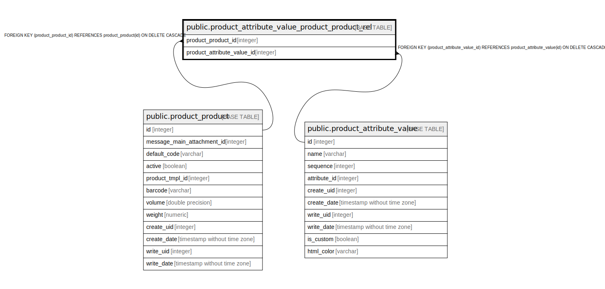

# public.product_attribute_value_product_product_rel

## Description

RELATION BETWEEN product_product AND product_attribute_value

## Columns

| Name | Type | Default | Nullable | Children | Parents | Comment |
| ---- | ---- | ------- | -------- | -------- | ------- | ------- |
| product_product_id | integer |  | false |  | [public.product_product](public.product_product.md) |  |
| product_attribute_value_id | integer |  | false |  | [public.product_attribute_value](public.product_attribute_value.md) |  |

## Constraints

| Name | Type | Definition |
| ---- | ---- | ---------- |
| product_attribute_value_product_product_product_product_id_fkey | FOREIGN KEY | FOREIGN KEY (product_product_id) REFERENCES product_product(id) ON DELETE CASCADE |
| product_attribute_value_produ_product_product_id_product_at_key | UNIQUE | UNIQUE (product_product_id, product_attribute_value_id) |
| product_attribute_value_product_product_attribute_value_id_fkey | FOREIGN KEY | FOREIGN KEY (product_attribute_value_id) REFERENCES product_attribute_value(id) ON DELETE CASCADE |

## Indexes

| Name | Definition |
| ---- | ---------- |
| product_attribute_value_produ_product_product_id_product_at_key | CREATE UNIQUE INDEX product_attribute_value_produ_product_product_id_product_at_key ON public.product_attribute_value_product_product_rel USING btree (product_product_id, product_attribute_value_id) |
| product_attribute_value_product_product__product_product_id_idx | CREATE INDEX product_attribute_value_product_product__product_product_id_idx ON public.product_attribute_value_product_product_rel USING btree (product_product_id) |
| product_attribute_value_product__product_attribute_value_id_idx | CREATE INDEX product_attribute_value_product__product_attribute_value_id_idx ON public.product_attribute_value_product_product_rel USING btree (product_attribute_value_id) |

## Relations

---

> Generated by [tbls](https://github.com/k1LoW/tbls)
