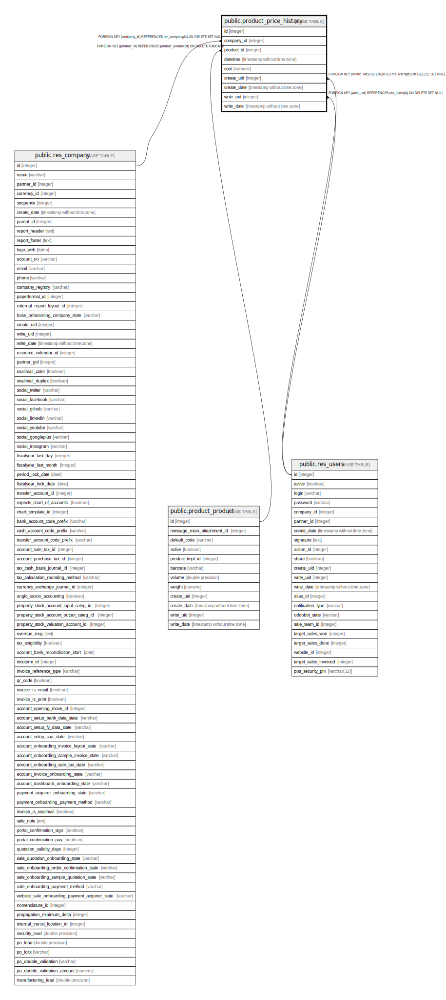

# public.product_price_history

## Description

Product Price List History

## Columns

| Name | Type | Default | Nullable | Children | Parents | Comment |
| ---- | ---- | ------- | -------- | -------- | ------- | ------- |
| id | integer | nextval('product_price_history_id_seq'::regclass) | false |  |  |  |
| company_id | integer |  | false |  | [public.res_company](public.res_company.md) | Company |
| product_id | integer |  | false |  | [public.product_product](public.product_product.md) | Product |
| datetime | timestamp without time zone |  | true |  |  | Date |
| cost | numeric |  | true |  |  | Cost |
| create_uid | integer |  | true |  | [public.res_users](public.res_users.md) | Created by |
| create_date | timestamp without time zone |  | true |  |  | Created on |
| write_uid | integer |  | true |  | [public.res_users](public.res_users.md) | Last Updated by |
| write_date | timestamp without time zone |  | true |  |  | Last Updated on |

## Constraints

| Name | Type | Definition |
| ---- | ---- | ---------- |
| product_price_history_create_uid_fkey | FOREIGN KEY | FOREIGN KEY (create_uid) REFERENCES res_users(id) ON DELETE SET NULL |
| product_price_history_write_uid_fkey | FOREIGN KEY | FOREIGN KEY (write_uid) REFERENCES res_users(id) ON DELETE SET NULL |
| product_price_history_company_id_fkey | FOREIGN KEY | FOREIGN KEY (company_id) REFERENCES res_company(id) ON DELETE SET NULL |
| product_price_history_pkey | PRIMARY KEY | PRIMARY KEY (id) |
| product_price_history_product_id_fkey | FOREIGN KEY | FOREIGN KEY (product_id) REFERENCES product_product(id) ON DELETE CASCADE |

## Indexes

| Name | Definition |
| ---- | ---------- |
| product_price_history_pkey | CREATE UNIQUE INDEX product_price_history_pkey ON public.product_price_history USING btree (id) |

## Relations

---

> Generated by [tbls](https://github.com/k1LoW/tbls)
