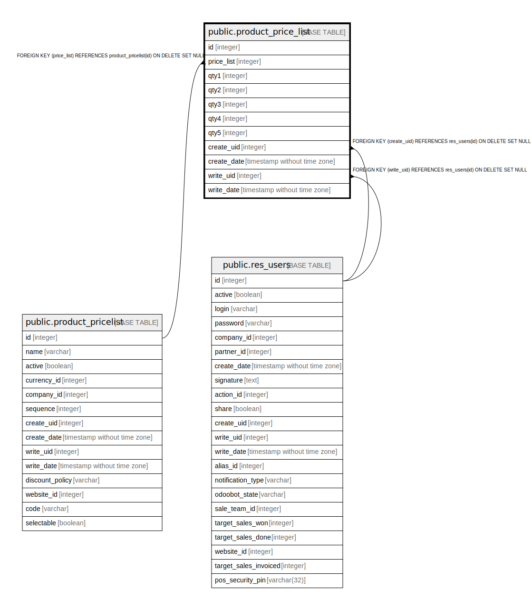

# public.product_price_list

## Description

Product Price per Unit Based on Pricelist Version

## Columns

| Name | Type | Default | Nullable | Children | Parents | Comment |
| ---- | ---- | ------- | -------- | -------- | ------- | ------- |
| id | integer | nextval('product_price_list_id_seq'::regclass) | false |  |  |  |
| price_list | integer |  | false |  | [public.product_pricelist](public.product_pricelist.md) | PriceList |
| qty1 | integer |  | true |  |  | Quantity-1 |
| qty2 | integer |  | true |  |  | Quantity-2 |
| qty3 | integer |  | true |  |  | Quantity-3 |
| qty4 | integer |  | true |  |  | Quantity-4 |
| qty5 | integer |  | true |  |  | Quantity-5 |
| create_uid | integer |  | true |  | [public.res_users](public.res_users.md) | Created by |
| create_date | timestamp without time zone |  | true |  |  | Created on |
| write_uid | integer |  | true |  | [public.res_users](public.res_users.md) | Last Updated by |
| write_date | timestamp without time zone |  | true |  |  | Last Updated on |

## Constraints

| Name | Type | Definition |
| ---- | ---- | ---------- |
| product_price_list_create_uid_fkey | FOREIGN KEY | FOREIGN KEY (create_uid) REFERENCES res_users(id) ON DELETE SET NULL |
| product_price_list_write_uid_fkey | FOREIGN KEY | FOREIGN KEY (write_uid) REFERENCES res_users(id) ON DELETE SET NULL |
| product_price_list_price_list_fkey | FOREIGN KEY | FOREIGN KEY (price_list) REFERENCES product_pricelist(id) ON DELETE SET NULL |
| product_price_list_pkey | PRIMARY KEY | PRIMARY KEY (id) |

## Indexes

| Name | Definition |
| ---- | ---------- |
| product_price_list_pkey | CREATE UNIQUE INDEX product_price_list_pkey ON public.product_price_list USING btree (id) |

## Relations

---

> Generated by [tbls](https://github.com/k1LoW/tbls)
