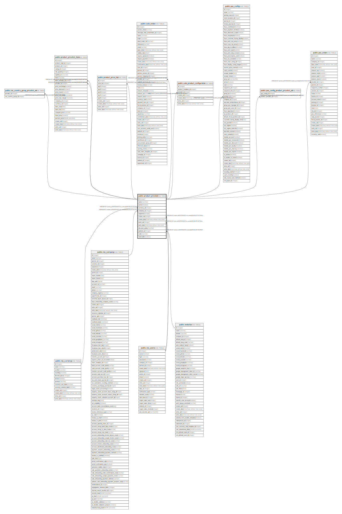

# public.product_pricelist

## Description

Pricelist

## Columns

| Name | Type | Default | Nullable | Children | Parents | Comment |
| ---- | ---- | ------- | -------- | -------- | ------- | ------- |
| id | integer | nextval('product_pricelist_id_seq'::regclass) | false | [public.res_country_group_pricelist_rel](public.res_country_group_pricelist_rel.md) [public.product_pricelist_item](public.product_pricelist_item.md) [public.product_price_list](public.product_price_list.md) [public.sale_order](public.sale_order.md) [public.sale_product_configurator](public.sale_product_configurator.md) [public.pos_config](public.pos_config.md) [public.pos_config_product_pricelist_rel](public.pos_config_product_pricelist_rel.md) [public.pos_order](public.pos_order.md) |  |  |
| name | varchar |  | false |  |  | Pricelist Name |
| active | boolean |  | true |  |  | Active |
| currency_id | integer |  | false |  | [public.res_currency](public.res_currency.md) | Currency |
| company_id | integer |  | true |  | [public.res_company](public.res_company.md) | Company |
| sequence | integer |  | true |  |  | Sequence |
| create_uid | integer |  | true |  | [public.res_users](public.res_users.md) | Created by |
| create_date | timestamp without time zone |  | true |  |  | Created on |
| write_uid | integer |  | true |  | [public.res_users](public.res_users.md) | Last Updated by |
| write_date | timestamp without time zone |  | true |  |  | Last Updated on |
| discount_policy | varchar |  | true |  |  | Discount Policy |
| website_id | integer |  | true |  | [public.website](public.website.md) | Website |
| code | varchar |  | true |  |  | E-commerce Promotional Code |
| selectable | boolean |  | true |  |  | Selectable |

## Constraints

| Name | Type | Definition |
| ---- | ---- | ---------- |
| product_pricelist_create_uid_fkey | FOREIGN KEY | FOREIGN KEY (create_uid) REFERENCES res_users(id) ON DELETE SET NULL |
| product_pricelist_write_uid_fkey | FOREIGN KEY | FOREIGN KEY (write_uid) REFERENCES res_users(id) ON DELETE SET NULL |
| product_pricelist_currency_id_fkey | FOREIGN KEY | FOREIGN KEY (currency_id) REFERENCES res_currency(id) ON DELETE SET NULL |
| product_pricelist_company_id_fkey | FOREIGN KEY | FOREIGN KEY (company_id) REFERENCES res_company(id) ON DELETE SET NULL |
| product_pricelist_website_id_fkey | FOREIGN KEY | FOREIGN KEY (website_id) REFERENCES website(id) ON DELETE RESTRICT |
| product_pricelist_pkey | PRIMARY KEY | PRIMARY KEY (id) |

## Indexes

| Name | Definition |
| ---- | ---------- |
| product_pricelist_pkey | CREATE UNIQUE INDEX product_pricelist_pkey ON public.product_pricelist USING btree (id) |

## Relations

---

> Generated by [tbls](https://github.com/k1LoW/tbls)
