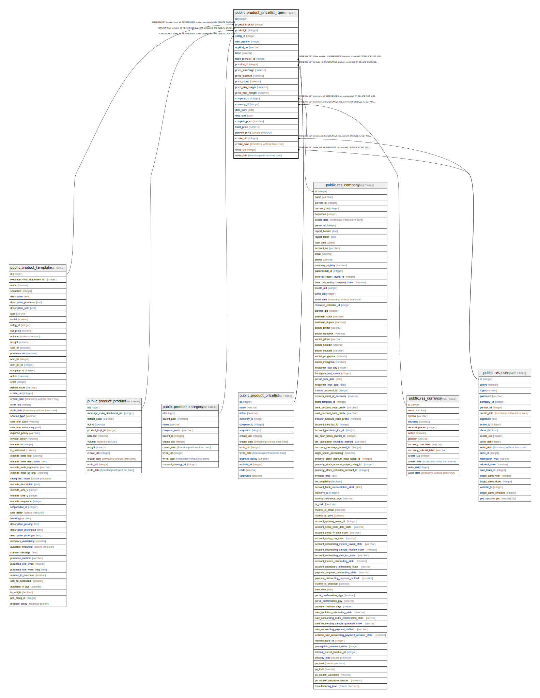

# public.product_pricelist_item

## Description

Pricelist Item

## Columns

| Name | Type | Default | Nullable | Children | Parents | Comment |
| ---- | ---- | ------- | -------- | -------- | ------- | ------- |
| id | integer | nextval('product_pricelist_item_id_seq'::regclass) | false |  |  |  |
| product_tmpl_id | integer |  | true |  | [public.product_template](public.product_template.md) | Product Template |
| product_id | integer |  | true |  | [public.product_product](public.product_product.md) | Product |
| categ_id | integer |  | true |  | [public.product_category](public.product_category.md) | Product Category |
| min_quantity | integer |  | true |  |  | Min. Quantity |
| applied_on | varchar |  | false |  |  | Apply On |
| base | varchar |  | false |  |  | Based on |
| base_pricelist_id | integer |  | true |  | [public.product_pricelist](public.product_pricelist.md) | Other Pricelist |
| pricelist_id | integer |  | true |  | [public.product_pricelist](public.product_pricelist.md) | Pricelist |
| price_surcharge | numeric |  | true |  |  | Price Surcharge |
| price_discount | numeric |  | true |  |  | Price Discount |
| price_round | numeric |  | true |  |  | Price Rounding |
| price_min_margin | numeric |  | true |  |  | Min. Price Margin |
| price_max_margin | numeric |  | true |  |  | Max. Price Margin |
| company_id | integer |  | true |  | [public.res_company](public.res_company.md) | Company |
| currency_id | integer |  | true |  | [public.res_currency](public.res_currency.md) | Currency |
| date_start | date |  | true |  |  | Start Date |
| date_end | date |  | true |  |  | End Date |
| compute_price | varchar |  | true |  |  | Compute Price |
| fixed_price | numeric |  | true |  |  | Fixed Price |
| percent_price | double precision |  | true |  |  | Percentage Price |
| create_uid | integer |  | true |  | [public.res_users](public.res_users.md) | Created by |
| create_date | timestamp without time zone |  | true |  |  | Created on |
| write_uid | integer |  | true |  | [public.res_users](public.res_users.md) | Last Updated by |
| write_date | timestamp without time zone |  | true |  |  | Last Updated on |

## Constraints

| Name | Type | Definition |
| ---- | ---- | ---------- |
| product_pricelist_item_create_uid_fkey | FOREIGN KEY | FOREIGN KEY (create_uid) REFERENCES res_users(id) ON DELETE SET NULL |
| product_pricelist_item_write_uid_fkey | FOREIGN KEY | FOREIGN KEY (write_uid) REFERENCES res_users(id) ON DELETE SET NULL |
| product_pricelist_item_currency_id_fkey | FOREIGN KEY | FOREIGN KEY (currency_id) REFERENCES res_currency(id) ON DELETE SET NULL |
| product_pricelist_item_company_id_fkey | FOREIGN KEY | FOREIGN KEY (company_id) REFERENCES res_company(id) ON DELETE SET NULL |
| product_pricelist_item_product_tmpl_id_fkey | FOREIGN KEY | FOREIGN KEY (product_tmpl_id) REFERENCES product_template(id) ON DELETE CASCADE |
| product_pricelist_item_categ_id_fkey | FOREIGN KEY | FOREIGN KEY (categ_id) REFERENCES product_category(id) ON DELETE CASCADE |
| product_pricelist_item_product_id_fkey | FOREIGN KEY | FOREIGN KEY (product_id) REFERENCES product_product(id) ON DELETE CASCADE |
| product_pricelist_item_base_pricelist_id_fkey | FOREIGN KEY | FOREIGN KEY (base_pricelist_id) REFERENCES product_pricelist(id) ON DELETE SET NULL |
| product_pricelist_item_pricelist_id_fkey | FOREIGN KEY | FOREIGN KEY (pricelist_id) REFERENCES product_pricelist(id) ON DELETE CASCADE |
| product_pricelist_item_pkey | PRIMARY KEY | PRIMARY KEY (id) |

## Indexes

| Name | Definition |
| ---- | ---------- |
| product_pricelist_item_pkey | CREATE UNIQUE INDEX product_pricelist_item_pkey ON public.product_pricelist_item USING btree (id) |
| product_pricelist_item_pricelist_id_index | CREATE INDEX product_pricelist_item_pricelist_id_index ON public.product_pricelist_item USING btree (pricelist_id) |
| product_pricelist_item_compute_price_index | CREATE INDEX product_pricelist_item_compute_price_index ON public.product_pricelist_item USING btree (compute_price) |

## Relations

---

> Generated by [tbls](https://github.com/k1LoW/tbls)
