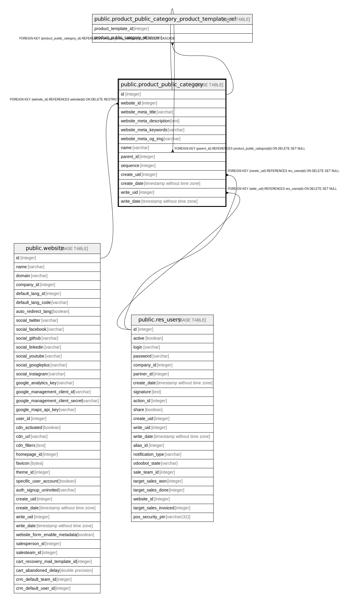

# public.product_public_category

## Description

Website Product Category

## Columns

| Name | Type | Default | Nullable | Children | Parents | Comment |
| ---- | ---- | ------- | -------- | -------- | ------- | ------- |
| id | integer | nextval('product_public_category_id_seq'::regclass) | false | [public.product_public_category](public.product_public_category.md) [public.product_public_category_product_template_rel](public.product_public_category_product_template_rel.md) |  |  |
| website_id | integer |  | true |  | [public.website](public.website.md) | Website |
| website_meta_title | varchar |  | true |  |  | Website meta title |
| website_meta_description | text |  | true |  |  | Website meta description |
| website_meta_keywords | varchar |  | true |  |  | Website meta keywords |
| website_meta_og_img | varchar |  | true |  |  | Website opengraph image |
| name | varchar |  | false |  |  | Name |
| parent_id | integer |  | true |  | [public.product_public_category](public.product_public_category.md) | Parent Category |
| sequence | integer |  | true |  |  | Sequence |
| create_uid | integer |  | true |  | [public.res_users](public.res_users.md) | Created by |
| create_date | timestamp without time zone |  | true |  |  | Created on |
| write_uid | integer |  | true |  | [public.res_users](public.res_users.md) | Last Updated by |
| write_date | timestamp without time zone |  | true |  |  | Last Updated on |

## Constraints

| Name | Type | Definition |
| ---- | ---- | ---------- |
| product_public_category_create_uid_fkey | FOREIGN KEY | FOREIGN KEY (create_uid) REFERENCES res_users(id) ON DELETE SET NULL |
| product_public_category_write_uid_fkey | FOREIGN KEY | FOREIGN KEY (write_uid) REFERENCES res_users(id) ON DELETE SET NULL |
| product_public_category_website_id_fkey | FOREIGN KEY | FOREIGN KEY (website_id) REFERENCES website(id) ON DELETE RESTRICT |
| product_public_category_parent_id_fkey | FOREIGN KEY | FOREIGN KEY (parent_id) REFERENCES product_public_category(id) ON DELETE SET NULL |
| product_public_category_pkey | PRIMARY KEY | PRIMARY KEY (id) |

## Indexes

| Name | Definition |
| ---- | ---------- |
| product_public_category_pkey | CREATE UNIQUE INDEX product_public_category_pkey ON public.product_public_category USING btree (id) |
| product_public_category_parent_id_index | CREATE INDEX product_public_category_parent_id_index ON public.product_public_category USING btree (parent_id) |

## Relations

---

> Generated by [tbls](https://github.com/k1LoW/tbls)
