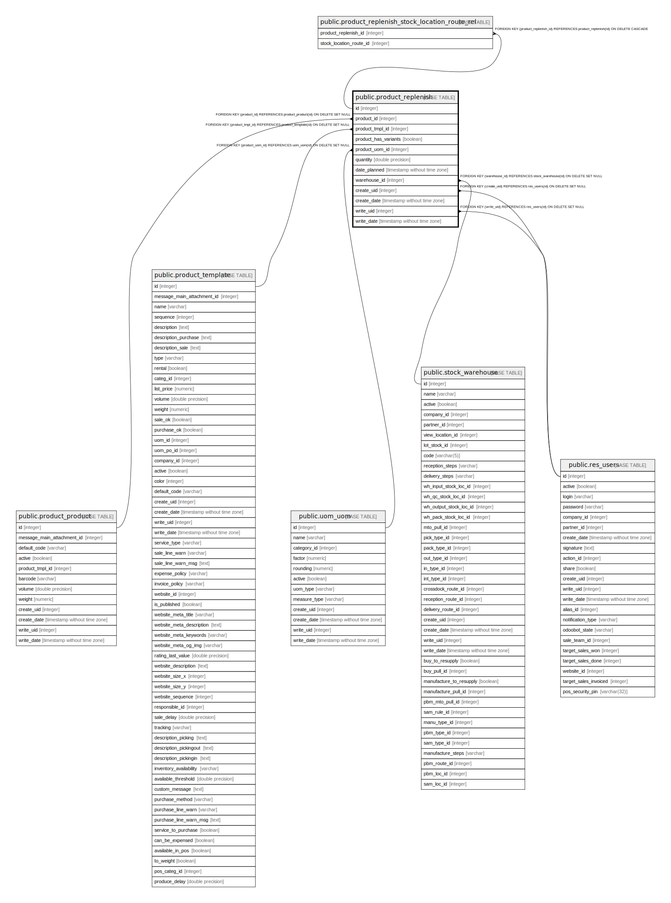

# public.product_replenish

## Description

Product Replenish

## Columns

| Name | Type | Default | Nullable | Children | Parents | Comment |
| ---- | ---- | ------- | -------- | -------- | ------- | ------- |
| id | integer | nextval('product_replenish_id_seq'::regclass) | false | [public.product_replenish_stock_location_route_rel](public.product_replenish_stock_location_route_rel.md) |  |  |
| product_id | integer |  | false |  | [public.product_product](public.product_product.md) | Product |
| product_tmpl_id | integer |  | false |  | [public.product_template](public.product_template.md) | Product Tmpl |
| product_has_variants | boolean |  | false |  |  | Has variants |
| product_uom_id | integer |  | false |  | [public.uom_uom](public.uom_uom.md) | Unity of measure |
| quantity | double precision |  | false |  |  | Quantity |
| date_planned | timestamp without time zone |  | true |  |  | Scheduled Date |
| warehouse_id | integer |  | false |  | [public.stock_warehouse](public.stock_warehouse.md) | Warehouse |
| create_uid | integer |  | true |  | [public.res_users](public.res_users.md) | Created by |
| create_date | timestamp without time zone |  | true |  |  | Created on |
| write_uid | integer |  | true |  | [public.res_users](public.res_users.md) | Last Updated by |
| write_date | timestamp without time zone |  | true |  |  | Last Updated on |

## Constraints

| Name | Type | Definition |
| ---- | ---- | ---------- |
| product_replenish_create_uid_fkey | FOREIGN KEY | FOREIGN KEY (create_uid) REFERENCES res_users(id) ON DELETE SET NULL |
| product_replenish_write_uid_fkey | FOREIGN KEY | FOREIGN KEY (write_uid) REFERENCES res_users(id) ON DELETE SET NULL |
| product_replenish_product_uom_id_fkey | FOREIGN KEY | FOREIGN KEY (product_uom_id) REFERENCES uom_uom(id) ON DELETE SET NULL |
| product_replenish_product_tmpl_id_fkey | FOREIGN KEY | FOREIGN KEY (product_tmpl_id) REFERENCES product_template(id) ON DELETE SET NULL |
| product_replenish_product_id_fkey | FOREIGN KEY | FOREIGN KEY (product_id) REFERENCES product_product(id) ON DELETE SET NULL |
| product_replenish_warehouse_id_fkey | FOREIGN KEY | FOREIGN KEY (warehouse_id) REFERENCES stock_warehouse(id) ON DELETE SET NULL |
| product_replenish_pkey | PRIMARY KEY | PRIMARY KEY (id) |

## Indexes

| Name | Definition |
| ---- | ---------- |
| product_replenish_pkey | CREATE UNIQUE INDEX product_replenish_pkey ON public.product_replenish USING btree (id) |

## Relations

---

> Generated by [tbls](https://github.com/k1LoW/tbls)
