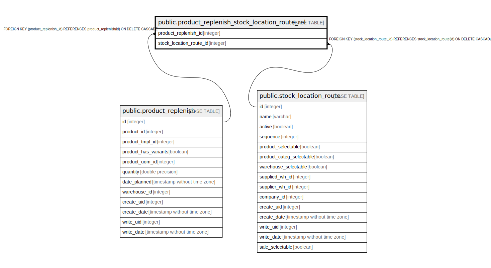

# public.product_replenish_stock_location_route_rel

## Description

RELATION BETWEEN product_replenish AND stock_location_route

## Columns

| Name | Type | Default | Nullable | Children | Parents | Comment |
| ---- | ---- | ------- | -------- | -------- | ------- | ------- |
| product_replenish_id | integer |  | false |  | [public.product_replenish](public.product_replenish.md) |  |
| stock_location_route_id | integer |  | false |  | [public.stock_location_route](public.stock_location_route.md) |  |

## Constraints

| Name | Type | Definition |
| ---- | ---- | ---------- |
| product_replenish_stock_location_r_stock_location_route_id_fkey | FOREIGN KEY | FOREIGN KEY (stock_location_route_id) REFERENCES stock_location_route(id) ON DELETE CASCADE |
| product_replenish_stock_location_rout_product_replenish_id_fkey | FOREIGN KEY | FOREIGN KEY (product_replenish_id) REFERENCES product_replenish(id) ON DELETE CASCADE |
| product_replenish_stock_locat_product_replenish_id_stock_lo_key | UNIQUE | UNIQUE (product_replenish_id, stock_location_route_id) |

## Indexes

| Name | Definition |
| ---- | ---------- |
| product_replenish_stock_locat_product_replenish_id_stock_lo_key | CREATE UNIQUE INDEX product_replenish_stock_locat_product_replenish_id_stock_lo_key ON public.product_replenish_stock_location_route_rel USING btree (product_replenish_id, stock_location_route_id) |
| product_replenish_stock_location_route_product_replenish_id_idx | CREATE INDEX product_replenish_stock_location_route_product_replenish_id_idx ON public.product_replenish_stock_location_route_rel USING btree (product_replenish_id) |
| product_replenish_stock_location_ro_stock_location_route_id_idx | CREATE INDEX product_replenish_stock_location_ro_stock_location_route_id_idx ON public.product_replenish_stock_location_route_rel USING btree (stock_location_route_id) |

## Relations

---

> Generated by [tbls](https://github.com/k1LoW/tbls)
