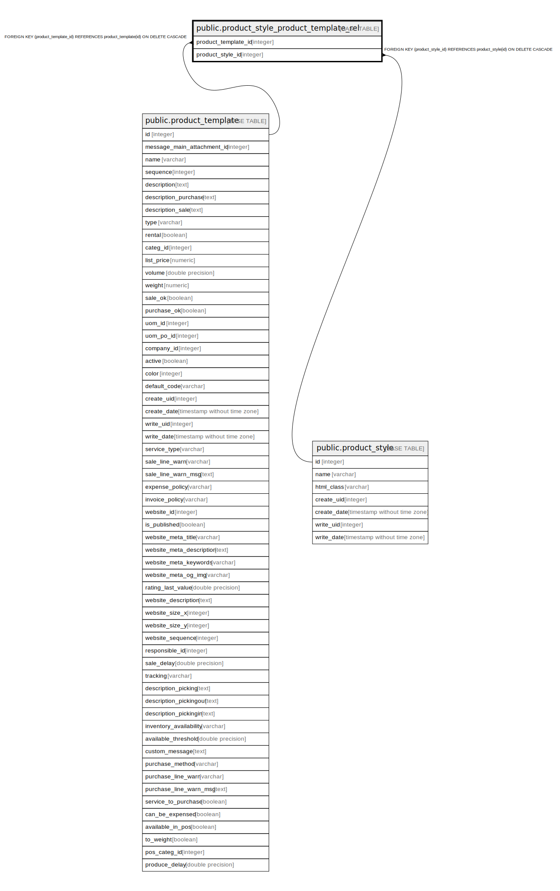

# public.product_style_product_template_rel

## Description

RELATION BETWEEN product_template AND product_style

## Columns

| Name | Type | Default | Nullable | Children | Parents | Comment |
| ---- | ---- | ------- | -------- | -------- | ------- | ------- |
| product_template_id | integer |  | false |  | [public.product_template](public.product_template.md) |  |
| product_style_id | integer |  | false |  | [public.product_style](public.product_style.md) |  |

## Constraints

| Name | Type | Definition |
| ---- | ---- | ---------- |
| product_style_product_template_rel_product_template_id_fkey | FOREIGN KEY | FOREIGN KEY (product_template_id) REFERENCES product_template(id) ON DELETE CASCADE |
| product_style_product_template_rel_product_style_id_fkey | FOREIGN KEY | FOREIGN KEY (product_style_id) REFERENCES product_style(id) ON DELETE CASCADE |
| product_style_product_templat_product_template_id_product_s_key | UNIQUE | UNIQUE (product_template_id, product_style_id) |

## Indexes

| Name | Definition |
| ---- | ---------- |
| product_style_product_templat_product_template_id_product_s_key | CREATE UNIQUE INDEX product_style_product_templat_product_template_id_product_s_key ON public.product_style_product_template_rel USING btree (product_template_id, product_style_id) |
| product_style_product_template_rel_product_template_id_idx | CREATE INDEX product_style_product_template_rel_product_template_id_idx ON public.product_style_product_template_rel USING btree (product_template_id) |
| product_style_product_template_rel_product_style_id_idx | CREATE INDEX product_style_product_template_rel_product_style_id_idx ON public.product_style_product_template_rel USING btree (product_style_id) |

## Relations

---

> Generated by [tbls](https://github.com/k1LoW/tbls)
