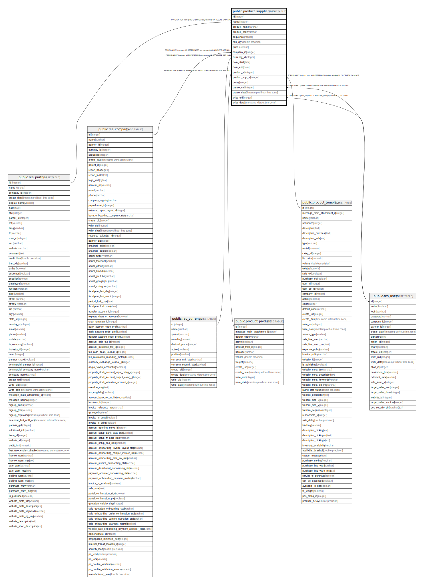

# public.product_supplierinfo

## Description

Supplier Pricelist

## Columns

| Name | Type | Default | Nullable | Children | Parents | Comment |
| ---- | ---- | ------- | -------- | -------- | ------- | ------- |
| id | integer | nextval('product_supplierinfo_id_seq'::regclass) | false |  |  |  |
| name | integer |  | false |  | [public.res_partner](public.res_partner.md) | Vendor |
| product_name | varchar |  | true |  |  | Vendor Product Name |
| product_code | varchar |  | true |  |  | Vendor Product Code |
| sequence | integer |  | true |  |  | Sequence |
| min_qty | double precision |  | false |  |  | Minimal Quantity |
| price | numeric |  | false |  |  | Price |
| company_id | integer |  | true |  | [public.res_company](public.res_company.md) | Company |
| currency_id | integer |  | false |  | [public.res_currency](public.res_currency.md) | Currency |
| date_start | date |  | true |  |  | Start Date |
| date_end | date |  | true |  |  | End Date |
| product_id | integer |  | true |  | [public.product_product](public.product_product.md) | Product Variant |
| product_tmpl_id | integer |  | true |  | [public.product_template](public.product_template.md) | Product Template |
| delay | integer |  | false |  |  | Delivery Lead Time |
| create_uid | integer |  | true |  | [public.res_users](public.res_users.md) | Created by |
| create_date | timestamp without time zone |  | true |  |  | Created on |
| write_uid | integer |  | true |  | [public.res_users](public.res_users.md) | Last Updated by |
| write_date | timestamp without time zone |  | true |  |  | Last Updated on |

## Constraints

| Name | Type | Definition |
| ---- | ---- | ---------- |
| product_supplierinfo_create_uid_fkey | FOREIGN KEY | FOREIGN KEY (create_uid) REFERENCES res_users(id) ON DELETE SET NULL |
| product_supplierinfo_write_uid_fkey | FOREIGN KEY | FOREIGN KEY (write_uid) REFERENCES res_users(id) ON DELETE SET NULL |
| product_supplierinfo_currency_id_fkey | FOREIGN KEY | FOREIGN KEY (currency_id) REFERENCES res_currency(id) ON DELETE SET NULL |
| product_supplierinfo_company_id_fkey | FOREIGN KEY | FOREIGN KEY (company_id) REFERENCES res_company(id) ON DELETE SET NULL |
| product_supplierinfo_name_fkey | FOREIGN KEY | FOREIGN KEY (name) REFERENCES res_partner(id) ON DELETE CASCADE |
| product_supplierinfo_product_tmpl_id_fkey | FOREIGN KEY | FOREIGN KEY (product_tmpl_id) REFERENCES product_template(id) ON DELETE CASCADE |
| product_supplierinfo_product_id_fkey | FOREIGN KEY | FOREIGN KEY (product_id) REFERENCES product_product(id) ON DELETE SET NULL |
| product_supplierinfo_pkey | PRIMARY KEY | PRIMARY KEY (id) |

## Indexes

| Name | Definition |
| ---- | ---------- |
| product_supplierinfo_pkey | CREATE UNIQUE INDEX product_supplierinfo_pkey ON public.product_supplierinfo USING btree (id) |
| product_supplierinfo_company_id_index | CREATE INDEX product_supplierinfo_company_id_index ON public.product_supplierinfo USING btree (company_id) |
| product_supplierinfo_product_tmpl_id_index | CREATE INDEX product_supplierinfo_product_tmpl_id_index ON public.product_supplierinfo USING btree (product_tmpl_id) |

## Relations

---

> Generated by [tbls](https://github.com/k1LoW/tbls)
