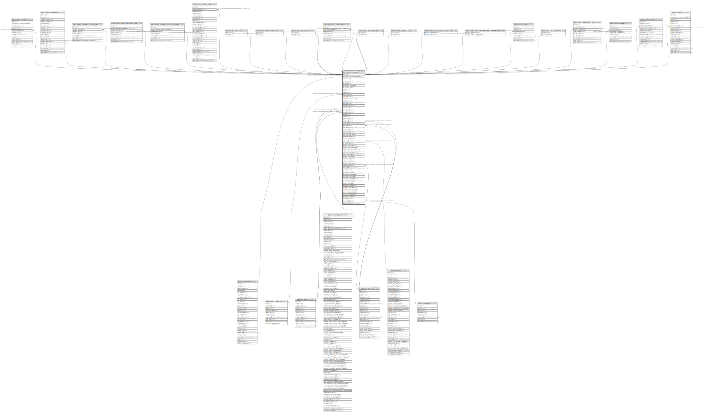

# public.product_template

## Description

Product Template

## Columns

| Name | Type | Default | Nullable | Children | Parents | Comment |
| ---- | ---- | ------- | -------- | -------- | ------- | ------- |
| id | integer | nextval('product_template_id_seq'::regclass) | false | [public.product_product](public.product_product.md) [public.product_supplierinfo](public.product_supplierinfo.md) [public.product_template_attribute_line](public.product_template_attribute_line.md) [public.product_template_attribute_value](public.product_template_attribute_value.md) [public.product_template_attribute_exclusion](public.product_template_attribute_exclusion.md) [public.product_pricelist_item](public.product_pricelist_item.md) [public.product_taxes_rel](public.product_taxes_rel.md) [public.product_supplier_taxes_rel](public.product_supplier_taxes_rel.md) [public.product_optional_rel](public.product_optional_rel.md) [public.sale_product_configurator](public.sale_product_configurator.md) [public.product_alternative_rel](public.product_alternative_rel.md) [public.product_accessory_rel](public.product_accessory_rel.md) [public.product_style_product_template_rel](public.product_style_product_template_rel.md) [public.product_public_category_product_template_rel](public.product_public_category_product_template_rel.md) [public.product_image](public.product_image.md) [public.stock_route_product](public.stock_route_product.md) [public.stock_change_product_qty](public.stock_change_product_qty.md) [public.stock_rules_report](public.stock_rules_report.md) [public.product_replenish](public.product_replenish.md) [public.mrp_bom](public.mrp_bom.md) |  |  |
| message_main_attachment_id | integer |  | true |  | [public.ir_attachment](public.ir_attachment.md) | Main Attachment |
| name | varchar |  | false |  |  | Name |
| sequence | integer |  | true |  |  | Sequence |
| description | text |  | true |  |  | Description |
| description_purchase | text |  | true |  |  | Purchase Description |
| description_sale | text |  | true |  |  | Sale Description |
| type | varchar |  | false |  |  | Product Type |
| rental | boolean |  | true |  |  | Can be Rent |
| categ_id | integer |  | false |  | [public.product_category](public.product_category.md) | Product Category |
| list_price | numeric |  | true |  |  | Sales Price |
| volume | double precision |  | true |  |  | Volume |
| weight | numeric |  | true |  |  | Weight |
| sale_ok | boolean |  | true |  |  | Can be Sold |
| purchase_ok | boolean |  | true |  |  | Can be Purchased |
| uom_id | integer |  | false |  | [public.uom_uom](public.uom_uom.md) | Unit of Measure |
| uom_po_id | integer |  | false |  | [public.uom_uom](public.uom_uom.md) | Purchase Unit of Measure |
| company_id | integer |  | true |  | [public.res_company](public.res_company.md) | Company |
| active | boolean |  | true |  |  | Active |
| color | integer |  | true |  |  | Color Index |
| default_code | varchar |  | true |  |  | Internal Reference |
| create_uid | integer |  | true |  | [public.res_users](public.res_users.md) | Created by |
| create_date | timestamp without time zone |  | true |  |  | Created on |
| write_uid | integer |  | true |  | [public.res_users](public.res_users.md) | Last Updated by |
| write_date | timestamp without time zone |  | true |  |  | Last Updated on |
| service_type | varchar |  | true |  |  | Track Service |
| sale_line_warn | varchar |  | false |  |  | Sales Order Line |
| sale_line_warn_msg | text |  | true |  |  | Message for Sales Order Line |
| expense_policy | varchar |  | true |  |  | Re-Invoice Policy |
| invoice_policy | varchar |  | true |  |  | Invoicing Policy |
| website_id | integer |  | true |  | [public.website](public.website.md) | Website |
| is_published | boolean |  | true |  |  | Is published |
| website_meta_title | varchar |  | true |  |  | Website meta title |
| website_meta_description | text |  | true |  |  | Website meta description |
| website_meta_keywords | varchar |  | true |  |  | Website meta keywords |
| website_meta_og_img | varchar |  | true |  |  | Website opengraph image |
| rating_last_value | double precision |  | true |  |  | Rating Last Value |
| website_description | text |  | true |  |  | Description for the website |
| website_size_x | integer |  | true |  |  | Size X |
| website_size_y | integer |  | true |  |  | Size Y |
| website_sequence | integer |  | true |  |  | Website Sequence |
| responsible_id | integer |  | false |  | [public.res_users](public.res_users.md) | Responsible |
| sale_delay | double precision |  | true |  |  | Customer Lead Time |
| tracking | varchar |  | false |  |  | Tracking |
| description_picking | text |  | true |  |  | Description on Picking |
| description_pickingout | text |  | true |  |  | Description on Delivery Orders |
| description_pickingin | text |  | true |  |  | Description on Receptions |
| inventory_availability | varchar |  | true |  |  | Inventory Availability |
| available_threshold | double precision |  | true |  |  | Availability Threshold |
| custom_message | text |  | true |  |  | Custom Message |
| purchase_method | varchar |  | true |  |  | Control Policy |
| purchase_line_warn | varchar |  | false |  |  | Purchase Order Line |
| purchase_line_warn_msg | text |  | true |  |  | Message for Purchase Order Line |
| service_to_purchase | boolean |  | true |  |  | Purchase Automatically |
| can_be_expensed | boolean |  | true |  |  | Can be Expensed |
| available_in_pos | boolean |  | true |  |  | Available in POS |
| to_weight | boolean |  | true |  |  | To Weigh With Scale |
| pos_categ_id | integer |  | true |  | [public.pos_category](public.pos_category.md) | Point of Sale Category |
| produce_delay | double precision |  | true |  |  | Manufacturing Lead Time |

## Constraints

| Name | Type | Definition | Comment |
| ---- | ---- | ---------- | ------- |
| product_template_service_to_purchase | CHECK | CHECK (((((type)::text <> 'service'::text) AND (service_to_purchase <> true)) OR ((type)::text = 'service'::text))) | CHECK((type != 'service' AND service_to_purchase != true) or (type = 'service')) |
| product_template_create_uid_fkey | FOREIGN KEY | FOREIGN KEY (create_uid) REFERENCES res_users(id) ON DELETE SET NULL |  |
| product_template_responsible_id_fkey | FOREIGN KEY | FOREIGN KEY (responsible_id) REFERENCES res_users(id) ON DELETE SET NULL |  |
| product_template_write_uid_fkey | FOREIGN KEY | FOREIGN KEY (write_uid) REFERENCES res_users(id) ON DELETE SET NULL |  |
| product_template_company_id_fkey | FOREIGN KEY | FOREIGN KEY (company_id) REFERENCES res_company(id) ON DELETE SET NULL |  |
| product_template_message_main_attachment_id_fkey | FOREIGN KEY | FOREIGN KEY (message_main_attachment_id) REFERENCES ir_attachment(id) ON DELETE SET NULL |  |
| product_template_website_id_fkey | FOREIGN KEY | FOREIGN KEY (website_id) REFERENCES website(id) ON DELETE RESTRICT |  |
| product_template_uom_id_fkey | FOREIGN KEY | FOREIGN KEY (uom_id) REFERENCES uom_uom(id) ON DELETE SET NULL |  |
| product_template_uom_po_id_fkey | FOREIGN KEY | FOREIGN KEY (uom_po_id) REFERENCES uom_uom(id) ON DELETE SET NULL |  |
| product_template_pkey | PRIMARY KEY | PRIMARY KEY (id) |  |
| product_template_categ_id_fkey | FOREIGN KEY | FOREIGN KEY (categ_id) REFERENCES product_category(id) ON DELETE SET NULL |  |
| product_template_pos_categ_id_fkey | FOREIGN KEY | FOREIGN KEY (pos_categ_id) REFERENCES pos_category(id) ON DELETE SET NULL |  |

## Indexes

| Name | Definition |
| ---- | ---------- |
| product_template_pkey | CREATE UNIQUE INDEX product_template_pkey ON public.product_template USING btree (id) |
| product_template_message_main_attachment_id_index | CREATE INDEX product_template_message_main_attachment_id_index ON public.product_template USING btree (message_main_attachment_id) |
| product_template_name_index | CREATE INDEX product_template_name_index ON public.product_template USING btree (name) |
| product_template_company_id_index | CREATE INDEX product_template_company_id_index ON public.product_template USING btree (company_id) |

## Relations

---

> Generated by [tbls](https://github.com/k1LoW/tbls)
