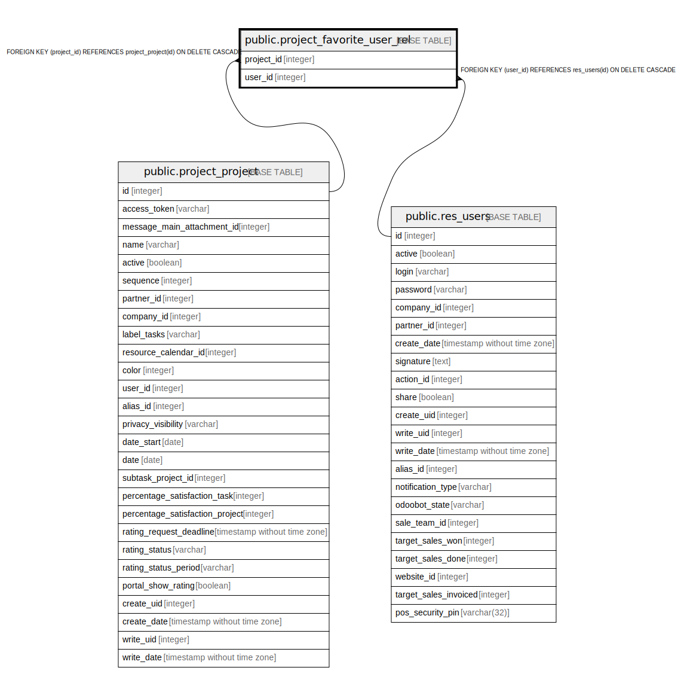

# public.project_favorite_user_rel

## Description

RELATION BETWEEN project_project AND res_users

## Columns

| Name | Type | Default | Nullable | Children | Parents | Comment |
| ---- | ---- | ------- | -------- | -------- | ------- | ------- |
| project_id | integer |  | false |  | [public.project_project](public.project_project.md) |  |
| user_id | integer |  | false |  | [public.res_users](public.res_users.md) |  |

## Constraints

| Name | Type | Definition |
| ---- | ---- | ---------- |
| project_favorite_user_rel_user_id_fkey | FOREIGN KEY | FOREIGN KEY (user_id) REFERENCES res_users(id) ON DELETE CASCADE |
| project_favorite_user_rel_project_id_fkey | FOREIGN KEY | FOREIGN KEY (project_id) REFERENCES project_project(id) ON DELETE CASCADE |
| project_favorite_user_rel_project_id_user_id_key | UNIQUE | UNIQUE (project_id, user_id) |

## Indexes

| Name | Definition |
| ---- | ---------- |
| project_favorite_user_rel_project_id_user_id_key | CREATE UNIQUE INDEX project_favorite_user_rel_project_id_user_id_key ON public.project_favorite_user_rel USING btree (project_id, user_id) |
| project_favorite_user_rel_project_id_idx | CREATE INDEX project_favorite_user_rel_project_id_idx ON public.project_favorite_user_rel USING btree (project_id) |
| project_favorite_user_rel_user_id_idx | CREATE INDEX project_favorite_user_rel_user_id_idx ON public.project_favorite_user_rel USING btree (user_id) |

## Relations

---

> Generated by [tbls](https://github.com/k1LoW/tbls)
