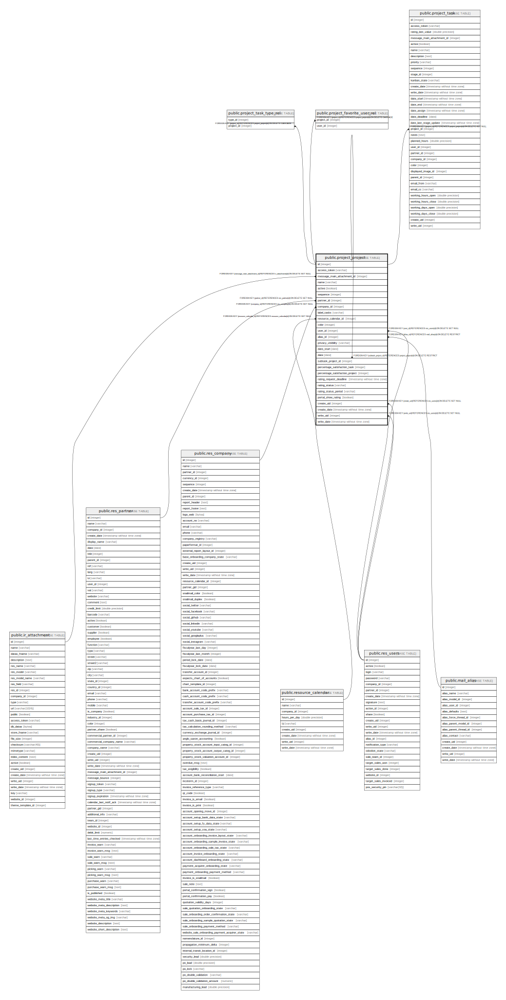

# public.project_project

## Description

Project

## Columns

| Name | Type | Default | Nullable | Children | Parents | Comment |
| ---- | ---- | ------- | -------- | -------- | ------- | ------- |
| id | integer | nextval('project_project_id_seq'::regclass) | false | [public.project_task_type_rel](public.project_task_type_rel.md) [public.project_project](public.project_project.md) [public.project_favorite_user_rel](public.project_favorite_user_rel.md) [public.project_task](public.project_task.md) |  |  |
| access_token | varchar |  | true |  |  | Security Token |
| message_main_attachment_id | integer |  | true |  | [public.ir_attachment](public.ir_attachment.md) | Main Attachment |
| name | varchar |  | false |  |  | Name |
| active | boolean |  | true |  |  | Active |
| sequence | integer |  | true |  |  | Sequence |
| partner_id | integer |  | true |  | [public.res_partner](public.res_partner.md) | Customer |
| company_id | integer |  | false |  | [public.res_company](public.res_company.md) | Company |
| label_tasks | varchar |  | true |  |  | Use Tasks as |
| resource_calendar_id | integer |  | true |  | [public.resource_calendar](public.resource_calendar.md) | Working Time |
| color | integer |  | true |  |  | Color Index |
| user_id | integer |  | true |  | [public.res_users](public.res_users.md) | Project Manager |
| alias_id | integer |  | false |  | [public.mail_alias](public.mail_alias.md) | Alias |
| privacy_visibility | varchar |  | false |  |  | Privacy |
| date_start | date |  | true |  |  | Start Date |
| date | date |  | true |  |  | Expiration Date |
| subtask_project_id | integer |  | true |  | [public.project_project](public.project_project.md) | Sub-task Project |
| percentage_satisfaction_task | integer |  | true |  |  | Happy % on Task |
| percentage_satisfaction_project | integer |  | true |  |  | Happy % on Project |
| rating_request_deadline | timestamp without time zone |  | true |  |  | Rating Request Deadline |
| rating_status | varchar |  | false |  |  | Customer(s) Ratings |
| rating_status_period | varchar |  | true |  |  | Rating Frequency |
| portal_show_rating | boolean |  | true |  |  | Rating visible publicly |
| create_uid | integer |  | true |  | [public.res_users](public.res_users.md) | Created by |
| create_date | timestamp without time zone |  | true |  |  | Created on |
| write_uid | integer |  | true |  | [public.res_users](public.res_users.md) | Last Updated by |
| write_date | timestamp without time zone |  | true |  |  | Last Updated on |

## Constraints

| Name | Type | Definition | Comment |
| ---- | ---- | ---------- | ------- |
| project_project_project_date_greater | CHECK | CHECK ((date >= date_start)) | check(date >= date_start) |
| project_project_create_uid_fkey | FOREIGN KEY | FOREIGN KEY (create_uid) REFERENCES res_users(id) ON DELETE SET NULL |  |
| project_project_user_id_fkey | FOREIGN KEY | FOREIGN KEY (user_id) REFERENCES res_users(id) ON DELETE SET NULL |  |
| project_project_write_uid_fkey | FOREIGN KEY | FOREIGN KEY (write_uid) REFERENCES res_users(id) ON DELETE SET NULL |  |
| project_project_company_id_fkey | FOREIGN KEY | FOREIGN KEY (company_id) REFERENCES res_company(id) ON DELETE SET NULL |  |
| project_project_partner_id_fkey | FOREIGN KEY | FOREIGN KEY (partner_id) REFERENCES res_partner(id) ON DELETE SET NULL |  |
| project_project_message_main_attachment_id_fkey | FOREIGN KEY | FOREIGN KEY (message_main_attachment_id) REFERENCES ir_attachment(id) ON DELETE SET NULL |  |
| project_project_resource_calendar_id_fkey | FOREIGN KEY | FOREIGN KEY (resource_calendar_id) REFERENCES resource_calendar(id) ON DELETE SET NULL |  |
| project_project_alias_id_fkey | FOREIGN KEY | FOREIGN KEY (alias_id) REFERENCES mail_alias(id) ON DELETE RESTRICT |  |
| project_project_pkey | PRIMARY KEY | PRIMARY KEY (id) |  |
| project_project_subtask_project_id_fkey | FOREIGN KEY | FOREIGN KEY (subtask_project_id) REFERENCES project_project(id) ON DELETE RESTRICT |  |

## Indexes

| Name | Definition |
| ---- | ---------- |
| project_project_pkey | CREATE UNIQUE INDEX project_project_pkey ON public.project_project USING btree (id) |
| project_project_message_main_attachment_id_index | CREATE INDEX project_project_message_main_attachment_id_index ON public.project_project USING btree (message_main_attachment_id) |
| project_project_name_index | CREATE INDEX project_project_name_index ON public.project_project USING btree (name) |
| project_project_date_index | CREATE INDEX project_project_date_index ON public.project_project USING btree (date) |

## Relations

---

> Generated by [tbls](https://github.com/k1LoW/tbls)
