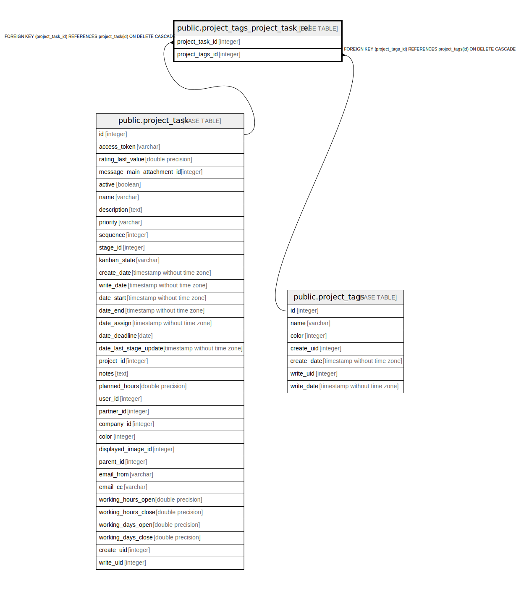

# public.project_tags_project_task_rel

## Description

RELATION BETWEEN project_task AND project_tags

## Columns

| Name | Type | Default | Nullable | Children | Parents | Comment |
| ---- | ---- | ------- | -------- | -------- | ------- | ------- |
| project_task_id | integer |  | false |  | [public.project_task](public.project_task.md) |  |
| project_tags_id | integer |  | false |  | [public.project_tags](public.project_tags.md) |  |

## Constraints

| Name | Type | Definition |
| ---- | ---- | ---------- |
| project_tags_project_task_rel_project_task_id_fkey | FOREIGN KEY | FOREIGN KEY (project_task_id) REFERENCES project_task(id) ON DELETE CASCADE |
| project_tags_project_task_rel_project_task_id_project_tags__key | UNIQUE | UNIQUE (project_task_id, project_tags_id) |
| project_tags_project_task_rel_project_tags_id_fkey | FOREIGN KEY | FOREIGN KEY (project_tags_id) REFERENCES project_tags(id) ON DELETE CASCADE |

## Indexes

| Name | Definition |
| ---- | ---------- |
| project_tags_project_task_rel_project_task_id_project_tags__key | CREATE UNIQUE INDEX project_tags_project_task_rel_project_task_id_project_tags__key ON public.project_tags_project_task_rel USING btree (project_task_id, project_tags_id) |
| project_tags_project_task_rel_project_task_id_idx | CREATE INDEX project_tags_project_task_rel_project_task_id_idx ON public.project_tags_project_task_rel USING btree (project_task_id) |
| project_tags_project_task_rel_project_tags_id_idx | CREATE INDEX project_tags_project_task_rel_project_tags_id_idx ON public.project_tags_project_task_rel USING btree (project_tags_id) |

## Relations

---

> Generated by [tbls](https://github.com/k1LoW/tbls)
