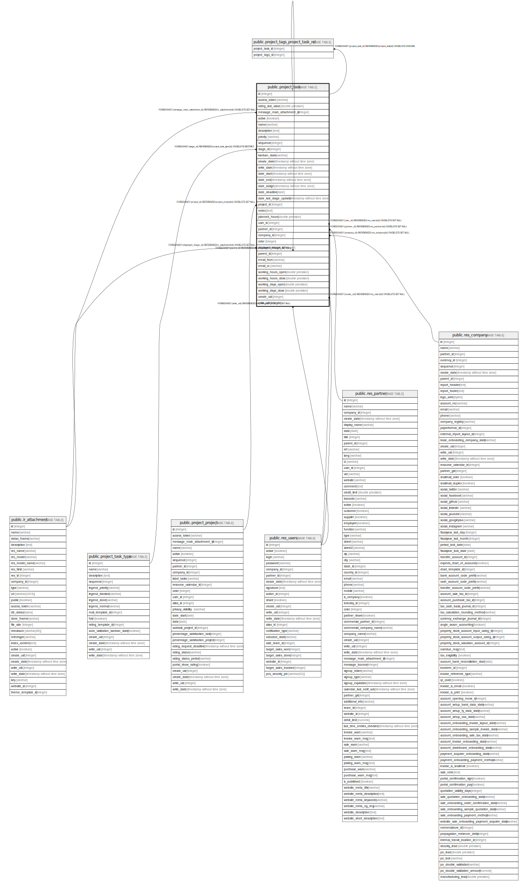

# public.project_task

## Description

Task

## Columns

| Name | Type | Default | Nullable | Children | Parents | Comment |
| ---- | ---- | ------- | -------- | -------- | ------- | ------- |
| id | integer | nextval('project_task_id_seq'::regclass) | false | [public.project_task](public.project_task.md) [public.project_tags_project_task_rel](public.project_tags_project_task_rel.md) |  |  |
| access_token | varchar |  | true |  |  | Security Token |
| rating_last_value | double precision |  | true |  |  | Rating Last Value |
| message_main_attachment_id | integer |  | true |  | [public.ir_attachment](public.ir_attachment.md) | Main Attachment |
| active | boolean |  | true |  |  | Active |
| name | varchar |  | false |  |  | Title |
| description | text |  | true |  |  | Description |
| priority | varchar |  | true |  |  | Priority |
| sequence | integer |  | true |  |  | Sequence |
| stage_id | integer |  | true |  | [public.project_task_type](public.project_task_type.md) | Stage |
| kanban_state | varchar |  | false |  |  | Kanban State |
| create_date | timestamp without time zone |  | true |  |  | Created On |
| write_date | timestamp without time zone |  | true |  |  | Last Updated On |
| date_start | timestamp without time zone |  | true |  |  | Starting Date |
| date_end | timestamp without time zone |  | true |  |  | Ending Date |
| date_assign | timestamp without time zone |  | true |  |  | Assigning Date |
| date_deadline | date |  | true |  |  | Deadline |
| date_last_stage_update | timestamp without time zone |  | true |  |  | Last Stage Update |
| project_id | integer |  | true |  | [public.project_project](public.project_project.md) | Project |
| notes | text |  | true |  |  | Notes |
| planned_hours | double precision |  | true |  |  | Planned Hours |
| user_id | integer |  | true |  | [public.res_users](public.res_users.md) | Assigned to |
| partner_id | integer |  | true |  | [public.res_partner](public.res_partner.md) | Customer |
| company_id | integer |  | false |  | [public.res_company](public.res_company.md) | Company |
| color | integer |  | true |  |  | Color Index |
| displayed_image_id | integer |  | true |  | [public.ir_attachment](public.ir_attachment.md) | Cover Image |
| parent_id | integer |  | true |  | [public.project_task](public.project_task.md) | Parent Task |
| email_from | varchar |  | true |  |  | Email |
| email_cc | varchar |  | true |  |  | Watchers Emails |
| working_hours_open | double precision |  | true |  |  | Working hours to assign |
| working_hours_close | double precision |  | true |  |  | Working hours to close |
| working_days_open | double precision |  | true |  |  | Working days to assign |
| working_days_close | double precision |  | true |  |  | Working days to close |
| create_uid | integer |  | true |  | [public.res_users](public.res_users.md) | Created by |
| write_uid | integer |  | true |  | [public.res_users](public.res_users.md) | Last Updated by |

## Constraints

| Name | Type | Definition |
| ---- | ---- | ---------- |
| project_task_create_uid_fkey | FOREIGN KEY | FOREIGN KEY (create_uid) REFERENCES res_users(id) ON DELETE SET NULL |
| project_task_user_id_fkey | FOREIGN KEY | FOREIGN KEY (user_id) REFERENCES res_users(id) ON DELETE SET NULL |
| project_task_write_uid_fkey | FOREIGN KEY | FOREIGN KEY (write_uid) REFERENCES res_users(id) ON DELETE SET NULL |
| project_task_company_id_fkey | FOREIGN KEY | FOREIGN KEY (company_id) REFERENCES res_company(id) ON DELETE SET NULL |
| project_task_partner_id_fkey | FOREIGN KEY | FOREIGN KEY (partner_id) REFERENCES res_partner(id) ON DELETE SET NULL |
| project_task_displayed_image_id_fkey | FOREIGN KEY | FOREIGN KEY (displayed_image_id) REFERENCES ir_attachment(id) ON DELETE SET NULL |
| project_task_message_main_attachment_id_fkey | FOREIGN KEY | FOREIGN KEY (message_main_attachment_id) REFERENCES ir_attachment(id) ON DELETE SET NULL |
| project_task_stage_id_fkey | FOREIGN KEY | FOREIGN KEY (stage_id) REFERENCES project_task_type(id) ON DELETE RESTRICT |
| project_task_project_id_fkey | FOREIGN KEY | FOREIGN KEY (project_id) REFERENCES project_project(id) ON DELETE SET NULL |
| project_task_parent_id_fkey | FOREIGN KEY | FOREIGN KEY (parent_id) REFERENCES project_task(id) ON DELETE SET NULL |
| project_task_pkey | PRIMARY KEY | PRIMARY KEY (id) |

## Indexes

| Name | Definition |
| ---- | ---------- |
| project_task_pkey | CREATE UNIQUE INDEX project_task_pkey ON public.project_task USING btree (id) |
| project_task_message_main_attachment_id_index | CREATE INDEX project_task_message_main_attachment_id_index ON public.project_task USING btree (message_main_attachment_id) |
| project_task_name_index | CREATE INDEX project_task_name_index ON public.project_task USING btree (name) |
| project_task_priority_index | CREATE INDEX project_task_priority_index ON public.project_task USING btree (priority) |
| project_task_sequence_index | CREATE INDEX project_task_sequence_index ON public.project_task USING btree (sequence) |
| project_task_stage_id_index | CREATE INDEX project_task_stage_id_index ON public.project_task USING btree (stage_id) |
| project_task_create_date_index | CREATE INDEX project_task_create_date_index ON public.project_task USING btree (create_date) |
| project_task_write_date_index | CREATE INDEX project_task_write_date_index ON public.project_task USING btree (write_date) |
| project_task_date_start_index | CREATE INDEX project_task_date_start_index ON public.project_task USING btree (date_start) |
| project_task_date_end_index | CREATE INDEX project_task_date_end_index ON public.project_task USING btree (date_end) |
| project_task_date_assign_index | CREATE INDEX project_task_date_assign_index ON public.project_task USING btree (date_assign) |
| project_task_date_deadline_index | CREATE INDEX project_task_date_deadline_index ON public.project_task USING btree (date_deadline) |
| project_task_date_last_stage_update_index | CREATE INDEX project_task_date_last_stage_update_index ON public.project_task USING btree (date_last_stage_update) |
| project_task_project_id_index | CREATE INDEX project_task_project_id_index ON public.project_task USING btree (project_id) |
| project_task_user_id_index | CREATE INDEX project_task_user_id_index ON public.project_task USING btree (user_id) |
| project_task_parent_id_index | CREATE INDEX project_task_parent_id_index ON public.project_task USING btree (parent_id) |
| project_task_email_from_index | CREATE INDEX project_task_email_from_index ON public.project_task USING btree (email_from) |

## Relations

---

> Generated by [tbls](https://github.com/k1LoW/tbls)
