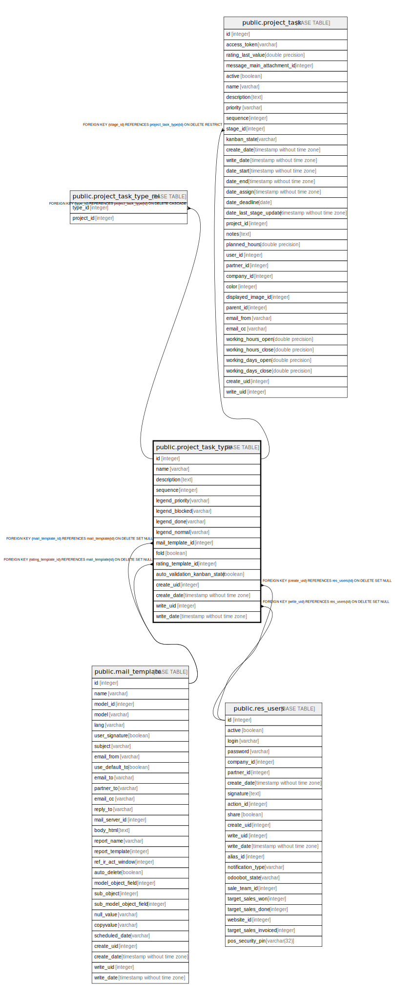

# public.project_task_type

## Description

Task Stage

## Columns

| Name | Type | Default | Nullable | Children | Parents | Comment |
| ---- | ---- | ------- | -------- | -------- | ------- | ------- |
| id | integer | nextval('project_task_type_id_seq'::regclass) | false | [public.project_task_type_rel](public.project_task_type_rel.md) [public.project_task](public.project_task.md) |  |  |
| name | varchar |  | false |  |  | Stage Name |
| description | text |  | true |  |  | Description |
| sequence | integer |  | true |  |  | Sequence |
| legend_priority | varchar |  | true |  |  | Starred Explanation |
| legend_blocked | varchar |  | false |  |  | Red Kanban Label |
| legend_done | varchar |  | false |  |  | Green Kanban Label |
| legend_normal | varchar |  | false |  |  | Grey Kanban Label |
| mail_template_id | integer |  | true |  | [public.mail_template](public.mail_template.md) | Email Template |
| fold | boolean |  | true |  |  | Folded in Kanban |
| rating_template_id | integer |  | true |  | [public.mail_template](public.mail_template.md) | Rating Email Template |
| auto_validation_kanban_state | boolean |  | true |  |  | Automatic kanban status |
| create_uid | integer |  | true |  | [public.res_users](public.res_users.md) | Created by |
| create_date | timestamp without time zone |  | true |  |  | Created on |
| write_uid | integer |  | true |  | [public.res_users](public.res_users.md) | Last Updated by |
| write_date | timestamp without time zone |  | true |  |  | Last Updated on |

## Constraints

| Name | Type | Definition |
| ---- | ---- | ---------- |
| project_task_type_create_uid_fkey | FOREIGN KEY | FOREIGN KEY (create_uid) REFERENCES res_users(id) ON DELETE SET NULL |
| project_task_type_write_uid_fkey | FOREIGN KEY | FOREIGN KEY (write_uid) REFERENCES res_users(id) ON DELETE SET NULL |
| project_task_type_mail_template_id_fkey | FOREIGN KEY | FOREIGN KEY (mail_template_id) REFERENCES mail_template(id) ON DELETE SET NULL |
| project_task_type_rating_template_id_fkey | FOREIGN KEY | FOREIGN KEY (rating_template_id) REFERENCES mail_template(id) ON DELETE SET NULL |
| project_task_type_pkey | PRIMARY KEY | PRIMARY KEY (id) |

## Indexes

| Name | Definition |
| ---- | ---------- |
| project_task_type_pkey | CREATE UNIQUE INDEX project_task_type_pkey ON public.project_task_type USING btree (id) |

## Relations

---

> Generated by [tbls](https://github.com/k1LoW/tbls)
