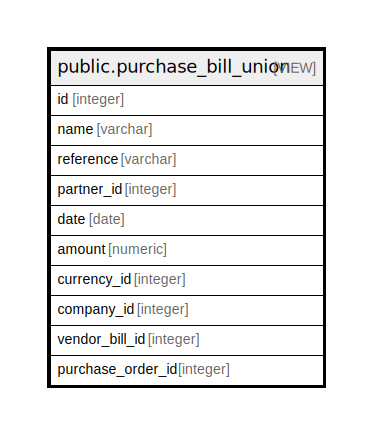

# public.purchase_bill_union

## Description

<details>
<summary><strong>Table Definition</strong></summary>

```sql
CREATE VIEW purchase_bill_union AS (
 SELECT account_invoice.id,
    account_invoice.number AS name,
    account_invoice.reference,
    account_invoice.partner_id,
    account_invoice.date,
    account_invoice.amount_untaxed AS amount,
    account_invoice.currency_id,
    account_invoice.company_id,
    account_invoice.id AS vendor_bill_id,
    NULL::integer AS purchase_order_id
   FROM account_invoice
  WHERE (((account_invoice.type)::text = 'in_invoice'::text) AND ((COALESCE(account_invoice.number, ''::character varying))::text <> ''::text))
UNION
 SELECT (- purchase_order.id) AS id,
    purchase_order.name,
    purchase_order.partner_ref AS reference,
    purchase_order.partner_id,
    (purchase_order.date_order)::date AS date,
    purchase_order.amount_untaxed AS amount,
    purchase_order.currency_id,
    purchase_order.company_id,
    NULL::integer AS vendor_bill_id,
    purchase_order.id AS purchase_order_id
   FROM purchase_order
  WHERE (((purchase_order.state)::text = ANY ((ARRAY['purchase'::character varying, 'done'::character varying])::text[])) AND ((purchase_order.invoice_status)::text = ANY ((ARRAY['to invoice'::character varying, 'no'::character varying])::text[])))
)
```

</details>

## Columns

| Name | Type | Default | Nullable | Children | Parents | Comment |
| ---- | ---- | ------- | -------- | -------- | ------- | ------- |
| id | integer |  | true |  |  |  |
| name | varchar |  | true |  |  |  |
| reference | varchar |  | true |  |  |  |
| partner_id | integer |  | true |  |  |  |
| date | date |  | true |  |  |  |
| amount | numeric |  | true |  |  |  |
| currency_id | integer |  | true |  |  |  |
| company_id | integer |  | true |  |  |  |
| vendor_bill_id | integer |  | true |  |  |  |
| purchase_order_id | integer |  | true |  |  |  |

## Relations



---

> Generated by [tbls](https://github.com/k1LoW/tbls)
