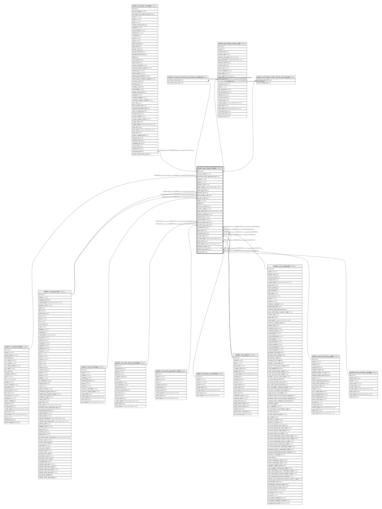

# public.purchase_order

## Description

Purchase Order

## Columns

| Name | Type | Default | Nullable | Children | Parents | Comment |
| ---- | ---- | ------- | -------- | -------- | ------- | ------- |
| id | integer | nextval('purchase_order_id_seq'::regclass) | false | [public.account_invoice](public.account_invoice.md) [public.account_invoice_purchase_order_rel](public.account_invoice_purchase_order_rel.md) [public.purchase_order_line](public.purchase_order_line.md) [public.purchase_order_stock_picking_rel](public.purchase_order_stock_picking_rel.md) |  |  |
| access_token | varchar |  | true |  |  | Security Token |
| message_main_attachment_id | integer |  | true |  | [public.ir_attachment](public.ir_attachment.md) | Main Attachment |
| name | varchar |  | false |  |  | Order Reference |
| origin | varchar |  | true |  |  | Source Document |
| partner_ref | varchar |  | true |  |  | Vendor Reference |
| date_order | timestamp without time zone |  | false |  |  | Order Date |
| date_approve | date |  | true |  |  | Approval Date |
| partner_id | integer |  | false |  | [public.res_partner](public.res_partner.md) | Vendor |
| dest_address_id | integer |  | true |  | [public.res_partner](public.res_partner.md) | Drop Ship Address |
| currency_id | integer |  | false |  | [public.res_currency](public.res_currency.md) | Currency |
| state | varchar |  | true |  |  | Status |
| notes | text |  | true |  |  | Terms and Conditions |
| invoice_count | integer |  | true |  |  | Bill Count |
| invoice_status | varchar |  | true |  |  | Billing Status |
| date_planned | timestamp without time zone |  | true |  |  | Scheduled Date |
| amount_untaxed | numeric |  | true |  |  | Untaxed Amount |
| amount_tax | numeric |  | true |  |  | Taxes |
| amount_total | numeric |  | true |  |  | Total |
| fiscal_position_id | integer |  | true |  | [public.account_fiscal_position](public.account_fiscal_position.md) | Fiscal Position |
| payment_term_id | integer |  | true |  | [public.account_payment_term](public.account_payment_term.md) | Payment Terms |
| incoterm_id | integer |  | true |  | [public.account_incoterms](public.account_incoterms.md) | Incoterm |
| user_id | integer |  | true |  | [public.res_users](public.res_users.md) | Purchase Representative |
| company_id | integer |  | false |  | [public.res_company](public.res_company.md) | Company |
| create_uid | integer |  | true |  | [public.res_users](public.res_users.md) | Created by |
| create_date | timestamp without time zone |  | true |  |  | Created on |
| write_uid | integer |  | true |  | [public.res_users](public.res_users.md) | Last Updated by |
| write_date | timestamp without time zone |  | true |  |  | Last Updated on |
| picking_count | integer |  | true |  |  | Picking count |
| picking_type_id | integer |  | false |  | [public.stock_picking_type](public.stock_picking_type.md) | Deliver To |
| group_id | integer |  | true |  | [public.procurement_group](public.procurement_group.md) | Procurement Group |

## Constraints

| Name | Type | Definition |
| ---- | ---- | ---------- |
| purchase_order_create_uid_fkey | FOREIGN KEY | FOREIGN KEY (create_uid) REFERENCES res_users(id) ON DELETE SET NULL |
| purchase_order_user_id_fkey | FOREIGN KEY | FOREIGN KEY (user_id) REFERENCES res_users(id) ON DELETE SET NULL |
| purchase_order_write_uid_fkey | FOREIGN KEY | FOREIGN KEY (write_uid) REFERENCES res_users(id) ON DELETE SET NULL |
| purchase_order_currency_id_fkey | FOREIGN KEY | FOREIGN KEY (currency_id) REFERENCES res_currency(id) ON DELETE SET NULL |
| purchase_order_company_id_fkey | FOREIGN KEY | FOREIGN KEY (company_id) REFERENCES res_company(id) ON DELETE SET NULL |
| purchase_order_dest_address_id_fkey | FOREIGN KEY | FOREIGN KEY (dest_address_id) REFERENCES res_partner(id) ON DELETE SET NULL |
| purchase_order_partner_id_fkey | FOREIGN KEY | FOREIGN KEY (partner_id) REFERENCES res_partner(id) ON DELETE SET NULL |
| purchase_order_message_main_attachment_id_fkey | FOREIGN KEY | FOREIGN KEY (message_main_attachment_id) REFERENCES ir_attachment(id) ON DELETE SET NULL |
| purchase_order_fiscal_position_id_fkey | FOREIGN KEY | FOREIGN KEY (fiscal_position_id) REFERENCES account_fiscal_position(id) ON DELETE SET NULL |
| purchase_order_payment_term_id_fkey | FOREIGN KEY | FOREIGN KEY (payment_term_id) REFERENCES account_payment_term(id) ON DELETE SET NULL |
| purchase_order_incoterm_id_fkey | FOREIGN KEY | FOREIGN KEY (incoterm_id) REFERENCES account_incoterms(id) ON DELETE SET NULL |
| purchase_order_picking_type_id_fkey | FOREIGN KEY | FOREIGN KEY (picking_type_id) REFERENCES stock_picking_type(id) ON DELETE SET NULL |
| purchase_order_group_id_fkey | FOREIGN KEY | FOREIGN KEY (group_id) REFERENCES procurement_group(id) ON DELETE SET NULL |
| purchase_order_pkey | PRIMARY KEY | PRIMARY KEY (id) |

## Indexes

| Name | Definition |
| ---- | ---------- |
| purchase_order_pkey | CREATE UNIQUE INDEX purchase_order_pkey ON public.purchase_order USING btree (id) |
| purchase_order_message_main_attachment_id_index | CREATE INDEX purchase_order_message_main_attachment_id_index ON public.purchase_order USING btree (message_main_attachment_id) |
| purchase_order_name_index | CREATE INDEX purchase_order_name_index ON public.purchase_order USING btree (name) |
| purchase_order_date_order_index | CREATE INDEX purchase_order_date_order_index ON public.purchase_order USING btree (date_order) |
| purchase_order_date_approve_index | CREATE INDEX purchase_order_date_approve_index ON public.purchase_order USING btree (date_approve) |
| purchase_order_state_index | CREATE INDEX purchase_order_state_index ON public.purchase_order USING btree (state) |
| purchase_order_date_planned_index | CREATE INDEX purchase_order_date_planned_index ON public.purchase_order USING btree (date_planned) |
| purchase_order_user_id_index | CREATE INDEX purchase_order_user_id_index ON public.purchase_order USING btree (user_id) |
| purchase_order_company_id_index | CREATE INDEX purchase_order_company_id_index ON public.purchase_order USING btree (company_id) |

## Relations

---

> Generated by [tbls](https://github.com/k1LoW/tbls)
