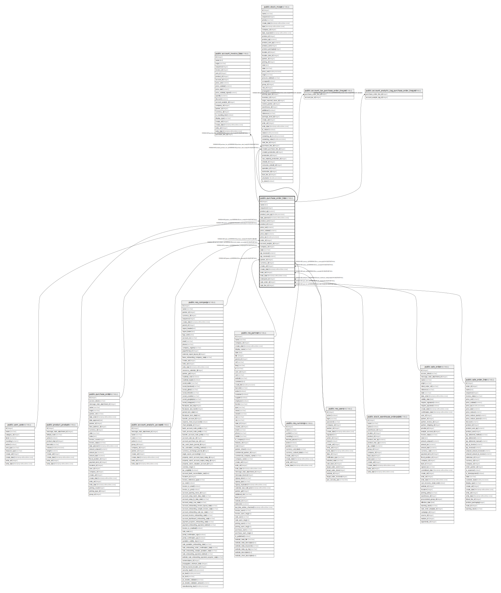

# public.purchase_order_line

## Description

Purchase Order Line

## Columns

| Name | Type | Default | Nullable | Children | Parents | Comment |
| ---- | ---- | ------- | -------- | -------- | ------- | ------- |
| id | integer | nextval('purchase_order_line_id_seq'::regclass) | false | [public.account_invoice_line](public.account_invoice_line.md) [public.stock_move](public.stock_move.md) [public.account_tax_purchase_order_line_rel](public.account_tax_purchase_order_line_rel.md) [public.account_analytic_tag_purchase_order_line_rel](public.account_analytic_tag_purchase_order_line_rel.md) |  |  |
| name | text |  | false |  |  | Description |
| sequence | integer |  | true |  |  | Sequence |
| product_qty | numeric |  | false |  |  | Quantity |
| product_uom_qty | double precision |  | true |  |  | Total Quantity |
| date_planned | timestamp without time zone |  | false |  |  | Scheduled Date |
| product_uom | integer |  | false |  | [public.uom_uom](public.uom_uom.md) | Product Unit of Measure |
| product_id | integer |  | false |  | [public.product_product](public.product_product.md) | Product |
| price_unit | numeric |  | false |  |  | Unit Price |
| price_subtotal | numeric |  | true |  |  | Subtotal |
| price_total | numeric |  | true |  |  | Total |
| price_tax | double precision |  | true |  |  | Tax |
| order_id | integer |  | false |  | [public.purchase_order](public.purchase_order.md) | Order Reference |
| account_analytic_id | integer |  | true |  | [public.account_analytic_account](public.account_analytic_account.md) | Analytic Account |
| company_id | integer |  | true |  | [public.res_company](public.res_company.md) | Company |
| state | varchar |  | true |  |  | Status |
| qty_invoiced | numeric |  | true |  |  | Billed Qty |
| qty_received | numeric |  | true |  |  | Received Qty |
| partner_id | integer |  | true |  | [public.res_partner](public.res_partner.md) | Partner |
| currency_id | integer |  | true |  | [public.res_currency](public.res_currency.md) | Currency |
| create_uid | integer |  | true |  | [public.res_users](public.res_users.md) | Created by |
| create_date | timestamp without time zone |  | true |  |  | Created on |
| write_uid | integer |  | true |  | [public.res_users](public.res_users.md) | Last Updated by |
| write_date | timestamp without time zone |  | true |  |  | Last Updated on |
| orderpoint_id | integer |  | true |  | [public.stock_warehouse_orderpoint](public.stock_warehouse_orderpoint.md) | Orderpoint |
| sale_order_id | integer |  | true |  | [public.sale_order](public.sale_order.md) | Sale Order |
| sale_line_id | integer |  | true |  | [public.sale_order_line](public.sale_order_line.md) | Origin Sale Item |

## Constraints

| Name | Type | Definition |
| ---- | ---- | ---------- |
| purchase_order_line_create_uid_fkey | FOREIGN KEY | FOREIGN KEY (create_uid) REFERENCES res_users(id) ON DELETE SET NULL |
| purchase_order_line_write_uid_fkey | FOREIGN KEY | FOREIGN KEY (write_uid) REFERENCES res_users(id) ON DELETE SET NULL |
| purchase_order_line_currency_id_fkey | FOREIGN KEY | FOREIGN KEY (currency_id) REFERENCES res_currency(id) ON DELETE SET NULL |
| purchase_order_line_company_id_fkey | FOREIGN KEY | FOREIGN KEY (company_id) REFERENCES res_company(id) ON DELETE SET NULL |
| purchase_order_line_partner_id_fkey | FOREIGN KEY | FOREIGN KEY (partner_id) REFERENCES res_partner(id) ON DELETE SET NULL |
| purchase_order_line_product_uom_fkey | FOREIGN KEY | FOREIGN KEY (product_uom) REFERENCES uom_uom(id) ON DELETE SET NULL |
| purchase_order_line_account_analytic_id_fkey | FOREIGN KEY | FOREIGN KEY (account_analytic_id) REFERENCES account_analytic_account(id) ON DELETE SET NULL |
| purchase_order_line_product_id_fkey | FOREIGN KEY | FOREIGN KEY (product_id) REFERENCES product_product(id) ON DELETE SET NULL |
| purchase_order_line_sale_order_id_fkey | FOREIGN KEY | FOREIGN KEY (sale_order_id) REFERENCES sale_order(id) ON DELETE SET NULL |
| purchase_order_line_sale_line_id_fkey | FOREIGN KEY | FOREIGN KEY (sale_line_id) REFERENCES sale_order_line(id) ON DELETE SET NULL |
| purchase_order_line_orderpoint_id_fkey | FOREIGN KEY | FOREIGN KEY (orderpoint_id) REFERENCES stock_warehouse_orderpoint(id) ON DELETE SET NULL |
| purchase_order_line_order_id_fkey | FOREIGN KEY | FOREIGN KEY (order_id) REFERENCES purchase_order(id) ON DELETE CASCADE |
| purchase_order_line_pkey | PRIMARY KEY | PRIMARY KEY (id) |

## Indexes

| Name | Definition |
| ---- | ---------- |
| purchase_order_line_pkey | CREATE UNIQUE INDEX purchase_order_line_pkey ON public.purchase_order_line USING btree (id) |
| purchase_order_line_date_planned_index | CREATE INDEX purchase_order_line_date_planned_index ON public.purchase_order_line USING btree (date_planned) |
| purchase_order_line_order_id_index | CREATE INDEX purchase_order_line_order_id_index ON public.purchase_order_line USING btree (order_id) |
| purchase_order_line_sale_line_id_index | CREATE INDEX purchase_order_line_sale_line_id_index ON public.purchase_order_line USING btree (sale_line_id) |

## Relations

---

> Generated by [tbls](https://github.com/k1LoW/tbls)
