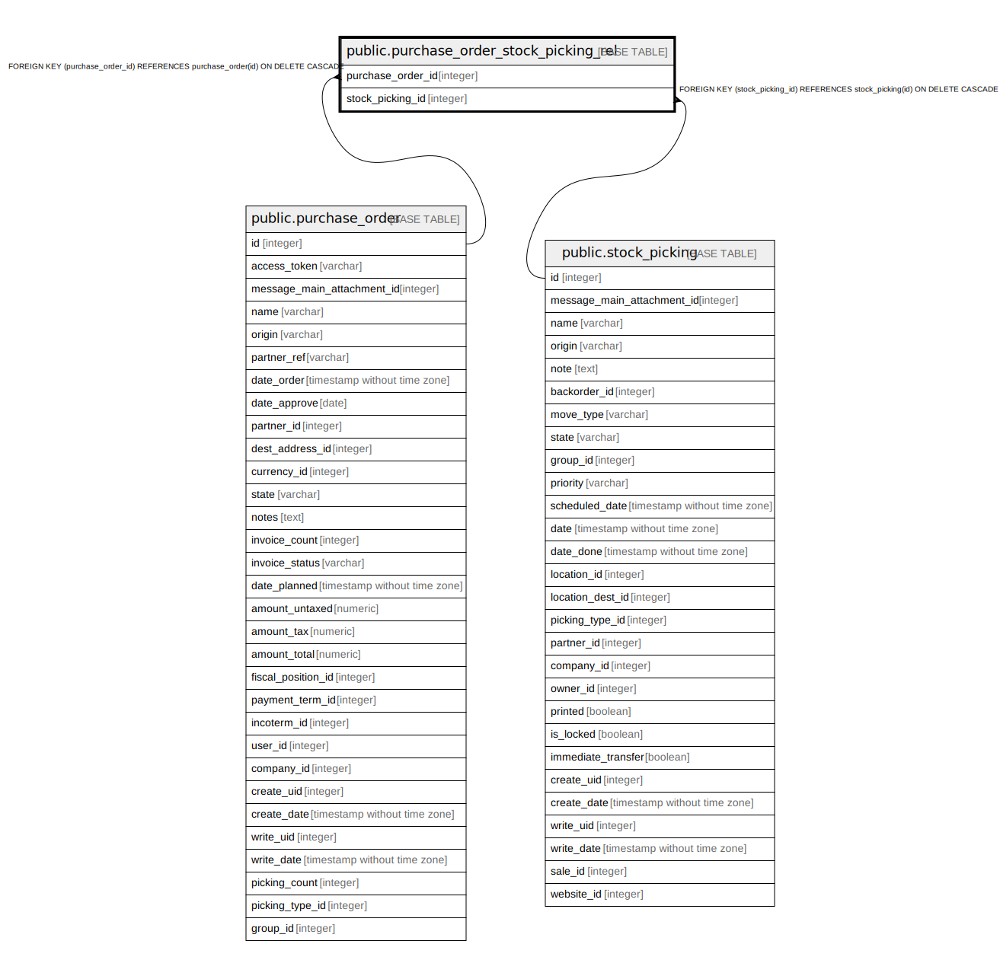

# public.purchase_order_stock_picking_rel

## Description

RELATION BETWEEN purchase_order AND stock_picking

## Columns

| Name | Type | Default | Nullable | Children | Parents | Comment |
| ---- | ---- | ------- | -------- | -------- | ------- | ------- |
| purchase_order_id | integer |  | false |  | [public.purchase_order](public.purchase_order.md) |  |
| stock_picking_id | integer |  | false |  | [public.stock_picking](public.stock_picking.md) |  |

## Constraints

| Name | Type | Definition |
| ---- | ---- | ---------- |
| purchase_order_stock_picking_rel_stock_picking_id_fkey | FOREIGN KEY | FOREIGN KEY (stock_picking_id) REFERENCES stock_picking(id) ON DELETE CASCADE |
| purchase_order_stock_picking_rel_purchase_order_id_fkey | FOREIGN KEY | FOREIGN KEY (purchase_order_id) REFERENCES purchase_order(id) ON DELETE CASCADE |
| purchase_order_stock_picking__purchase_order_id_stock_picki_key | UNIQUE | UNIQUE (purchase_order_id, stock_picking_id) |

## Indexes

| Name | Definition |
| ---- | ---------- |
| purchase_order_stock_picking__purchase_order_id_stock_picki_key | CREATE UNIQUE INDEX purchase_order_stock_picking__purchase_order_id_stock_picki_key ON public.purchase_order_stock_picking_rel USING btree (purchase_order_id, stock_picking_id) |
| purchase_order_stock_picking_rel_purchase_order_id_idx | CREATE INDEX purchase_order_stock_picking_rel_purchase_order_id_idx ON public.purchase_order_stock_picking_rel USING btree (purchase_order_id) |
| purchase_order_stock_picking_rel_stock_picking_id_idx | CREATE INDEX purchase_order_stock_picking_rel_stock_picking_id_idx ON public.purchase_order_stock_picking_rel USING btree (stock_picking_id) |

## Relations

---

> Generated by [tbls](https://github.com/k1LoW/tbls)
