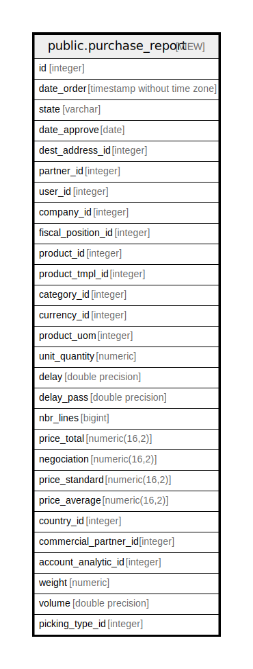

# public.purchase_report

## Description

<details>
<summary><strong>Table Definition</strong></summary>

```sql
CREATE VIEW purchase_report AS (
 WITH currency_rate AS (
         SELECT r.currency_id,
            COALESCE(r.company_id, c.id) AS company_id,
            r.rate,
            r.name AS date_start,
            ( SELECT r2.name
                   FROM res_currency_rate r2
                  WHERE ((r2.name > r.name) AND (r2.currency_id = r.currency_id) AND ((r2.company_id IS NULL) OR (r2.company_id = c.id)))
                  ORDER BY r2.name
                 LIMIT 1) AS date_end
           FROM (res_currency_rate r
             JOIN res_company c ON (((r.company_id IS NULL) OR (r.company_id = c.id))))
        )
 SELECT min(l.id) AS id,
    s.date_order,
    s.state,
    s.date_approve,
    s.dest_address_id,
    s.partner_id,
    s.user_id,
    s.company_id,
    s.fiscal_position_id,
    l.product_id,
    p.product_tmpl_id,
    t.categ_id AS category_id,
    s.currency_id,
    t.uom_id AS product_uom,
    sum(((l.product_qty / u.factor) * u2.factor)) AS unit_quantity,
    (date_part('epoch'::text, age((s.date_approve)::timestamp without time zone, s.date_order)) / ((((24 * 60) * 60))::numeric(16,2))::double precision) AS delay,
    (date_part('epoch'::text, age(l.date_planned, s.date_order)) / ((((24 * 60) * 60))::numeric(16,2))::double precision) AS delay_pass,
    count(*) AS nbr_lines,
    (sum(((l.price_unit / COALESCE(NULLIF(cr.rate, (0)::numeric), 1.0)) * l.product_qty)))::numeric(16,2) AS price_total,
    (avg((((100.0 * ((l.price_unit / COALESCE(NULLIF(cr.rate, (0)::numeric), 1.0)) * l.product_qty)))::double precision / NULLIF((((ip.value_float * (l.product_qty)::double precision) / (u.factor)::double precision) * (u2.factor)::double precision), (0.0)::double precision))))::numeric(16,2) AS negociation,
    (sum((((ip.value_float * (l.product_qty)::double precision) / (u.factor)::double precision) * (u2.factor)::double precision)))::numeric(16,2) AS price_standard,
    ((sum(((l.product_qty * l.price_unit) / COALESCE(NULLIF(cr.rate, (0)::numeric), 1.0))) / NULLIF(sum(((l.product_qty / u.factor) * u2.factor)), 0.0)))::numeric(16,2) AS price_average,
    partner.country_id,
    partner.commercial_partner_id,
    analytic_account.id AS account_analytic_id,
    sum((((p.weight * l.product_qty) / u.factor) * u2.factor)) AS weight,
    sum((((p.volume * (l.product_qty)::double precision) / (u.factor)::double precision) * (u2.factor)::double precision)) AS volume,
    spt.warehouse_id AS picking_type_id
   FROM ((((((((((purchase_order_line l
     JOIN purchase_order s ON ((l.order_id = s.id)))
     JOIN res_partner partner ON ((s.partner_id = partner.id)))
     LEFT JOIN product_product p ON ((l.product_id = p.id)))
     LEFT JOIN product_template t ON ((p.product_tmpl_id = t.id)))
     LEFT JOIN ir_property ip ON ((((ip.name)::text = 'standard_price'::text) AND ((ip.res_id)::text = concat('product.product,', p.id)) AND (ip.company_id = s.company_id))))
     LEFT JOIN uom_uom u ON ((u.id = l.product_uom)))
     LEFT JOIN uom_uom u2 ON ((u2.id = t.uom_id)))
     LEFT JOIN account_analytic_account analytic_account ON ((l.account_analytic_id = analytic_account.id)))
     LEFT JOIN currency_rate cr ON (((cr.currency_id = s.currency_id) AND (cr.company_id = s.company_id) AND (cr.date_start <= COALESCE((s.date_order)::timestamp with time zone, now())) AND ((cr.date_end IS NULL) OR (cr.date_end > COALESCE((s.date_order)::timestamp with time zone, now()))))))
     LEFT JOIN stock_picking_type spt ON ((spt.id = s.picking_type_id)))
  GROUP BY s.company_id, s.user_id, s.partner_id, u.factor, s.currency_id, l.price_unit, s.date_approve, l.date_planned, l.product_uom, s.dest_address_id, s.fiscal_position_id, l.product_id, p.product_tmpl_id, t.categ_id, s.date_order, s.state, u.uom_type, u.category_id, t.uom_id, u.id, u2.factor, partner.country_id, partner.commercial_partner_id, analytic_account.id, spt.warehouse_id
)
```

</details>

## Columns

| Name | Type | Default | Nullable | Children | Parents | Comment |
| ---- | ---- | ------- | -------- | -------- | ------- | ------- |
| id | integer |  | true |  |  |  |
| date_order | timestamp without time zone |  | true |  |  |  |
| state | varchar |  | true |  |  |  |
| date_approve | date |  | true |  |  |  |
| dest_address_id | integer |  | true |  |  |  |
| partner_id | integer |  | true |  |  |  |
| user_id | integer |  | true |  |  |  |
| company_id | integer |  | true |  |  |  |
| fiscal_position_id | integer |  | true |  |  |  |
| product_id | integer |  | true |  |  |  |
| product_tmpl_id | integer |  | true |  |  |  |
| category_id | integer |  | true |  |  |  |
| currency_id | integer |  | true |  |  |  |
| product_uom | integer |  | true |  |  |  |
| unit_quantity | numeric |  | true |  |  |  |
| delay | double precision |  | true |  |  |  |
| delay_pass | double precision |  | true |  |  |  |
| nbr_lines | bigint |  | true |  |  |  |
| price_total | numeric(16,2) |  | true |  |  |  |
| negociation | numeric(16,2) |  | true |  |  |  |
| price_standard | numeric(16,2) |  | true |  |  |  |
| price_average | numeric(16,2) |  | true |  |  |  |
| country_id | integer |  | true |  |  |  |
| commercial_partner_id | integer |  | true |  |  |  |
| account_analytic_id | integer |  | true |  |  |  |
| weight | numeric |  | true |  |  |  |
| volume | double precision |  | true |  |  |  |
| picking_type_id | integer |  | true |  |  |  |

## Relations



---

> Generated by [tbls](https://github.com/k1LoW/tbls)
