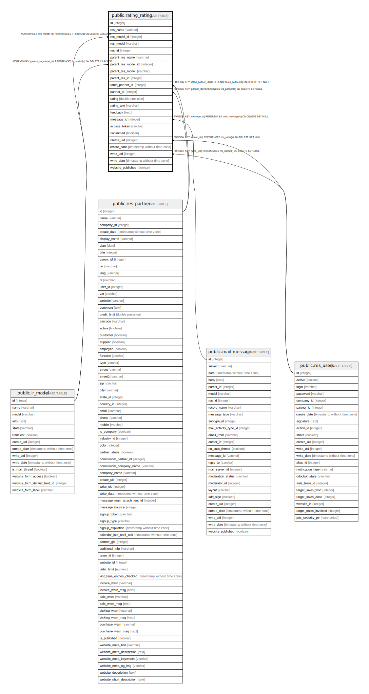

# public.rating_rating

## Description

Rating

## Columns

| Name | Type | Default | Nullable | Children | Parents | Comment |
| ---- | ---- | ------- | -------- | -------- | ------- | ------- |
| id | integer | nextval('rating_rating_id_seq'::regclass) | false |  |  |  |
| res_name | varchar |  | true |  |  | Resource name |
| res_model_id | integer |  | true |  | [public.ir_model](public.ir_model.md) | Related Document Model |
| res_model | varchar |  | true |  |  | Document Model |
| res_id | integer |  | false |  |  | Document |
| parent_res_name | varchar |  | true |  |  | Parent Document Name |
| parent_res_model_id | integer |  | true |  | [public.ir_model](public.ir_model.md) | Parent Related Document Model |
| parent_res_model | varchar |  | true |  |  | Parent Document Model |
| parent_res_id | integer |  | true |  |  | Parent Document |
| rated_partner_id | integer |  | true |  | [public.res_partner](public.res_partner.md) | Rated person |
| partner_id | integer |  | true |  | [public.res_partner](public.res_partner.md) | Customer |
| rating | double precision |  | true |  |  | Rating Number |
| rating_text | varchar |  | true |  |  | Rating |
| feedback | text |  | true |  |  | Comment |
| message_id | integer |  | true |  | [public.mail_message](public.mail_message.md) | Linked message |
| access_token | varchar |  | true |  |  | Security Token |
| consumed | boolean |  | true |  |  | Filled Rating |
| create_uid | integer |  | true |  | [public.res_users](public.res_users.md) | Created by |
| create_date | timestamp without time zone |  | true |  |  | Created on |
| write_uid | integer |  | true |  | [public.res_users](public.res_users.md) | Last Updated by |
| write_date | timestamp without time zone |  | true |  |  | Last Updated on |
| website_published | boolean |  | true |  |  | Published |

## Constraints

| Name | Type | Definition | Comment |
| ---- | ---- | ---------- | ------- |
| rating_rating_rating_range | CHECK | CHECK (((rating >= (0)::double precision) AND (rating <= (10)::double precision))) | check(rating >= 0 and rating <= 10) |
| rating_rating_create_uid_fkey | FOREIGN KEY | FOREIGN KEY (create_uid) REFERENCES res_users(id) ON DELETE SET NULL |  |
| rating_rating_write_uid_fkey | FOREIGN KEY | FOREIGN KEY (write_uid) REFERENCES res_users(id) ON DELETE SET NULL |  |
| rating_rating_partner_id_fkey | FOREIGN KEY | FOREIGN KEY (partner_id) REFERENCES res_partner(id) ON DELETE SET NULL |  |
| rating_rating_rated_partner_id_fkey | FOREIGN KEY | FOREIGN KEY (rated_partner_id) REFERENCES res_partner(id) ON DELETE SET NULL |  |
| rating_rating_parent_res_model_id_fkey | FOREIGN KEY | FOREIGN KEY (parent_res_model_id) REFERENCES ir_model(id) ON DELETE CASCADE |  |
| rating_rating_res_model_id_fkey | FOREIGN KEY | FOREIGN KEY (res_model_id) REFERENCES ir_model(id) ON DELETE CASCADE |  |
| rating_rating_message_id_fkey | FOREIGN KEY | FOREIGN KEY (message_id) REFERENCES mail_message(id) ON DELETE SET NULL |  |
| rating_rating_pkey | PRIMARY KEY | PRIMARY KEY (id) |  |

## Indexes

| Name | Definition |
| ---- | ---------- |
| rating_rating_pkey | CREATE UNIQUE INDEX rating_rating_pkey ON public.rating_rating USING btree (id) |
| rating_rating_res_model_id_index | CREATE INDEX rating_rating_res_model_id_index ON public.rating_rating USING btree (res_model_id) |
| rating_rating_res_model_index | CREATE INDEX rating_rating_res_model_index ON public.rating_rating USING btree (res_model) |
| rating_rating_res_id_index | CREATE INDEX rating_rating_res_id_index ON public.rating_rating USING btree (res_id) |
| rating_rating_parent_res_model_id_index | CREATE INDEX rating_rating_parent_res_model_id_index ON public.rating_rating USING btree (parent_res_model_id) |
| rating_rating_parent_res_model_index | CREATE INDEX rating_rating_parent_res_model_index ON public.rating_rating USING btree (parent_res_model) |
| rating_rating_parent_res_id_index | CREATE INDEX rating_rating_parent_res_id_index ON public.rating_rating USING btree (parent_res_id) |
| rating_rating_message_id_index | CREATE INDEX rating_rating_message_id_index ON public.rating_rating USING btree (message_id) |

## Relations

---

> Generated by [tbls](https://github.com/k1LoW/tbls)
