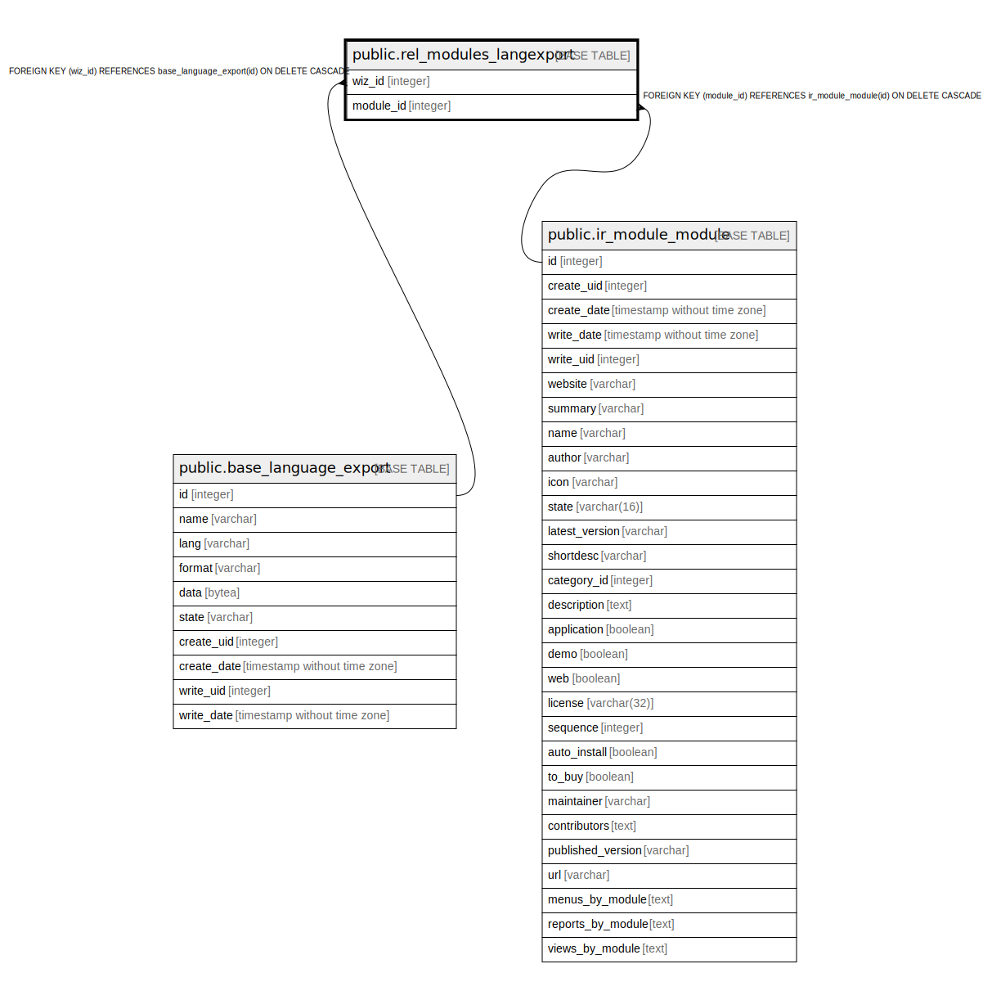

# public.rel_modules_langexport

## Description

RELATION BETWEEN base_language_export AND ir_module_module

## Columns

| Name | Type | Default | Nullable | Children | Parents | Comment |
| ---- | ---- | ------- | -------- | -------- | ------- | ------- |
| wiz_id | integer |  | false |  | [public.base_language_export](public.base_language_export.md) |  |
| module_id | integer |  | false |  | [public.ir_module_module](public.ir_module_module.md) |  |

## Constraints

| Name | Type | Definition |
| ---- | ---- | ---------- |
| rel_modules_langexport_module_id_fkey | FOREIGN KEY | FOREIGN KEY (module_id) REFERENCES ir_module_module(id) ON DELETE CASCADE |
| rel_modules_langexport_wiz_id_fkey | FOREIGN KEY | FOREIGN KEY (wiz_id) REFERENCES base_language_export(id) ON DELETE CASCADE |
| rel_modules_langexport_wiz_id_module_id_key | UNIQUE | UNIQUE (wiz_id, module_id) |

## Indexes

| Name | Definition |
| ---- | ---------- |
| rel_modules_langexport_wiz_id_module_id_key | CREATE UNIQUE INDEX rel_modules_langexport_wiz_id_module_id_key ON public.rel_modules_langexport USING btree (wiz_id, module_id) |
| rel_modules_langexport_wiz_id_idx | CREATE INDEX rel_modules_langexport_wiz_id_idx ON public.rel_modules_langexport USING btree (wiz_id) |
| rel_modules_langexport_module_id_idx | CREATE INDEX rel_modules_langexport_module_id_idx ON public.rel_modules_langexport USING btree (module_id) |

## Relations

---

> Generated by [tbls](https://github.com/k1LoW/tbls)
