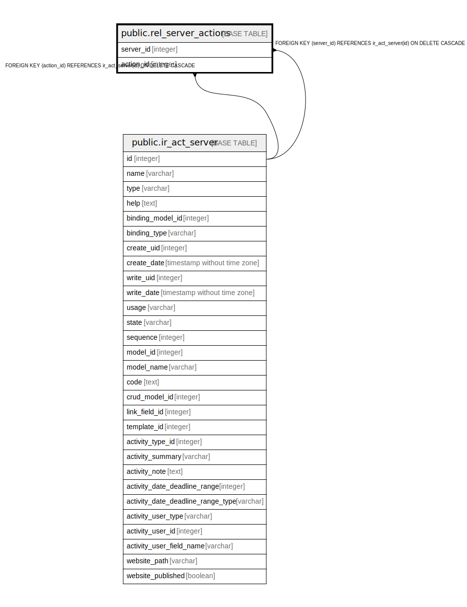

# public.rel_server_actions

## Description

RELATION BETWEEN ir_act_server AND ir_act_server

## Columns

| Name | Type | Default | Nullable | Children | Parents | Comment |
| ---- | ---- | ------- | -------- | -------- | ------- | ------- |
| server_id | integer |  | false |  | [public.ir_act_server](public.ir_act_server.md) |  |
| action_id | integer |  | false |  | [public.ir_act_server](public.ir_act_server.md) |  |

## Constraints

| Name | Type | Definition |
| ---- | ---- | ---------- |
| rel_server_actions_action_id_fkey | FOREIGN KEY | FOREIGN KEY (action_id) REFERENCES ir_act_server(id) ON DELETE CASCADE |
| rel_server_actions_server_id_fkey | FOREIGN KEY | FOREIGN KEY (server_id) REFERENCES ir_act_server(id) ON DELETE CASCADE |
| rel_server_actions_server_id_action_id_key | UNIQUE | UNIQUE (server_id, action_id) |

## Indexes

| Name | Definition |
| ---- | ---------- |
| rel_server_actions_server_id_action_id_key | CREATE UNIQUE INDEX rel_server_actions_server_id_action_id_key ON public.rel_server_actions USING btree (server_id, action_id) |
| rel_server_actions_server_id_idx | CREATE INDEX rel_server_actions_server_id_idx ON public.rel_server_actions USING btree (server_id) |
| rel_server_actions_action_id_idx | CREATE INDEX rel_server_actions_action_id_idx ON public.rel_server_actions USING btree (action_id) |

## Relations

---

> Generated by [tbls](https://github.com/k1LoW/tbls)
