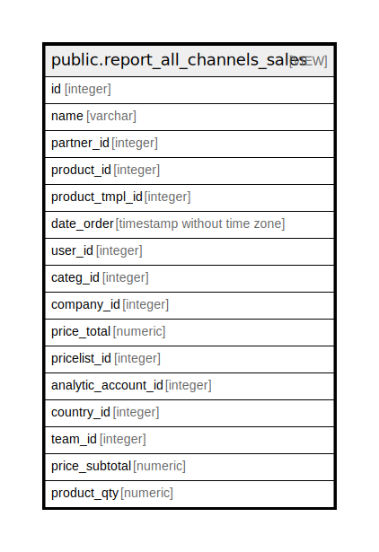

# public.report_all_channels_sales

## Description

<details>
<summary><strong>Table Definition</strong></summary>

```sql
CREATE VIEW report_all_channels_sales AS (
 SELECT foo.id,
    foo.name,
    foo.partner_id,
    foo.product_id,
    foo.product_tmpl_id,
    foo.date_order,
    foo.user_id,
    foo.categ_id,
    foo.company_id,
    foo.price_total,
    foo.pricelist_id,
    foo.analytic_account_id,
    foo.country_id,
    foo.team_id,
    foo.price_subtotal,
    foo.product_qty
   FROM ( SELECT sol.id,
            so.name,
            so.partner_id,
            sol.product_id,
            pro.product_tmpl_id,
            so.date_order,
            so.user_id,
            pt.categ_id,
            so.company_id,
            (sol.price_total /
                CASE COALESCE(so.currency_rate, (0)::numeric)
                    WHEN 0 THEN 1.0
                    ELSE so.currency_rate
                END) AS price_total,
            so.pricelist_id,
            rp.country_id,
            (sol.price_subtotal /
                CASE COALESCE(so.currency_rate, (0)::numeric)
                    WHEN 0 THEN 1.0
                    ELSE so.currency_rate
                END) AS price_subtotal,
            ((sol.product_uom_qty / u.factor) * u2.factor) AS product_qty,
            so.analytic_account_id,
            so.team_id
           FROM (((((((sale_order_line sol
             JOIN sale_order so ON ((sol.order_id = so.id)))
             LEFT JOIN product_product pro ON ((sol.product_id = pro.id)))
             JOIN res_partner rp ON ((so.partner_id = rp.id)))
             LEFT JOIN product_template pt ON ((pro.product_tmpl_id = pt.id)))
             LEFT JOIN product_pricelist pp ON ((so.pricelist_id = pp.id)))
             LEFT JOIN uom_uom u ON ((u.id = sol.product_uom)))
             LEFT JOIN uom_uom u2 ON ((u2.id = pt.uom_id)))
          WHERE ((so.state)::text = ANY ((ARRAY['sale'::character varying, 'done'::character varying])::text[]))) foo
)
```

</details>

## Columns

| Name | Type | Default | Nullable | Children | Parents | Comment |
| ---- | ---- | ------- | -------- | -------- | ------- | ------- |
| id | integer |  | true |  |  |  |
| name | varchar |  | true |  |  |  |
| partner_id | integer |  | true |  |  |  |
| product_id | integer |  | true |  |  |  |
| product_tmpl_id | integer |  | true |  |  |  |
| date_order | timestamp without time zone |  | true |  |  |  |
| user_id | integer |  | true |  |  |  |
| categ_id | integer |  | true |  |  |  |
| company_id | integer |  | true |  |  |  |
| price_total | numeric |  | true |  |  |  |
| pricelist_id | integer |  | true |  |  |  |
| analytic_account_id | integer |  | true |  |  |  |
| country_id | integer |  | true |  |  |  |
| team_id | integer |  | true |  |  |  |
| price_subtotal | numeric |  | true |  |  |  |
| product_qty | numeric |  | true |  |  |  |

## Relations



---

> Generated by [tbls](https://github.com/k1LoW/tbls)
