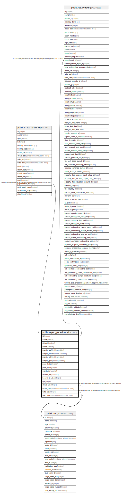

# public.report_paperformat

## Description

Paper Format Config

## Columns

| Name | Type | Default | Nullable | Children | Parents | Comment |
| ---- | ---- | ------- | -------- | -------- | ------- | ------- |
| id | integer | nextval('report_paperformat_id_seq'::regclass) | false | [public.ir_act_report_xml](public.ir_act_report_xml.md) [public.res_company](public.res_company.md) |  |  |
| name | varchar |  | false |  |  | Name |
| default | boolean |  | true |  |  | Default paper format ? |
| format | varchar |  | true |  |  | Paper size |
| margin_top | double precision |  | true |  |  | Top Margin (mm) |
| margin_bottom | double precision |  | true |  |  | Bottom Margin (mm) |
| margin_left | double precision |  | true |  |  | Left Margin (mm) |
| margin_right | double precision |  | true |  |  | Right Margin (mm) |
| page_height | integer |  | true |  |  | Page height (mm) |
| page_width | integer |  | true |  |  | Page width (mm) |
| orientation | varchar |  | true |  |  | Orientation |
| header_line | boolean |  | true |  |  | Display a header line |
| header_spacing | integer |  | true |  |  | Header spacing |
| dpi | integer |  | false |  |  | Output DPI |
| create_uid | integer |  | true |  | [public.res_users](public.res_users.md) | Created by |
| create_date | timestamp without time zone |  | true |  |  | Created on |
| write_uid | integer |  | true |  | [public.res_users](public.res_users.md) | Last Updated by |
| write_date | timestamp without time zone |  | true |  |  | Last Updated on |

## Constraints

| Name | Type | Definition |
| ---- | ---- | ---------- |
| report_paperformat_create_uid_fkey | FOREIGN KEY | FOREIGN KEY (create_uid) REFERENCES res_users(id) ON DELETE SET NULL |
| report_paperformat_write_uid_fkey | FOREIGN KEY | FOREIGN KEY (write_uid) REFERENCES res_users(id) ON DELETE SET NULL |
| report_paperformat_pkey | PRIMARY KEY | PRIMARY KEY (id) |

## Indexes

| Name | Definition |
| ---- | ---------- |
| report_paperformat_pkey | CREATE UNIQUE INDEX report_paperformat_pkey ON public.report_paperformat USING btree (id) |

## Relations

---

> Generated by [tbls](https://github.com/k1LoW/tbls)
