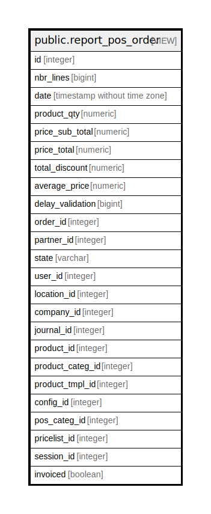

# public.report_pos_order

## Description

<details>
<summary><strong>Table Definition</strong></summary>

```sql
CREATE VIEW report_pos_order AS (
 SELECT min(l.id) AS id,
    count(*) AS nbr_lines,
    s.date_order AS date,
    sum(l.qty) AS product_qty,
    sum((l.qty * l.price_unit)) AS price_sub_total,
    sum((((l.qty * l.price_unit) * ((100)::numeric - l.discount)) / (100)::numeric)) AS price_total,
    sum(((l.qty * l.price_unit) * (l.discount / (100)::numeric))) AS total_discount,
    (sum((l.qty * l.price_unit)) / sum((l.qty * u.factor))) AS average_price,
    sum((to_char((date_trunc('day'::text, s.date_order) - date_trunc('day'::text, s.create_date)), 'DD'::text))::integer) AS delay_validation,
    s.id AS order_id,
    s.partner_id,
    s.state,
    s.user_id,
    s.location_id,
    s.company_id,
    s.sale_journal AS journal_id,
    l.product_id,
    pt.categ_id AS product_categ_id,
    p.product_tmpl_id,
    ps.config_id,
    pt.pos_categ_id,
    s.pricelist_id,
    s.session_id,
    (s.invoice_id IS NOT NULL) AS invoiced
   FROM (((((pos_order_line l
     LEFT JOIN pos_order s ON ((s.id = l.order_id)))
     LEFT JOIN product_product p ON ((l.product_id = p.id)))
     LEFT JOIN product_template pt ON ((p.product_tmpl_id = pt.id)))
     LEFT JOIN uom_uom u ON ((u.id = pt.uom_id)))
     LEFT JOIN pos_session ps ON ((s.session_id = ps.id)))
  GROUP BY s.id, s.date_order, s.partner_id, s.state, pt.categ_id, s.user_id, s.location_id, s.company_id, s.sale_journal, s.pricelist_id, s.invoice_id, s.create_date, s.session_id, l.product_id, pt.pos_categ_id, p.product_tmpl_id, ps.config_id
 HAVING (sum((l.qty * u.factor)) <> (0)::numeric)
)
```

</details>

## Columns

| Name | Type | Default | Nullable | Children | Parents | Comment |
| ---- | ---- | ------- | -------- | -------- | ------- | ------- |
| id | integer |  | true |  |  |  |
| nbr_lines | bigint |  | true |  |  |  |
| date | timestamp without time zone |  | true |  |  |  |
| product_qty | numeric |  | true |  |  |  |
| price_sub_total | numeric |  | true |  |  |  |
| price_total | numeric |  | true |  |  |  |
| total_discount | numeric |  | true |  |  |  |
| average_price | numeric |  | true |  |  |  |
| delay_validation | bigint |  | true |  |  |  |
| order_id | integer |  | true |  |  |  |
| partner_id | integer |  | true |  |  |  |
| state | varchar |  | true |  |  |  |
| user_id | integer |  | true |  |  |  |
| location_id | integer |  | true |  |  |  |
| company_id | integer |  | true |  |  |  |
| journal_id | integer |  | true |  |  |  |
| product_id | integer |  | true |  |  |  |
| product_categ_id | integer |  | true |  |  |  |
| product_tmpl_id | integer |  | true |  |  |  |
| config_id | integer |  | true |  |  |  |
| pos_categ_id | integer |  | true |  |  |  |
| pricelist_id | integer |  | true |  |  |  |
| session_id | integer |  | true |  |  |  |
| invoiced | boolean |  | true |  |  |  |

## Relations



---

> Generated by [tbls](https://github.com/k1LoW/tbls)
