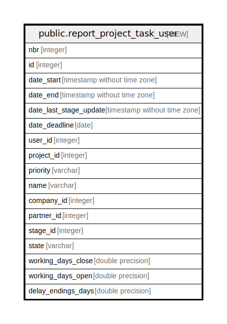

# public.report_project_task_user

## Description

<details>
<summary><strong>Table Definition</strong></summary>

```sql
CREATE VIEW report_project_task_user AS (
 SELECT ( SELECT 1) AS nbr,
    t.id,
    t.date_start,
    t.date_end,
    t.date_last_stage_update,
    t.date_deadline,
    t.user_id,
    t.project_id,
    t.priority,
    t.name,
    t.company_id,
    t.partner_id,
    t.stage_id,
    t.kanban_state AS state,
    t.working_days_close,
    t.working_days_open,
    (date_part('epoch'::text, ((t.date_deadline)::timestamp without time zone - timezone('UTC'::text, now()))) / ((3600 * 24))::double precision) AS delay_endings_days
   FROM project_task t
  WHERE (t.active = true)
  GROUP BY t.id, t.create_date, t.write_date, t.date_start, t.date_end, t.date_deadline, t.date_last_stage_update, t.user_id, t.project_id, t.priority, t.name, t.company_id, t.partner_id, t.stage_id
)
```

</details>

## Columns

| Name | Type | Default | Nullable | Children | Parents | Comment |
| ---- | ---- | ------- | -------- | -------- | ------- | ------- |
| nbr | integer |  | true |  |  |  |
| id | integer |  | true |  |  |  |
| date_start | timestamp without time zone |  | true |  |  |  |
| date_end | timestamp without time zone |  | true |  |  |  |
| date_last_stage_update | timestamp without time zone |  | true |  |  |  |
| date_deadline | date |  | true |  |  |  |
| user_id | integer |  | true |  |  |  |
| project_id | integer |  | true |  |  |  |
| priority | varchar |  | true |  |  |  |
| name | varchar |  | true |  |  |  |
| company_id | integer |  | true |  |  |  |
| partner_id | integer |  | true |  |  |  |
| stage_id | integer |  | true |  |  |  |
| state | varchar |  | true |  |  |  |
| working_days_close | double precision |  | true |  |  |  |
| working_days_open | double precision |  | true |  |  |  |
| delay_endings_days | double precision |  | true |  |  |  |

## Relations



---

> Generated by [tbls](https://github.com/k1LoW/tbls)
