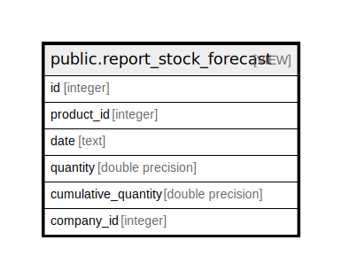

# public.report_stock_forecast

## Description

<details>
<summary><strong>Table Definition</strong></summary>

```sql
CREATE VIEW report_stock_forecast AS (
 SELECT min(final.id) AS id,
    final.product_id,
    to_char(final.date, 'YYYY-MM-DD'::text) AS date,
    sum(final.product_qty) AS quantity,
    sum(sum(final.product_qty)) OVER (PARTITION BY final.product_id ORDER BY final.date) AS cumulative_quantity,
    final.company_id
   FROM ( SELECT min(main.id) AS id,
            main.product_id,
            sub.date,
                CASE
                    WHEN (main.date = sub.date) THEN sum(main.product_qty)
                    ELSE (0)::double precision
                END AS product_qty,
            main.company_id
           FROM (( SELECT min(sq.id) AS id,
                    sq.product_id,
                    date_trunc('week'::text, (to_date(to_char((CURRENT_DATE)::timestamp with time zone, 'YYYY/MM/DD'::text), 'YYYY/MM/DD'::text))::timestamp with time zone) AS date,
                    sum(sq.quantity) AS product_qty,
                    sq.company_id
                   FROM ((stock_quant sq
                     LEFT JOIN product_product ON ((product_product.id = sq.product_id)))
                     LEFT JOIN stock_location location_id ON ((sq.location_id = location_id.id)))
                  WHERE ((location_id.usage)::text = 'internal'::text)
                  GROUP BY (date_trunc('week'::text, (to_date(to_char((CURRENT_DATE)::timestamp with time zone, 'YYYY/MM/DD'::text), 'YYYY/MM/DD'::text))::timestamp with time zone)), sq.product_id, sq.company_id
                UNION ALL
                 SELECT min((- sm.id)) AS id,
                    sm.product_id,
                        CASE
                            WHEN (sm.date_expected > CURRENT_DATE) THEN date_trunc('week'::text, (to_date(to_char(sm.date_expected, 'YYYY/MM/DD'::text), 'YYYY/MM/DD'::text))::timestamp with time zone)
                            ELSE date_trunc('week'::text, (to_date(to_char((CURRENT_DATE)::timestamp with time zone, 'YYYY/MM/DD'::text), 'YYYY/MM/DD'::text))::timestamp with time zone)
                        END AS date,
                    sum(sm.product_qty) AS product_qty,
                    sm.company_id
                   FROM (((stock_move sm
                     LEFT JOIN product_product ON ((product_product.id = sm.product_id)))
                     LEFT JOIN stock_location dest_location ON ((sm.location_dest_id = dest_location.id)))
                     LEFT JOIN stock_location source_location ON ((sm.location_id = source_location.id)))
                  WHERE (((sm.state)::text = ANY ((ARRAY['confirmed'::character varying, 'partially_available'::character varying, 'assigned'::character varying, 'waiting'::character varying])::text[])) AND ((source_location.usage)::text <> 'internal'::text) AND ((dest_location.usage)::text = 'internal'::text))
                  GROUP BY sm.date_expected, sm.product_id, sm.company_id
                UNION ALL
                 SELECT min((- sm.id)) AS id,
                    sm.product_id,
                        CASE
                            WHEN (sm.date_expected > CURRENT_DATE) THEN date_trunc('week'::text, (to_date(to_char(sm.date_expected, 'YYYY/MM/DD'::text), 'YYYY/MM/DD'::text))::timestamp with time zone)
                            ELSE date_trunc('week'::text, (to_date(to_char((CURRENT_DATE)::timestamp with time zone, 'YYYY/MM/DD'::text), 'YYYY/MM/DD'::text))::timestamp with time zone)
                        END AS date,
                    sum((- sm.product_qty)) AS product_qty,
                    sm.company_id
                   FROM (((stock_move sm
                     LEFT JOIN product_product ON ((product_product.id = sm.product_id)))
                     LEFT JOIN stock_location source_location ON ((sm.location_id = source_location.id)))
                     LEFT JOIN stock_location dest_location ON ((sm.location_dest_id = dest_location.id)))
                  WHERE (((sm.state)::text = ANY ((ARRAY['confirmed'::character varying, 'partially_available'::character varying, 'assigned'::character varying, 'waiting'::character varying])::text[])) AND ((source_location.usage)::text = 'internal'::text) AND ((dest_location.usage)::text <> 'internal'::text))
                  GROUP BY sm.date_expected, sm.product_id, sm.company_id) main
             LEFT JOIN ( SELECT DISTINCT date_search.date
                   FROM ( SELECT date_trunc('week'::text, (CURRENT_DATE)::timestamp with time zone) AS date
                        UNION ALL
                         SELECT date_trunc('week'::text, (to_date(to_char(sm.date_expected, 'YYYY/MM/DD'::text), 'YYYY/MM/DD'::text))::timestamp with time zone) AS date
                           FROM ((stock_move sm
                             LEFT JOIN stock_location source_location ON ((sm.location_id = source_location.id)))
                             LEFT JOIN stock_location dest_location ON ((sm.location_dest_id = dest_location.id)))
                          WHERE (((sm.state)::text = ANY ((ARRAY['confirmed'::character varying, 'assigned'::character varying, 'waiting'::character varying])::text[])) AND (sm.date_expected > CURRENT_DATE) AND ((((dest_location.usage)::text = 'internal'::text) AND ((source_location.usage)::text <> 'internal'::text)) OR (((source_location.usage)::text = 'internal'::text) AND ((dest_location.usage)::text <> 'internal'::text))))) date_search) sub ON ((sub.date IS NOT NULL)))
          GROUP BY main.product_id, sub.date, main.date, main.company_id) final
  GROUP BY final.product_id, final.date, final.company_id
)
```

</details>

## Columns

| Name | Type | Default | Nullable | Children | Parents | Comment |
| ---- | ---- | ------- | -------- | -------- | ------- | ------- |
| id | integer |  | true |  |  |  |
| product_id | integer |  | true |  |  |  |
| date | text |  | true |  |  |  |
| quantity | double precision |  | true |  |  |  |
| cumulative_quantity | double precision |  | true |  |  |  |
| company_id | integer |  | true |  |  |  |

## Relations



---

> Generated by [tbls](https://github.com/k1LoW/tbls)
