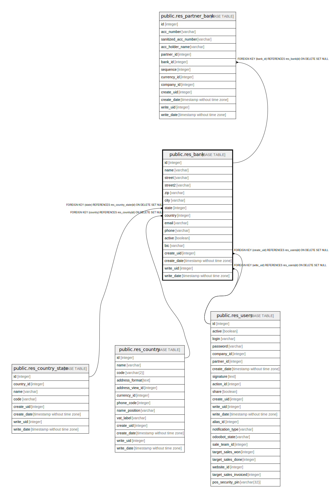

# public.res_bank

## Description

Bank

## Columns

| Name | Type | Default | Nullable | Children | Parents | Comment |
| ---- | ---- | ------- | -------- | -------- | ------- | ------- |
| id | integer | nextval('res_bank_id_seq'::regclass) | false | [public.res_partner_bank](public.res_partner_bank.md) |  |  |
| name | varchar |  | false |  |  | Name |
| street | varchar |  | true |  |  | Street |
| street2 | varchar |  | true |  |  | Street2 |
| zip | varchar |  | true |  |  | Zip |
| city | varchar |  | true |  |  | City |
| state | integer |  | true |  | [public.res_country_state](public.res_country_state.md) | Fed. State |
| country | integer |  | true |  | [public.res_country](public.res_country.md) | Country |
| email | varchar |  | true |  |  | Email |
| phone | varchar |  | true |  |  | Phone |
| active | boolean |  | true |  |  | Active |
| bic | varchar |  | true |  |  | Bank Identifier Code |
| create_uid | integer |  | true |  | [public.res_users](public.res_users.md) | Created by |
| create_date | timestamp without time zone |  | true |  |  | Created on |
| write_uid | integer |  | true |  | [public.res_users](public.res_users.md) | Last Updated by |
| write_date | timestamp without time zone |  | true |  |  | Last Updated on |

## Constraints

| Name | Type | Definition |
| ---- | ---- | ---------- |
| res_bank_create_uid_fkey | FOREIGN KEY | FOREIGN KEY (create_uid) REFERENCES res_users(id) ON DELETE SET NULL |
| res_bank_write_uid_fkey | FOREIGN KEY | FOREIGN KEY (write_uid) REFERENCES res_users(id) ON DELETE SET NULL |
| res_bank_country_fkey | FOREIGN KEY | FOREIGN KEY (country) REFERENCES res_country(id) ON DELETE SET NULL |
| res_bank_state_fkey | FOREIGN KEY | FOREIGN KEY (state) REFERENCES res_country_state(id) ON DELETE SET NULL |
| res_bank_pkey | PRIMARY KEY | PRIMARY KEY (id) |

## Indexes

| Name | Definition |
| ---- | ---------- |
| res_bank_pkey | CREATE UNIQUE INDEX res_bank_pkey ON public.res_bank USING btree (id) |
| res_bank_bic_index | CREATE INDEX res_bank_bic_index ON public.res_bank USING btree (bic) |

## Relations

---

> Generated by [tbls](https://github.com/k1LoW/tbls)
