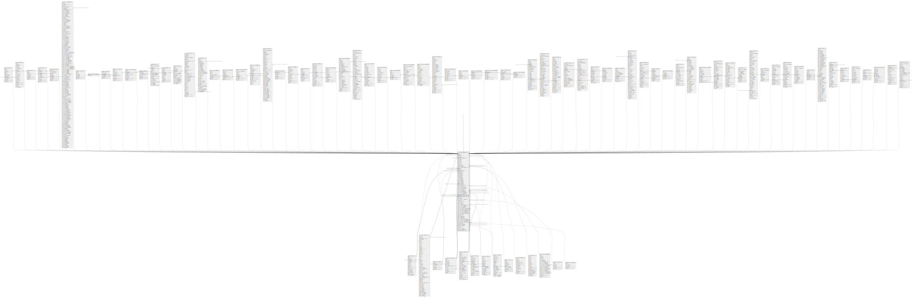

# public.res_company

## Description

## Columns

| Name | Type | Default | Nullable | Children | Parents | Comment |
| ---- | ---- | ------- | -------- | -------- | ------- | ------- |
| id | integer | nextval('res_company_id_seq'::regclass) | false | [public.res_users](public.res_users.md) [public.res_company](public.res_company.md) [public.res_partner](public.res_partner.md) [public.ir_sequence](public.ir_sequence.md) [public.ir_attachment](public.ir_attachment.md) [public.ir_default](public.ir_default.md) [public.ir_property](public.ir_property.md) [public.res_partner_bank](public.res_partner_bank.md) [public.res_config_settings](public.res_config_settings.md) [public.res_currency_rate](public.res_currency_rate.md) [public.res_company_users_rel](public.res_company_users_rel.md) [public.iap_account](public.iap_account.md) [public.resource_calendar](public.resource_calendar.md) [public.resource_resource](public.resource_resource.md) [public.resource_calendar_leaves](public.resource_calendar_leaves.md) [public.resource_test](public.resource_test.md) [public.crm_team](public.crm_team.md) [public.snailmail_letter](public.snailmail_letter.md) [public.digest_digest](public.digest_digest.md) [public.crm_lead](public.crm_lead.md) [public.website](public.website.md) [public.account_analytic_tag](public.account_analytic_tag.md) [public.account_analytic_group](public.account_analytic_group.md) [public.account_analytic_account](public.account_analytic_account.md) [public.account_analytic_line](public.account_analytic_line.md) [public.product_template](public.product_template.md) [public.product_price_history](public.product_price_history.md) [public.product_supplierinfo](public.product_supplierinfo.md) [public.product_pricelist](public.product_pricelist.md) [public.product_pricelist_item](public.product_pricelist_item.md) [public.account_fiscal_position](public.account_fiscal_position.md) [public.account_account](public.account_account.md) [public.account_journal](public.account_journal.md) [public.account_tax](public.account_tax.md) [public.account_reconcile_model](public.account_reconcile_model.md) [public.account_invoice](public.account_invoice.md) [public.account_invoice_line](public.account_invoice_line.md) [public.account_invoice_tax](public.account_invoice_tax.md) [public.account_payment_term](public.account_payment_term.md) [public.account_bank_statement](public.account_bank_statement.md) [public.account_bank_statement_line](public.account_bank_statement_line.md) [public.account_move](public.account_move.md) [public.account_move_line](public.account_move_line.md) [public.account_partial_reconcile](public.account_partial_reconcile.md) [public.account_fiscal_year](public.account_fiscal_year.md) [public.account_common_report](public.account_common_report.md) [public.account_common_journal_report](public.account_common_journal_report.md) [public.account_print_journal](public.account_print_journal.md) [public.account_financial_year_op](public.account_financial_year_op.md) [public.payment_acquirer](public.payment_acquirer.md) [public.sale_order](public.sale_order.md) [public.sale_order_line](public.sale_order_line.md) [public.project_project](public.project_project.md) [public.project_task](public.project_task.md) [public.stock_inventory](public.stock_inventory.md) [public.stock_inventory_line](public.stock_inventory_line.md) [public.stock_location](public.stock_location.md) [public.stock_location_route](public.stock_location_route.md) [public.stock_move](public.stock_move.md) [public.stock_picking](public.stock_picking.md) [public.stock_quant](public.stock_quant.md) [public.stock_quant_package](public.stock_quant_package.md) [public.stock_rule](public.stock_rule.md) [public.stock_warehouse](public.stock_warehouse.md) [public.stock_warehouse_orderpoint](public.stock_warehouse_orderpoint.md) [public.purchase_order](public.purchase_order.md) [public.purchase_order_line](public.purchase_order_line.md) [public.hr_job](public.hr_job.md) [public.hr_employee](public.hr_employee.md) [public.hr_department](public.hr_department.md) [public.hr_contract](public.hr_contract.md) [public.hr_expense](public.hr_expense.md) [public.hr_expense_sheet](public.hr_expense_sheet.md) [public.lunch_order](public.lunch_order.md) [public.pos_config](public.pos_config.md) [public.pos_order](public.pos_order.md) [public.pos_order_line](public.pos_order_line.md) [public.mrp_bom](public.mrp_bom.md) [public.mrp_routing](public.mrp_routing.md) [public.mrp_routing_workcenter](public.mrp_routing_workcenter.md) [public.mrp_workcenter](public.mrp_workcenter.md) [public.mrp_production](public.mrp_production.md) |  |  |
| name | varchar |  | false |  |  |  |
| partner_id | integer |  | false |  | [public.res_partner](public.res_partner.md) |  |
| currency_id | integer |  | false |  | [public.res_currency](public.res_currency.md) |  |
| sequence | integer |  | true |  |  |  |
| create_date | timestamp without time zone |  | true |  |  |  |
| parent_id | integer |  | true |  | [public.res_company](public.res_company.md) | Parent Company |
| report_header | text |  | true |  |  | Company Tagline |
| report_footer | text |  | true |  |  | Report Footer |
| logo_web | bytea |  | true |  |  | Logo Web |
| account_no | varchar |  | true |  |  | Account No. |
| email | varchar |  | true |  |  | Email |
| phone | varchar |  | true |  |  | Phone |
| company_registry | varchar |  | true |  |  | Company Registry |
| paperformat_id | integer |  | true |  | [public.report_paperformat](public.report_paperformat.md) | Paper format |
| external_report_layout_id | integer |  | true |  | [public.ir_ui_view](public.ir_ui_view.md) | Document Template |
| base_onboarding_company_state | varchar |  | true |  |  | State of the onboarding company step |
| create_uid | integer |  | true |  | [public.res_users](public.res_users.md) | Created by |
| write_uid | integer |  | true |  | [public.res_users](public.res_users.md) | Last Updated by |
| write_date | timestamp without time zone |  | true |  |  | Last Updated on |
| resource_calendar_id | integer |  | true |  | [public.resource_calendar](public.resource_calendar.md) | Default Working Hours |
| partner_gid | integer |  | true |  |  | Company database ID |
| snailmail_color | boolean |  | true |  |  | Color |
| snailmail_duplex | boolean |  | true |  |  | Both sides |
| social_twitter | varchar |  | true |  |  | Twitter Account |
| social_facebook | varchar |  | true |  |  | Facebook Account |
| social_github | varchar |  | true |  |  | GitHub Account |
| social_linkedin | varchar |  | true |  |  | LinkedIn Account |
| social_youtube | varchar |  | true |  |  | Youtube Account |
| social_googleplus | varchar |  | true |  |  | Google+ Account |
| social_instagram | varchar |  | true |  |  | Instagram Account |
| fiscalyear_last_day | integer |  | false |  |  | Fiscalyear Last Day |
| fiscalyear_last_month | integer |  | false |  |  | Fiscalyear Last Month |
| period_lock_date | date |  | true |  |  | Lock Date for Non-Advisers |
| fiscalyear_lock_date | date |  | true |  |  | Lock Date |
| transfer_account_id | integer |  | true |  | [public.account_account](public.account_account.md) | Inter-Banks Transfer Account |
| expects_chart_of_accounts | boolean |  | true |  |  | Expects a Chart of Accounts |
| chart_template_id | integer |  | true |  | [public.account_chart_template](public.account_chart_template.md) | Chart Template |
| bank_account_code_prefix | varchar |  | true |  |  | Prefix of the bank accounts |
| cash_account_code_prefix | varchar |  | true |  |  | Prefix of the cash accounts |
| transfer_account_code_prefix | varchar |  | true |  |  | Prefix of the transfer accounts |
| account_sale_tax_id | integer |  | true |  | [public.account_tax](public.account_tax.md) | Default Sale Tax |
| account_purchase_tax_id | integer |  | true |  | [public.account_tax](public.account_tax.md) | Default Purchase Tax |
| tax_cash_basis_journal_id | integer |  | true |  | [public.account_journal](public.account_journal.md) | Cash Basis Journal |
| tax_calculation_rounding_method | varchar |  | true |  |  | Tax Calculation Rounding Method |
| currency_exchange_journal_id | integer |  | true |  | [public.account_journal](public.account_journal.md) | Exchange Gain or Loss Journal |
| anglo_saxon_accounting | boolean |  | true |  |  | Use anglo-saxon accounting |
| property_stock_account_input_categ_id | integer |  | true |  | [public.account_account](public.account_account.md) | Input Account for Stock Valuation |
| property_stock_account_output_categ_id | integer |  | true |  | [public.account_account](public.account_account.md) | Output Account for Stock Valuation |
| property_stock_valuation_account_id | integer |  | true |  | [public.account_account](public.account_account.md) | Account Template for Stock Valuation |
| overdue_msg | text |  | true |  |  | Overdue Payments Message |
| tax_exigibility | boolean |  | true |  |  | Use Cash Basis |
| account_bank_reconciliation_start | date |  | true |  |  | Bank Reconciliation Threshold |
| incoterm_id | integer |  | true |  | [public.account_incoterms](public.account_incoterms.md) | Default incoterm |
| invoice_reference_type | varchar |  | true |  |  | Default Communication Type |
| qr_code | boolean |  | true |  |  | Display SEPA QR code |
| invoice_is_email | boolean |  | true |  |  | Email by default |
| invoice_is_print | boolean |  | true |  |  | Print by default |
| account_opening_move_id | integer |  | true |  | [public.account_move](public.account_move.md) | Opening Journal Entry |
| account_setup_bank_data_state | varchar |  | true |  |  | State of the onboarding bank data step |
| account_setup_fy_data_state | varchar |  | true |  |  | State of the onboarding fiscal year step |
| account_setup_coa_state | varchar |  | true |  |  | State of the onboarding charts of account step |
| account_onboarding_invoice_layout_state | varchar |  | true |  |  | State of the onboarding invoice layout step |
| account_onboarding_sample_invoice_state | varchar |  | true |  |  | State of the onboarding sample invoice step |
| account_onboarding_sale_tax_state | varchar |  | true |  |  | State of the onboarding sale tax step |
| account_invoice_onboarding_state | varchar |  | true |  |  | State of the account invoice onboarding panel |
| account_dashboard_onboarding_state | varchar |  | true |  |  | State of the account dashboard onboarding panel |
| payment_acquirer_onboarding_state | varchar |  | true |  |  | State of the onboarding payment acquirer step |
| payment_onboarding_payment_method | varchar |  | true |  |  | Selected onboarding payment method |
| invoice_is_snailmail | boolean |  | true |  |  | Send by Letter by default |
| sale_note | text |  | true |  |  | Default Terms and Conditions |
| portal_confirmation_sign | boolean |  | true |  |  | Online Signature |
| portal_confirmation_pay | boolean |  | true |  |  | Online Payment |
| quotation_validity_days | integer |  | true |  |  | Default Quotation Validity (Days) |
| sale_quotation_onboarding_state | varchar |  | true |  |  | State of the sale onboarding panel |
| sale_onboarding_order_confirmation_state | varchar |  | true |  |  | State of the onboarding confirmation order step |
| sale_onboarding_sample_quotation_state | varchar |  | true |  |  | State of the onboarding sample quotation step |
| sale_onboarding_payment_method | varchar |  | true |  |  | Sale onboarding selected payment method |
| website_sale_onboarding_payment_acquirer_state | varchar |  | true |  |  | State of the website sale onboarding payment acquirer step |
| nomenclature_id | integer |  | true |  | [public.barcode_nomenclature](public.barcode_nomenclature.md) | Nomenclature |
| propagation_minimum_delta | integer |  | true |  |  | Minimum Delta for Propagation of a Date Change on moves linked together |
| internal_transit_location_id | integer |  | true |  | [public.stock_location](public.stock_location.md) | Internal Transit Location |
| security_lead | double precision |  | false |  |  | Sales Safety Days |
| po_lead | double precision |  | false |  |  | Purchase Lead Time |
| po_lock | varchar |  | true |  |  | Purchase Order Modification |
| po_double_validation | varchar |  | true |  |  | Levels of Approvals |
| po_double_validation_amount | numeric |  | true |  |  | Double validation amount |
| manufacturing_lead | double precision |  | false |  |  | Manufacturing Lead Time |

## Constraints

| Name | Type | Definition | Comment |
| ---- | ---- | ---------- | ------- |
| res_company_check_quotation_validity_days | CHECK | CHECK ((quotation_validity_days > 0)) | CHECK(quotation_validity_days > 0) |
| res_company_create_uid_fkey | FOREIGN KEY | FOREIGN KEY (create_uid) REFERENCES res_users(id) ON DELETE SET NULL |  |
| res_company_write_uid_fkey | FOREIGN KEY | FOREIGN KEY (write_uid) REFERENCES res_users(id) ON DELETE SET NULL |  |
| res_company_currency_id_fkey | FOREIGN KEY | FOREIGN KEY (currency_id) REFERENCES res_currency(id) ON DELETE SET NULL |  |
| res_company_parent_id_fkey | FOREIGN KEY | FOREIGN KEY (parent_id) REFERENCES res_company(id) ON DELETE SET NULL |  |
| res_company_pkey | PRIMARY KEY | PRIMARY KEY (id) |  |
| res_company_partner_id_fkey | FOREIGN KEY | FOREIGN KEY (partner_id) REFERENCES res_partner(id) ON DELETE SET NULL |  |
| res_company_external_report_layout_id_fkey | FOREIGN KEY | FOREIGN KEY (external_report_layout_id) REFERENCES ir_ui_view(id) ON DELETE SET NULL |  |
| res_company_paperformat_id_fkey | FOREIGN KEY | FOREIGN KEY (paperformat_id) REFERENCES report_paperformat(id) ON DELETE SET NULL |  |
| res_company_name_uniq | UNIQUE | UNIQUE (name) | unique (name) |
| res_company_resource_calendar_id_fkey | FOREIGN KEY | FOREIGN KEY (resource_calendar_id) REFERENCES resource_calendar(id) ON DELETE RESTRICT |  |
| res_company_property_stock_account_input_categ_id_fkey | FOREIGN KEY | FOREIGN KEY (property_stock_account_input_categ_id) REFERENCES account_account(id) ON DELETE SET NULL |  |
| res_company_property_stock_account_output_categ_id_fkey | FOREIGN KEY | FOREIGN KEY (property_stock_account_output_categ_id) REFERENCES account_account(id) ON DELETE SET NULL |  |
| res_company_property_stock_valuation_account_id_fkey | FOREIGN KEY | FOREIGN KEY (property_stock_valuation_account_id) REFERENCES account_account(id) ON DELETE SET NULL |  |
| res_company_transfer_account_id_fkey | FOREIGN KEY | FOREIGN KEY (transfer_account_id) REFERENCES account_account(id) ON DELETE SET NULL |  |
| res_company_currency_exchange_journal_id_fkey | FOREIGN KEY | FOREIGN KEY (currency_exchange_journal_id) REFERENCES account_journal(id) ON DELETE SET NULL |  |
| res_company_tax_cash_basis_journal_id_fkey | FOREIGN KEY | FOREIGN KEY (tax_cash_basis_journal_id) REFERENCES account_journal(id) ON DELETE SET NULL |  |
| res_company_account_purchase_tax_id_fkey | FOREIGN KEY | FOREIGN KEY (account_purchase_tax_id) REFERENCES account_tax(id) ON DELETE SET NULL |  |
| res_company_account_sale_tax_id_fkey | FOREIGN KEY | FOREIGN KEY (account_sale_tax_id) REFERENCES account_tax(id) ON DELETE SET NULL |  |
| res_company_account_opening_move_id_fkey | FOREIGN KEY | FOREIGN KEY (account_opening_move_id) REFERENCES account_move(id) ON DELETE SET NULL |  |
| res_company_chart_template_id_fkey | FOREIGN KEY | FOREIGN KEY (chart_template_id) REFERENCES account_chart_template(id) ON DELETE SET NULL |  |
| res_company_incoterm_id_fkey | FOREIGN KEY | FOREIGN KEY (incoterm_id) REFERENCES account_incoterms(id) ON DELETE SET NULL |  |
| res_company_nomenclature_id_fkey | FOREIGN KEY | FOREIGN KEY (nomenclature_id) REFERENCES barcode_nomenclature(id) ON DELETE SET NULL |  |
| res_company_internal_transit_location_id_fkey | FOREIGN KEY | FOREIGN KEY (internal_transit_location_id) REFERENCES stock_location(id) ON DELETE SET NULL |  |

## Indexes

| Name | Definition |
| ---- | ---------- |
| res_company_pkey | CREATE UNIQUE INDEX res_company_pkey ON public.res_company USING btree (id) |
| res_company_parent_id_index | CREATE INDEX res_company_parent_id_index ON public.res_company USING btree (parent_id) |
| res_company_name_uniq | CREATE UNIQUE INDEX res_company_name_uniq ON public.res_company USING btree (name) |

## Relations

---

> Generated by [tbls](https://github.com/k1LoW/tbls)
