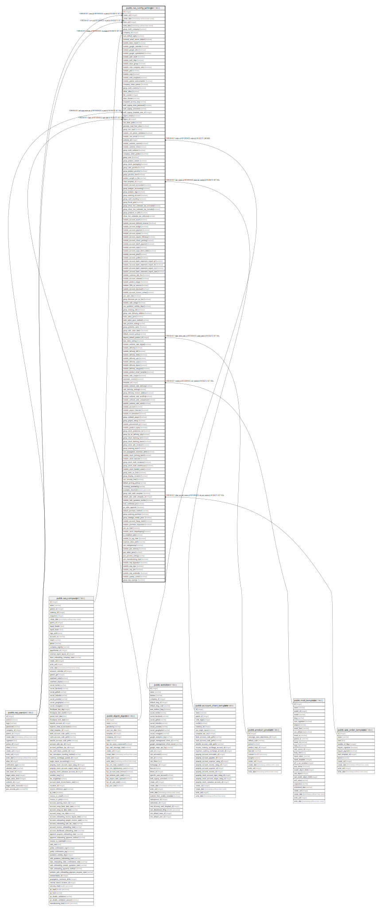

# public.res_config_settings

## Description

Config Settings

## Columns

| Name | Type | Default | Nullable | Children | Parents | Comment |
| ---- | ---- | ------- | -------- | -------- | ------- | ------- |
| id | integer | nextval('res_config_settings_id_seq'::regclass) | false |  |  |  |
| create_uid | integer |  | true |  | [public.res_users](public.res_users.md) | Created by |
| create_date | timestamp without time zone |  | true |  |  | Created on |
| write_uid | integer |  | true |  | [public.res_users](public.res_users.md) | Last Updated by |
| write_date | timestamp without time zone |  | true |  |  | Last Updated on |
| group_multi_company | boolean |  | true |  |  | Manage multiple companies |
| company_id | integer |  | false |  | [public.res_company](public.res_company.md) | Company |
| user_default_rights | boolean |  | true |  |  | Default Access Rights |
| external_email_server_default | boolean |  | true |  |  | External Email Servers |
| module_base_import | boolean |  | true |  |  | Allow users to import data from CSV/XLS/XLSX/ODS files |
| module_google_calendar | boolean |  | true |  |  | Allow the users to synchronize their calendar  with Google Calendar |
| module_google_drive | boolean |  | true |  |  | Attach Google documents to any record |
| module_google_spreadsheet | boolean |  | true |  |  | Google Spreadsheet |
| module_auth_oauth | boolean |  | true |  |  | Use external authentication providers (OAuth) |
| module_auth_ldap | boolean |  | true |  |  | LDAP Authentication |
| module_base_gengo | boolean |  | true |  |  | Translate Your Website with Gengo |
| module_inter_company_rules | boolean |  | true |  |  | Manage Inter Company |
| module_pad | boolean |  | true |  |  | Collaborative Pads |
| module_voip | boolean |  | true |  |  | Asterisk (VoIP) |
| module_web_unsplash | boolean |  | true |  |  | Unsplash Image Library |
| module_partner_autocomplete | boolean |  | true |  |  | Auto-populate company data |
| company_share_partner | boolean |  | true |  |  | Share partners to all companies |
| group_multi_currency | boolean |  | true |  |  | Multi-Currencies |
| show_effect | boolean |  | true |  |  | Show Effect |
| fail_counter | integer |  | true |  |  | Fail Mail |
| alias_domain | varchar |  | true |  |  | Alias Domain |
| unsplash_access_key | varchar |  | true |  |  | Access Key |
| auth_signup_reset_password | boolean |  | true |  |  | Enable password reset from Login page |
| auth_signup_uninvited | varchar |  | true |  |  | Customer Account |
| auth_signup_template_user_id | integer |  | true |  | [public.res_users](public.res_users.md) | Template user for new users created through signup |
| digest_emails | boolean |  | true |  |  | Digest Emails |
| digest_id | integer |  | true |  | [public.digest_digest](public.digest_digest.md) | Digest Email |
| crm_alias_prefix | varchar |  | true |  |  | Default Alias Name for Leads |
| generate_lead_from_alias | boolean |  | true |  |  | Manual Assignation of Emails |
| group_use_lead | boolean |  | true |  |  | Leads |
| module_crm_phone_validation | boolean |  | true |  |  | Phone Formatting |
| module_crm_reveal | boolean |  | true |  |  | Create Leads/Opportunities from your website's traffic |
| website_id | integer |  | true |  | [public.website](public.website.md) | website |
| module_website_version | boolean |  | true |  |  | A/B Testing |
| module_website_links | boolean |  | true |  |  | Link Trackers |
| group_multi_website | boolean |  | true |  |  | Multi-website |
| company_share_product | boolean |  | true |  |  | Share product to all companies |
| group_uom | boolean |  | true |  |  | Units of Measure |
| group_product_variant | boolean |  | true |  |  | Variants and Options |
| group_stock_packaging | boolean |  | true |  |  | Product Packagings |
| group_sale_pricelist | boolean |  | true |  |  | Use pricelists to adapt your price per customers |
| group_product_pricelist | boolean |  | true |  |  | Show pricelists On Products |
| group_pricelist_item | boolean |  | true |  |  | Show pricelists to customers |
| product_weight_in_lbs | varchar |  | true |  |  | Weight unit of measure |
| chart_template_id | integer |  | true |  | [public.account_chart_template](public.account_chart_template.md) | Template |
| module_account_accountant | boolean |  | true |  |  | Accounting |
| group_analytic_accounting | boolean |  | true |  |  | Analytic Accounting |
| group_analytic_tags | boolean |  | true |  |  | Analytic Tags |
| group_warning_account | boolean |  | true |  |  | Warnings in Invoices |
| group_cash_rounding | boolean |  | true |  |  | Cash Rounding |
| group_fiscal_year | boolean |  | true |  |  | Fiscal Years |
| group_show_line_subtotals_tax_excluded | boolean |  | true |  |  | Show line subtotals without taxes (B2B) |
| group_show_line_subtotals_tax_included | boolean |  | true |  |  | Show line subtotals with taxes (B2C) |
| group_products_in_bills | boolean |  | true |  |  | Use products in vendor bills |
| show_line_subtotals_tax_selection | varchar |  | false |  |  | Line Subtotals Tax Display |
| module_account_asset | boolean |  | true |  |  | Assets Management |
| module_account_deferred_revenue | boolean |  | true |  |  | Revenue Recognition |
| module_account_budget | boolean |  | true |  |  | Budget Management |
| module_account_payment | boolean |  | true |  |  | Invoice Online Payment |
| module_account_reports | boolean |  | true |  |  | Dynamic Reports |
| module_account_reports_followup | boolean |  | true |  |  | Follow-up Levels |
| module_account_check_printing | boolean |  | true |  |  | Allow check printing and deposits |
| module_account_batch_payment | boolean |  | true |  |  | Use batch payments |
| module_account_sepa | boolean |  | true |  |  | SEPA Credit Transfer (SCT) |
| module_account_sepa_direct_debit | boolean |  | true |  |  | Use SEPA Direct Debit |
| module_account_plaid | boolean |  | true |  |  | Plaid Connector |
| module_account_yodlee | boolean |  | true |  |  | Bank Interface - Sync your bank feeds automatically |
| module_account_bank_statement_import_qif | boolean |  | true |  |  | Import .qif files |
| module_account_bank_statement_import_ofx | boolean |  | true |  |  | Import in .ofx format |
| module_account_bank_statement_import_csv | boolean |  | true |  |  | Import in .csv format |
| module_account_bank_statement_import_camt | boolean |  | true |  |  | Import in CAMT.053 format |
| module_currency_rate_live | boolean |  | true |  |  | Automatic Currency Rates |
| module_account_intrastat | boolean |  | true |  |  | Intrastat |
| module_product_margin | boolean |  | true |  |  | Allow Product Margin |
| module_l10n_eu_service | boolean |  | true |  |  | EU Digital Goods VAT |
| module_account_taxcloud | boolean |  | true |  |  | Account TaxCloud |
| module_account_invoice_extract | boolean |  | true |  |  | Automate Bill Processing |
| use_sale_note | boolean |  | true |  |  | Default Terms & Conditions |
| group_discount_per_so_line | boolean |  | true |  |  | Discounts |
| module_sale_margin | boolean |  | true |  |  | Margins |
| use_quotation_validity_days | boolean |  | true |  |  | Default Quotation Validity |
| group_warning_sale | boolean |  | true |  |  | Sale Order Warnings |
| group_sale_delivery_address | boolean |  | true |  |  | Customer Addresses |
| multi_sales_price | boolean |  | true |  |  | Multiple Sales Prices per Product |
| multi_sales_price_method | varchar |  | true |  |  | Pricelists Method |
| sale_pricelist_setting | varchar |  | true |  |  | Pricelists |
| group_proforma_sales | boolean |  | true |  |  | Pro-Forma Invoice |
| group_sale_order_dates | boolean |  | true |  |  | Delivery Date |
| default_invoice_policy | varchar |  | true |  |  | Invoicing Policy |
| deposit_default_product_id | integer |  | true |  | [public.product_product](public.product_product.md) | Deposit Product |
| auto_done_setting | boolean |  | true |  |  | Lock Confirmed Sales |
| module_website_sale_digital | boolean |  | true |  |  | Digital Content |
| module_delivery | boolean |  | true |  |  | Shipping Costs |
| module_delivery_dhl | boolean |  | true |  |  | DHL Connector |
| module_delivery_fedex | boolean |  | true |  |  | FedEx Connector |
| module_delivery_ups | boolean |  | true |  |  | UPS Connector |
| module_delivery_usps | boolean |  | true |  |  | USPS Connector |
| module_delivery_bpost | boolean |  | true |  |  | bpost Connector |
| module_delivery_easypost | boolean |  | true |  |  | Easypost Connector |
| module_product_email_template | boolean |  | true |  |  | Specific Email |
| module_sale_coupon | boolean |  | true |  |  | Coupons & Promotions |
| automatic_invoice | boolean |  | true |  |  | Automatic Invoice |
| template_id | integer |  | true |  | [public.mail_template](public.mail_template.md) | Email Template |
| module_website_sale_delivery | boolean |  | true |  |  | eCommerce Shipping Costs |
| sale_delivery_settings | varchar |  | true |  |  | Shipping Management |
| group_delivery_invoice_address | boolean |  | true |  |  | Shipping Address |
| module_website_sale_wishlist | boolean |  | true |  |  | Wishlists |
| module_website_sale_comparison | boolean |  | true |  |  | Product Comparison Tool |
| module_website_sale_stock | boolean |  | true |  |  | Inventory |
| module_account | boolean |  | true |  |  | Invoicing |
| module_project_forecast | boolean |  | true |  |  | Forecasts |
| module_hr_timesheet | boolean |  | true |  |  | Task Logs |
| group_subtask_project | boolean |  | true |  |  | Sub-tasks |
| group_project_rating | boolean |  | true |  |  | Use Rating on Project |
| module_procurement_jit | integer |  | true |  |  | Reservation |
| module_product_expiry | boolean |  | true |  |  | Expiration Dates |
| group_stock_production_lot | boolean |  | true |  |  | Lots & Serial Numbers |
| group_lot_on_delivery_slip | boolean |  | true |  |  | Display Lots & Serial Numbers |
| group_stock_tracking_lot | boolean |  | true |  |  | Delivery Packages |
| group_stock_tracking_owner | boolean |  | true |  |  | Consignment |
| group_stock_adv_location | boolean |  | true |  |  | Multi-Step Routes |
| group_warning_stock | boolean |  | true |  |  | Warnings for Stock |
| use_propagation_minimum_delta | boolean |  | true |  |  | No Rescheduling Propagation |
| module_stock_picking_batch | boolean |  | true |  |  | Batch Pickings |
| module_stock_barcode | boolean |  | true |  |  | Barcode Scanner |
| group_stock_multi_locations | boolean |  | true |  |  | Storage Locations |
| group_stock_multi_warehouses | boolean |  | true |  |  | Multi-Warehouses |
| module_stock_landed_costs | boolean |  | true |  |  | Landed Costs |
| group_route_so_lines | boolean |  | true |  |  | Order-Specific Routes |
| group_display_incoterm | boolean |  | true |  |  | Incoterms |
| use_security_lead | boolean |  | true |  |  | Security Lead Time for Sales |
| default_picking_policy | varchar |  | false |  |  | Picking Policy |
| inventory_availability | varchar |  | true |  |  | Inventory Availability |
| available_threshold | double precision |  | true |  |  | Availability Threshold |
| group_sale_order_template | boolean |  | true |  |  | Quotation Templates |
| default_sale_order_template_id | integer |  | true |  | [public.sale_order_template](public.sale_order_template.md) | Default Template |
| module_sale_quotation_builder | boolean |  | true |  |  | Quotation Builder |
| lock_confirmed_po | boolean |  | true |  |  | Lock Confirmed Orders |
| po_order_approval | boolean |  | true |  |  | Purchase Order Approval |
| default_purchase_method | varchar |  | true |  |  | Bill Control |
| group_warning_purchase | boolean |  | true |  |  | Purchase Warnings |
| group_manage_vendor_price | boolean |  | true |  |  | Vendor Pricelists |
| module_account_3way_match | boolean |  | true |  |  | 3-way matching: purchases, receptions and bills |
| module_purchase_requisition | boolean |  | true |  |  | Purchase Agreements |
| use_po_lead | boolean |  | true |  |  | Security Lead Time for Purchase |
| module_stock_dropshipping | boolean |  | true |  |  | Dropshipping |
| is_installed_sale | boolean |  | true |  |  | Is the Sale Module Installed |
| module_hr_org_chart | boolean |  | true |  |  | Show Organizational Chart |
| expense_alias_prefix | varchar |  | true |  |  | Default Alias Name for Expenses |
| use_mailgateway | boolean |  | true |  |  | Let your employees record expenses by email |
| module_pos_mercury | boolean |  | true |  |  | Integrated Card Payments |
| pos_sales_price | boolean |  | true |  |  | Multiple Product Prices |
| pos_pricelist_setting | varchar |  | true |  |  | POS Pricelists |
| use_manufacturing_lead | boolean |  | true |  |  | Default Manufacturing Lead Time |
| module_mrp_byproduct | boolean |  | true |  |  | By-Products |
| module_mrp_mps | boolean |  | true |  |  | Master Production Schedule |
| module_mrp_plm | boolean |  | true |  |  | Product Lifecycle Management (PLM) |
| module_mrp_workorder | boolean |  | true |  |  | Work Orders |
| module_quality_control | boolean |  | true |  |  | Quality |
| group_mrp_routings | boolean |  | true |  |  | MRP Work Orders |

## Constraints

| Name | Type | Definition |
| ---- | ---- | ---------- |
| res_config_settings_auth_signup_template_user_id_fkey | FOREIGN KEY | FOREIGN KEY (auth_signup_template_user_id) REFERENCES res_users(id) ON DELETE SET NULL |
| res_config_settings_create_uid_fkey | FOREIGN KEY | FOREIGN KEY (create_uid) REFERENCES res_users(id) ON DELETE SET NULL |
| res_config_settings_write_uid_fkey | FOREIGN KEY | FOREIGN KEY (write_uid) REFERENCES res_users(id) ON DELETE SET NULL |
| res_config_settings_company_id_fkey | FOREIGN KEY | FOREIGN KEY (company_id) REFERENCES res_company(id) ON DELETE SET NULL |
| res_config_settings_pkey | PRIMARY KEY | PRIMARY KEY (id) |
| res_config_settings_template_id_fkey | FOREIGN KEY | FOREIGN KEY (template_id) REFERENCES mail_template(id) ON DELETE SET NULL |
| res_config_settings_digest_id_fkey | FOREIGN KEY | FOREIGN KEY (digest_id) REFERENCES digest_digest(id) ON DELETE SET NULL |
| res_config_settings_website_id_fkey | FOREIGN KEY | FOREIGN KEY (website_id) REFERENCES website(id) ON DELETE CASCADE |
| res_config_settings_deposit_default_product_id_fkey | FOREIGN KEY | FOREIGN KEY (deposit_default_product_id) REFERENCES product_product(id) ON DELETE SET NULL |
| res_config_settings_chart_template_id_fkey | FOREIGN KEY | FOREIGN KEY (chart_template_id) REFERENCES account_chart_template(id) ON DELETE SET NULL |
| res_config_settings_default_sale_order_template_id_fkey | FOREIGN KEY | FOREIGN KEY (default_sale_order_template_id) REFERENCES sale_order_template(id) ON DELETE SET NULL |

## Indexes

| Name | Definition |
| ---- | ---------- |
| res_config_settings_pkey | CREATE UNIQUE INDEX res_config_settings_pkey ON public.res_config_settings USING btree (id) |

## Relations

---

> Generated by [tbls](https://github.com/k1LoW/tbls)
