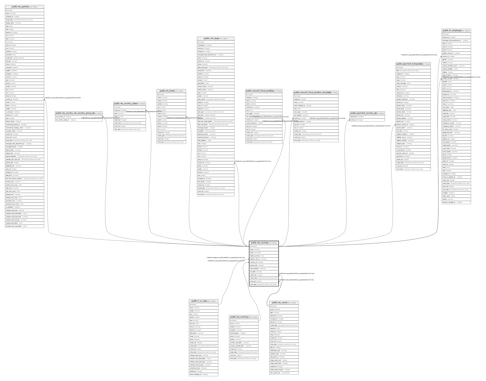

# public.res_country

## Description

Country

## Columns

| Name | Type | Default | Nullable | Children | Parents | Comment |
| ---- | ---- | ------- | -------- | -------- | ------- | ------- |
| id | integer | nextval('res_country_id_seq'::regclass) | false | [public.res_partner](public.res_partner.md) [public.res_country_res_country_group_rel](public.res_country_res_country_group_rel.md) [public.res_country_state](public.res_country_state.md) [public.res_bank](public.res_bank.md) [public.crm_lead](public.crm_lead.md) [public.account_fiscal_position](public.account_fiscal_position.md) [public.account_fiscal_position_template](public.account_fiscal_position_template.md) [public.payment_country_rel](public.payment_country_rel.md) [public.payment_transaction](public.payment_transaction.md) [public.hr_employee](public.hr_employee.md) |  |  |
| name | varchar |  | false |  |  | Country Name |
| code | varchar(2) |  | true |  |  | Country Code |
| address_format | text |  | true |  |  | Layout in Reports |
| address_view_id | integer |  | true |  | [public.ir_ui_view](public.ir_ui_view.md) | Input View |
| currency_id | integer |  | true |  | [public.res_currency](public.res_currency.md) | Currency |
| phone_code | integer |  | true |  |  | Country Calling Code |
| name_position | varchar |  | true |  |  | Customer Name Position |
| vat_label | varchar |  | true |  |  | Vat Label |
| create_uid | integer |  | true |  | [public.res_users](public.res_users.md) | Created by |
| create_date | timestamp without time zone |  | true |  |  | Created on |
| write_uid | integer |  | true |  | [public.res_users](public.res_users.md) | Last Updated by |
| write_date | timestamp without time zone |  | true |  |  | Last Updated on |

## Constraints

| Name | Type | Definition | Comment |
| ---- | ---- | ---------- | ------- |
| res_country_create_uid_fkey | FOREIGN KEY | FOREIGN KEY (create_uid) REFERENCES res_users(id) ON DELETE SET NULL |  |
| res_country_write_uid_fkey | FOREIGN KEY | FOREIGN KEY (write_uid) REFERENCES res_users(id) ON DELETE SET NULL |  |
| res_country_currency_id_fkey | FOREIGN KEY | FOREIGN KEY (currency_id) REFERENCES res_currency(id) ON DELETE SET NULL |  |
| res_country_address_view_id_fkey | FOREIGN KEY | FOREIGN KEY (address_view_id) REFERENCES ir_ui_view(id) ON DELETE SET NULL |  |
| res_country_pkey | PRIMARY KEY | PRIMARY KEY (id) |  |
| res_country_code_uniq | UNIQUE | UNIQUE (code) | unique (code) |
| res_country_name_uniq | UNIQUE | UNIQUE (name) | unique (name) |

## Indexes

| Name | Definition |
| ---- | ---------- |
| res_country_pkey | CREATE UNIQUE INDEX res_country_pkey ON public.res_country USING btree (id) |
| res_country_code_uniq | CREATE UNIQUE INDEX res_country_code_uniq ON public.res_country USING btree (code) |
| res_country_name_uniq | CREATE UNIQUE INDEX res_country_name_uniq ON public.res_country USING btree (name) |

## Relations

---

> Generated by [tbls](https://github.com/k1LoW/tbls)
