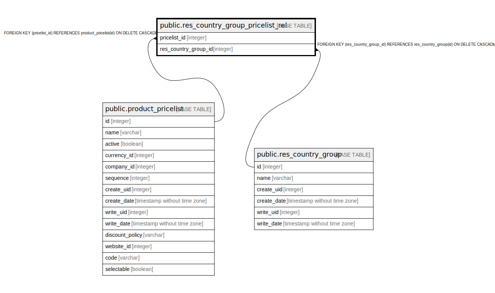

# public.res_country_group_pricelist_rel

## Description

RELATION BETWEEN product_pricelist AND res_country_group

## Columns

| Name | Type | Default | Nullable | Children | Parents | Comment |
| ---- | ---- | ------- | -------- | -------- | ------- | ------- |
| pricelist_id | integer |  | false |  | [public.product_pricelist](public.product_pricelist.md) |  |
| res_country_group_id | integer |  | false |  | [public.res_country_group](public.res_country_group.md) |  |

## Constraints

| Name | Type | Definition |
| ---- | ---- | ---------- |
| res_country_group_pricelist_rel_res_country_group_id_fkey | FOREIGN KEY | FOREIGN KEY (res_country_group_id) REFERENCES res_country_group(id) ON DELETE CASCADE |
| res_country_group_pricelist_rel_pricelist_id_fkey | FOREIGN KEY | FOREIGN KEY (pricelist_id) REFERENCES product_pricelist(id) ON DELETE CASCADE |
| res_country_group_pricelist_r_pricelist_id_res_country_grou_key | UNIQUE | UNIQUE (pricelist_id, res_country_group_id) |

## Indexes

| Name | Definition |
| ---- | ---------- |
| res_country_group_pricelist_r_pricelist_id_res_country_grou_key | CREATE UNIQUE INDEX res_country_group_pricelist_r_pricelist_id_res_country_grou_key ON public.res_country_group_pricelist_rel USING btree (pricelist_id, res_country_group_id) |
| res_country_group_pricelist_rel_pricelist_id_idx | CREATE INDEX res_country_group_pricelist_rel_pricelist_id_idx ON public.res_country_group_pricelist_rel USING btree (pricelist_id) |
| res_country_group_pricelist_rel_res_country_group_id_idx | CREATE INDEX res_country_group_pricelist_rel_res_country_group_id_idx ON public.res_country_group_pricelist_rel USING btree (res_country_group_id) |

## Relations

---

> Generated by [tbls](https://github.com/k1LoW/tbls)
